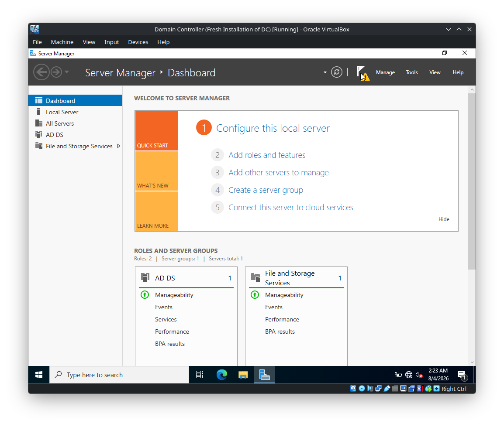
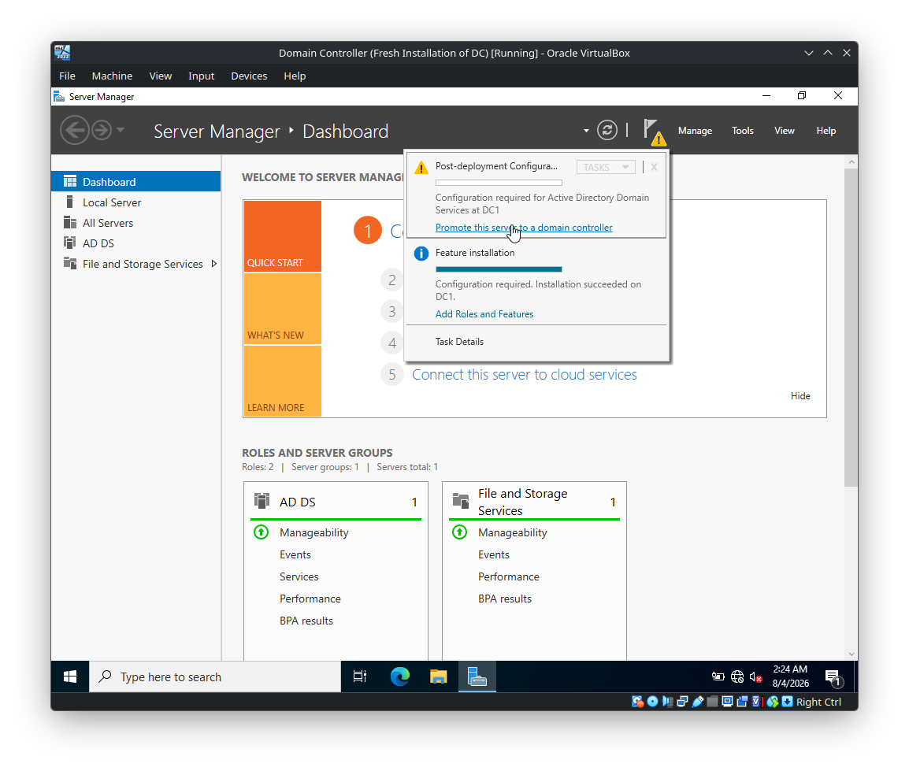
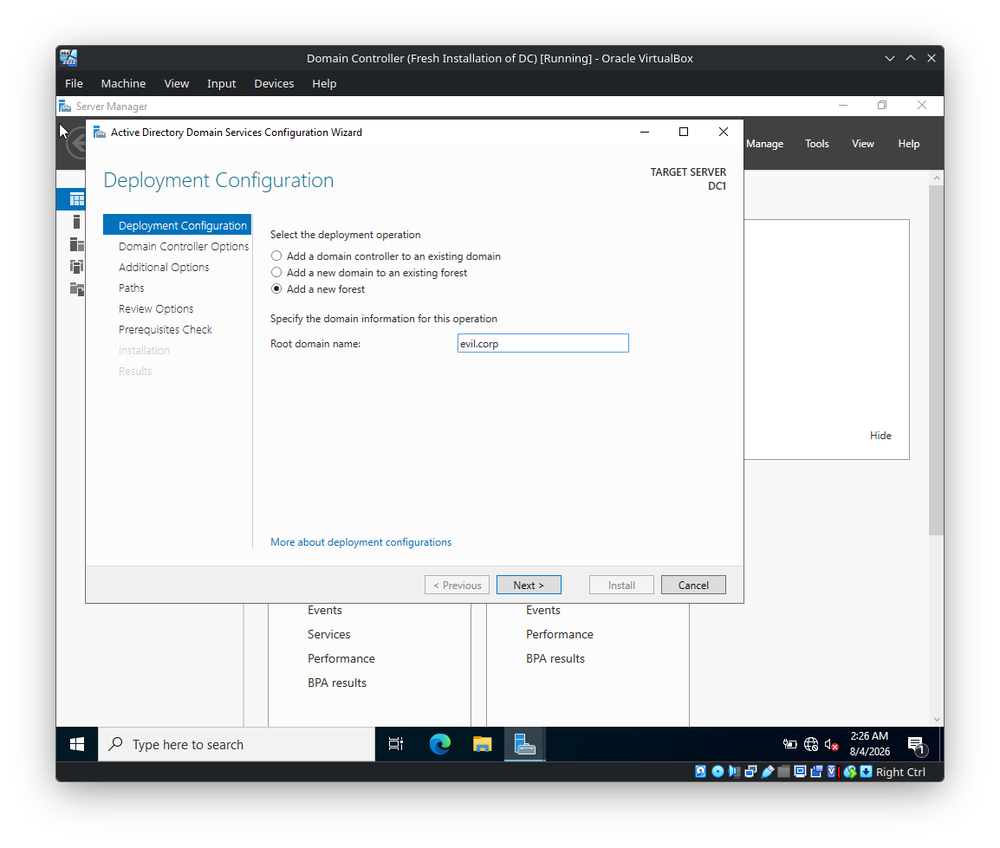
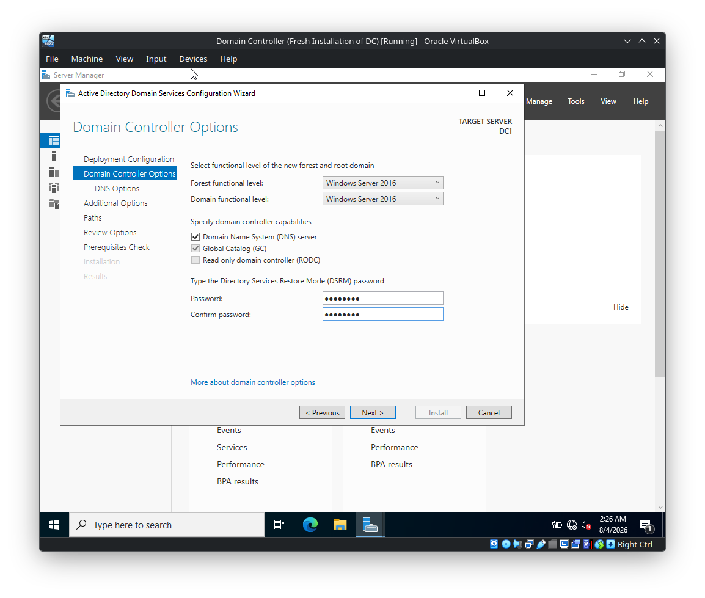
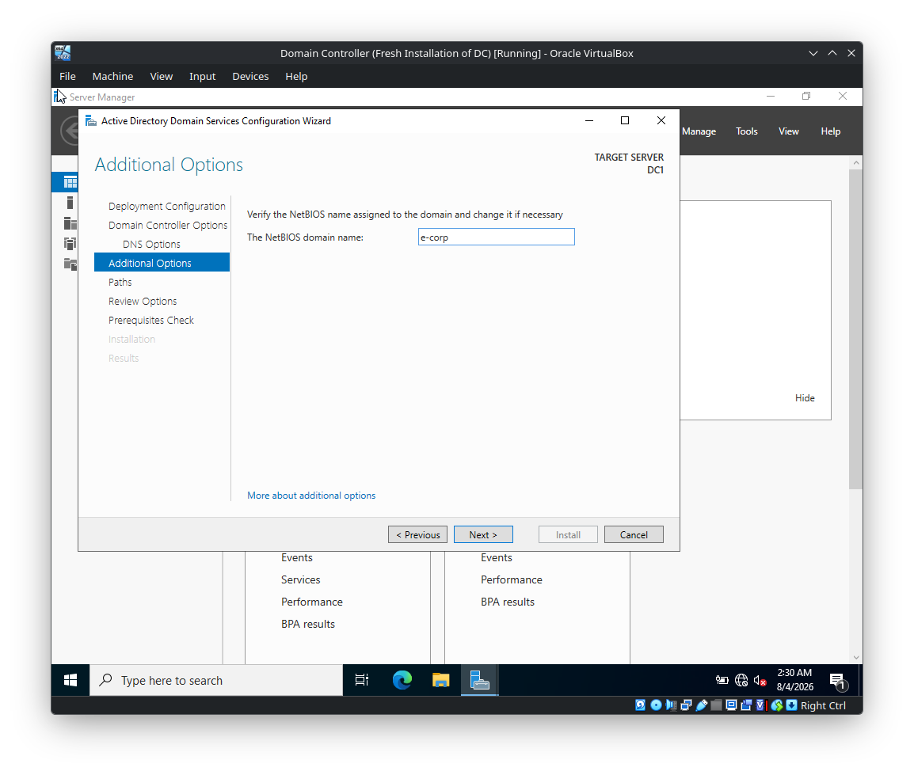
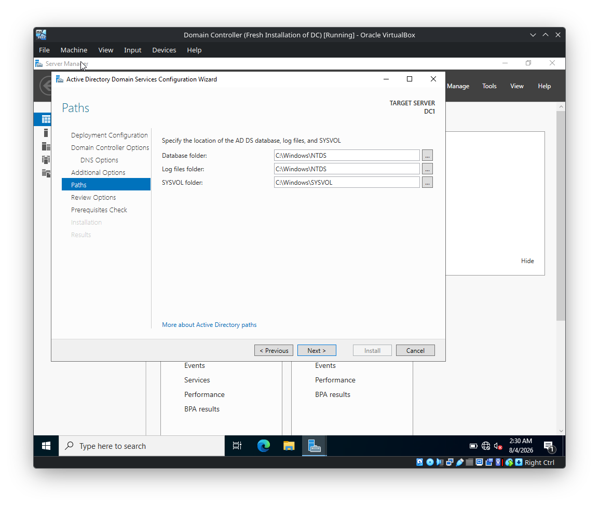
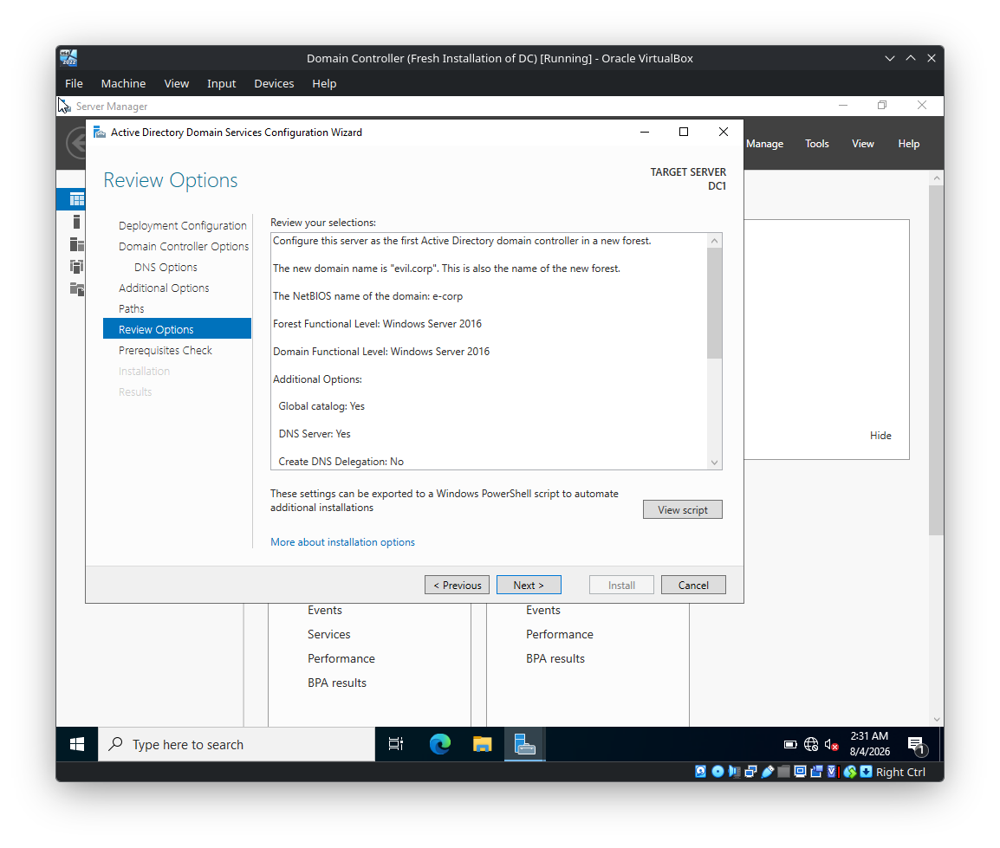
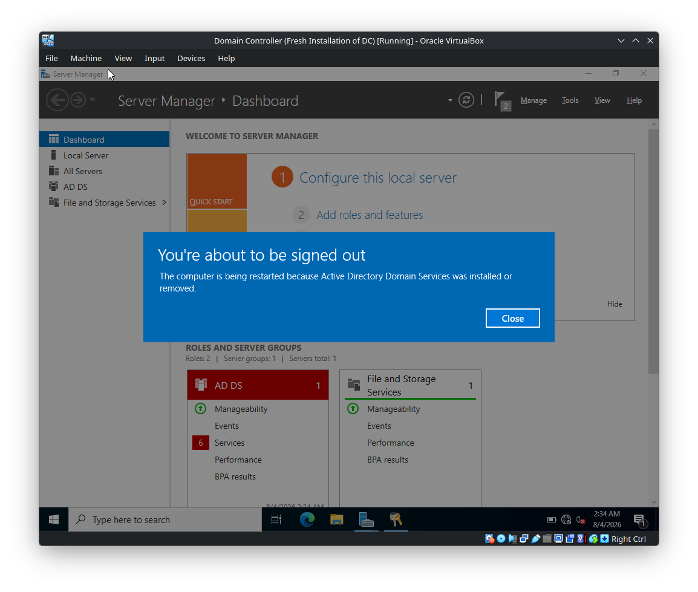
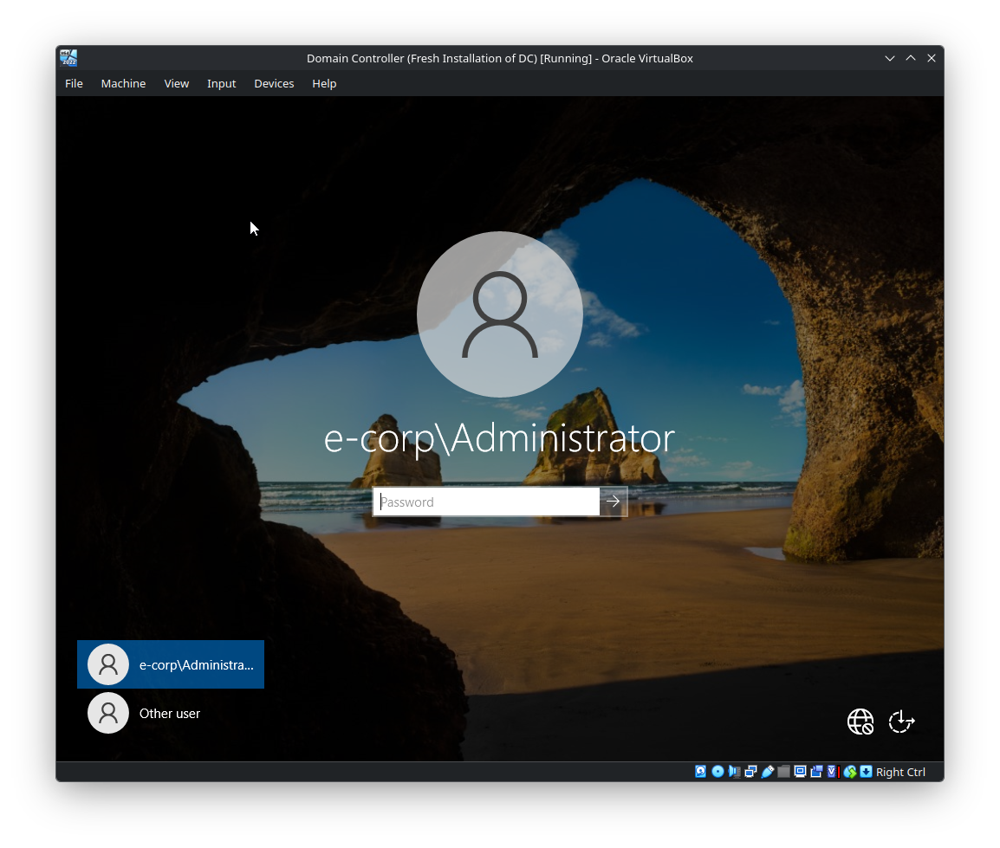

# DC-Server — Active Directory Domain Services (AD DS) Setup Walkthrough

> **Lab:** Windows Server 2022  
> **Server:** `DC1`  
> **Domain:** `evil.corp`  
> **NetBIOS Domain:** `e-corp`  
> **Purpose:** Configure Active Directory Domain Services and promote `DC1` as the first Domain Controller in a new forest.

---

## 1. Overview

This walkthrough documents the complete AD DS configuration performed on the Windows Server.

The server is configured as the first Domain Controller for a new Active Directory forest:

```text
Forest: evil.corp
Domain: evil.corp
NetBIOS: e-corp
Domain Controller: DC1
```

The configuration is performed through the **Active Directory Domain Services Configuration Wizard**.

### Configuration Flow

```text
Install AD DS Role
        |
        v
Server Manager Notification
        |
        v
Promote Server to Domain Controller
        |
        v
Add a New Forest
        |
        v
Configure Domain Controller Options
        |
        v
Configure DNS
        |
        v
Configure NetBIOS Name
        |
        v
Configure AD DS Paths
        |
        v
Review Configuration
        |
        v
Run Prerequisite Checks
        |
        v
Install / Promote DC
        |
        v
Automatic Restart
        |
        v
Login as e-corp\Administrator
```

---

# 2. AD DS Role Installation

Before promoting the server, the **Active Directory Domain Services (AD DS)** role must be installed.

After the role installation completes, open **Server Manager**.

The notification flag indicates that additional configuration is required.



Click the notification flag and select:

**Promote this server to a domain controller**



This launches the:

**Active Directory Domain Services Configuration Wizard**

---

# 3. Deployment Configuration

The first page of the wizard is **Deployment Configuration**.



Because this is the **first Domain Controller** and there is no existing Active Directory forest, select:

```text
Add a new forest
```

Enter the root domain name:

```text
evil.corp
```

### Configuration

| Option | Value |
|---|---|
| Deployment Operation | Add a new forest |
| Root Domain Name | `evil.corp` |

Click **Next**.

### Why `Add a new forest`?

A forest is the top-level logical container in an Active Directory environment.

Since this lab does not have an existing forest, `DC1` becomes the first Domain Controller and creates:

```text
Forest
└── evil.corp
    └── Domain
        └── DC1
```

---

# 4. Domain Controller Options

The next page is **Domain Controller Options**.



Configure the following options.

| Option | Selected Value |
|---|---|
| Forest Functional Level | Windows Server 2016 |
| Domain Functional Level | Windows Server 2016 |
| DNS Server | Enabled |
| Global Catalog (GC) | Enabled |
| Read Only Domain Controller (RODC) | Disabled |

The screenshot shows:

```text
Forest functional level: Windows Server 2016
Domain functional level: Windows Server 2016
```

The following capabilities are enabled:

```text
[x] Domain Name System (DNS) server
[x] Global Catalog (GC)
[ ] Read only domain controller (RODC)
```

## 4.1 Configure DSRM Password

The wizard also asks for a:

**Directory Services Restore Mode (DSRM) password**

Enter a strong password and confirm it.

```text
Password: <DSRM_PASSWORD>
Confirm password: <DSRM_PASSWORD>
```

> Do not document or commit the actual DSRM password in the repository.

### What is DSRM?

DSRM is a special recovery mode used for maintenance and recovery of Active Directory Domain Services.

Click **Next**.

---

# 5. DNS Options

The wizard now displays the **DNS Options** page.


A warning is displayed:

```text
A delegation for this DNS server cannot be created because
the authoritative parent zone cannot be found...
```

The **Create DNS delegation** option remains unchecked.

```text
[ ] Create DNS delegation
```

### Configuration

| Option | Value |
|---|---|
| Create DNS Delegation | No |

Click **Next**.

## 5.1 Why Is the DNS Delegation Warning Present?

The lab is creating a new internal Active Directory forest:

```text
evil.corp
```

There is no existing parent DNS zone in the lab to which a delegation needs to be created.

Therefore:

```text
DNS Delegation = Not Created
```

This warning does not prevent the Domain Controller promotion, as confirmed later by the successful prerequisite check.

---

# 6. Additional Options

The **Additional Options** page is used to configure the NetBIOS domain name.



The wizard has assigned:

```text
e-corp
```

as the NetBIOS domain name.

### Configuration

| Option | Value |
|---|---|
| DNS Domain | `evil.corp` |
| NetBIOS Domain | `e-corp` |

The traditional Windows domain authentication format is therefore:

```text
E-CORP\Administrator
```

Click **Next**.

---

# 7. AD DS Paths

The **Paths** page specifies where Active Directory stores its database, log files, and SYSVOL data.



The configuration shown in the screenshot uses the default paths.

### Database Folder

```text
C:\Windows\NTDS
```

### Log Files Folder

```text
C:\Windows\NTDS
```

### SYSVOL Folder

```text
C:\Windows\SYSVOL
```

### Configuration Table

| Component | Path |
|---|---|
| AD DS Database | `C:\Windows\NTDS` |
| AD DS Log Files | `C:\Windows\NTDS` |
| SYSVOL | `C:\Windows\SYSVOL` |

The primary Active Directory database is stored as:

```text
C:\Windows\NTDS\ntds.dit
```

Click **Next**.

---

# 8. Review Options

The **Review Options** page displays the configuration selected throughout the wizard.



The screenshot confirms:

```text
Configure this server as the first Active Directory domain controller in a new forest.

The new domain name is "evil.corp".
This is also the name of the new forest.

The NetBIOS name of the domain: e-corp

Forest Functional Level: Windows Server 2016

Domain Functional Level: Windows Server 2016

Global catalog: Yes

DNS Server: Yes

Create DNS Delegation: No
```

### Final Review

| Setting | Value |
|---|---|
| Deployment | First Domain Controller in a new forest |
| Forest | `evil.corp` |
| Domain | `evil.corp` |
| NetBIOS | `e-corp` |
| Forest Functional Level | Windows Server 2016 |
| Domain Functional Level | Windows Server 2016 |
| Global Catalog | Yes |
| DNS Server | Yes |
| DNS Delegation | No |

Click **Next**.

---

# 9. Prerequisites Check

Before installation, Windows performs a prerequisite validation.


The important result is:

```text
All prerequisite checks passed successfully.
Click "Install" to begin installation.
```

The screenshot also displays two warnings.

### Warning 1 — Windows Server 2022 Cryptography Setting

The wizard reports a Windows Server 2022 security setting related to cryptographic algorithms compatible with Windows NT 4.0.

This warning does not prevent installation because the prerequisite check has passed.

### Warning 2 — DNS Delegation

The wizard again reports that a DNS delegation cannot be created because the authoritative parent zone cannot be found.

For this lab, DNS delegation is intentionally not configured.

### Important

The key status is:

```text
All prerequisite checks passed successfully.
```

Click:

**Install**

---

# 10. AD DS Installation and Domain Controller Promotion

After clicking **Install**, Windows begins the promotion process.

The following components are configured as part of the operation:

```text
Active Directory Domain Services
DNS
Global Catalog
Active Directory Database
SYSVOL
Domain Configuration
Forest Configuration
```

The server is being promoted as the first Domain Controller for:

```text
evil.corp
```

The promotion process will automatically restart the server.

---

# 11. Automatic Restart

During the AD DS installation, Windows displays a restart/sign-out notification.



The message states that:

```text
The computer is being restarted because Active Directory Domain Services
was installed or removed.
```

Allow the server to restart.

Do not interrupt the reboot.

---

# 12. Domain Controller Reboot

After the promotion process completes, the server restarts.



The reboot is required because the server's role has changed from a normal Windows Server installation to a Domain Controller.

---

# 13. Domain Administrator Login

After the reboot, the Windows login screen shows the newly created domain account context.


The login is shown as:

```text
e-corp\Administrator
```

This confirms that the server is now operating in the newly created Active Directory domain context.

Enter the Administrator password and log in.

---

# 14. Verify the AD DS Installation

After logging in, open **Server Manager**.

The **AD DS** role should be visible under the server roles.

The resulting environment is:

```text
Active Directory Forest
└── evil.corp
    └── Active Directory Domain
        └── DC1
            ├── AD DS
            ├── DNS
            ├── Global Catalog
            └── SYSVOL
```

---

# 15. Verification Using PowerShell

The graphical wizard confirms the installation, but it is good practice to verify the resulting Active Directory configuration from PowerShell.

Open:

**PowerShell as Administrator**

## 15.1 Verify the Hostname

```powershell
hostname
```

Expected:

```text
DC1
```

---

## 15.2 Verify the Active Directory Domain

```powershell
Get-ADDomain
```

The domain should be:

```text
evil.corp
```

---

## 15.3 Verify the Active Directory Forest

```powershell
Get-ADForest
```

The forest should be:

```text
evil.corp
```

---

## 15.4 Verify the Domain Controller

```powershell
Get-ADDomainController
```

The output should identify:

```text
DC1
```

as the Domain Controller.

---

## 15.5 Verify DNS Resolution

Run:

```cmd
nslookup dc1.evil.corp
```

The hostname should resolve to the IP address assigned to the Domain Controller.

---

# 16. Final Configuration

The completed configuration is:

| Component | Configuration |
|---|---|
| Operating System | Windows Server 2022 |
| Server Name | `DC1` |
| Forest | `evil.corp` |
| Domain | `evil.corp` |
| NetBIOS Domain | `e-corp` |
| Forest Functional Level | Windows Server 2016 |
| Domain Functional Level | Windows Server 2016 |
| DNS Server | Enabled |
| Global Catalog | Enabled |
| RODC | Disabled |
| DNS Delegation | Not Created |
| AD DS Database | `C:\Windows\NTDS` |
| AD DS Logs | `C:\Windows\NTDS` |
| SYSVOL | `C:\Windows\SYSVOL` |

---

# 17. Important Concepts

## Active Directory Domain Services

AD DS provides centralized identity and resource management for a Windows domain.

It manages objects such as:

```text
Users
Groups
Computers
Organizational Units
Domain Controllers
Group Policy
```

---

## Forest

The forest is the highest-level logical structure in this lab.

```text
evil.corp
```

---

## Domain

The Active Directory domain created in this configuration is:

```text
evil.corp
```

---

## NetBIOS Domain Name

The NetBIOS domain name is:

```text
e-corp
```

It can be used in the traditional Windows authentication format:

```text
E-CORP\Administrator
```

---

## Domain Controller

The server:

```text
DC1
```

is promoted as the Domain Controller for:

```text
evil.corp
```

---

## DNS

DNS is a fundamental dependency of Active Directory.

It allows domain members and Active Directory components to locate services and resolve domain names.

In this configuration, DNS Server is enabled on the Domain Controller.

---

## Global Catalog

The Global Catalog is enabled on `DC1`.

It provides searchable information about objects across the Active Directory forest.

---

## SYSVOL

The SYSVOL directory is:

```text
C:\Windows\SYSVOL
```

It stores domain-wide files used by Active Directory, including Group Policy-related data and logon scripts.

---

## NTDS Database

The Active Directory database is stored under:

```text
C:\Windows\NTDS
```

The primary database file is:

```text
C:\Windows\NTDS\ntds.dit
```

---

## DSRM

Directory Services Restore Mode provides a special recovery environment for Active Directory maintenance and recovery.

The DSRM password was configured during the **Domain Controller Options** stage.

---

# 18. Final Architecture

```text
                         Active Directory Forest
                                evil.corp
                                    |
                                    |
                         Active Directory Domain
                                evil.corp
                                    |
                                    |
                                   DC1
                                    |
              +---------------------+---------------------+
              |                     |                     |
             AD DS                 DNS             Global Catalog
              |
              |
            SYSVOL
              |
              |
      C:\Windows\SYSVOL
```

---

# 19. Configuration Completion Checklist

```text
[+] AD DS role installed
[+] Server Manager notification displayed
[+] Server promoted to Domain Controller
[+] New forest created
[+] evil.corp domain created
[+] e-corp NetBIOS name configured
[+] Windows Server 2016 forest functional level selected
[+] Windows Server 2016 domain functional level selected
[+] DNS Server enabled
[+] Global Catalog enabled
[+] RODC disabled
[+] DSRM password configured
[+] DNS delegation left disabled
[+] AD DS database path configured
[+] AD DS log path configured
[+] SYSVOL path configured
[+] Review completed
[+] Prerequisite checks passed
[+] Domain Controller promotion completed
[+] Server restarted
[+] e-corp\Administrator login available
```

---

# 20. Next Steps

The AD DS foundation is now established.

The next phase of the lab can build on this Domain Controller by configuring:

1. Organizational Units (OUs)
2. Domain users
3. Security groups
4. Computer accounts
5. Domain-joined client machines
6. Group Policy Objects (GPOs)
7. SMB shares
8. NTFS permissions
9. Service accounts
10. Active Directory enumeration
11. Kerberos authentication testing
12. LDAP enumeration
13. SMB enumeration
14. Controlled Active Directory attack scenarios

---

## Status

```text
AD DS CONFIGURATION: COMPLETE
DOMAIN: evil.corp
NETBIOS: e-corp
DOMAIN CONTROLLER: DC1
```

