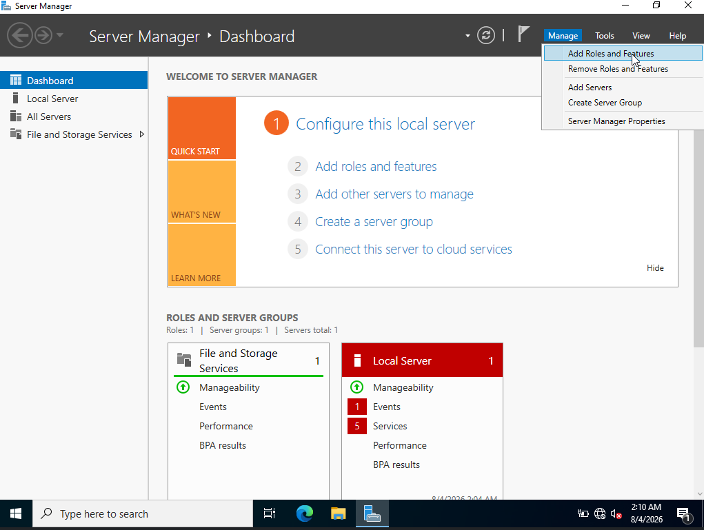
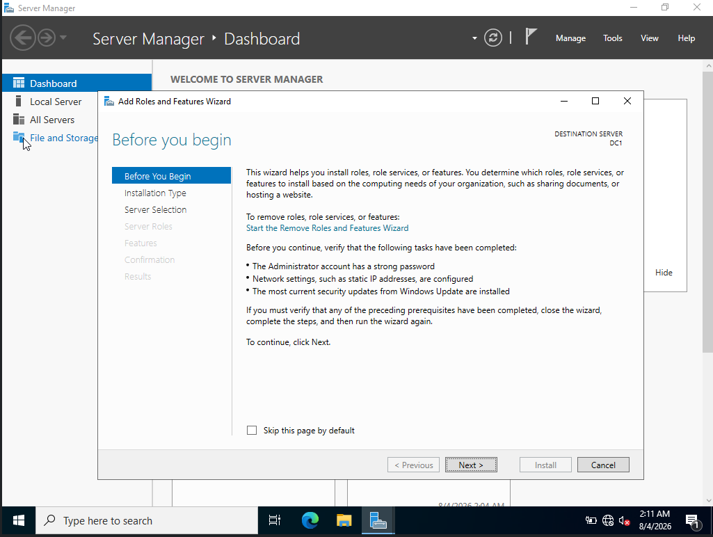
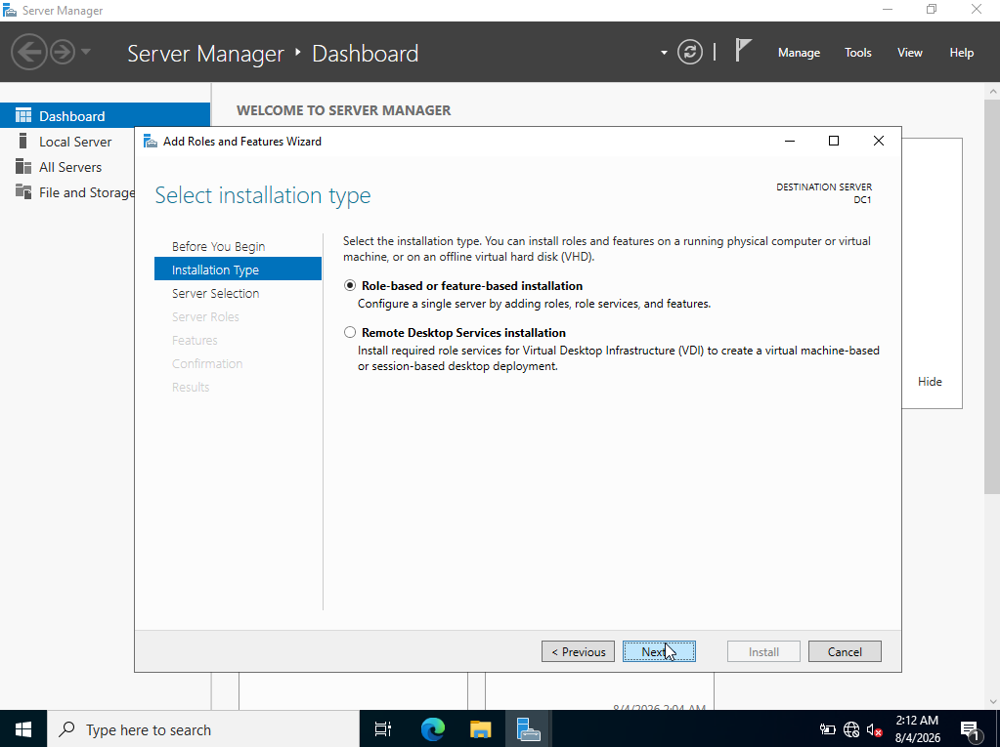
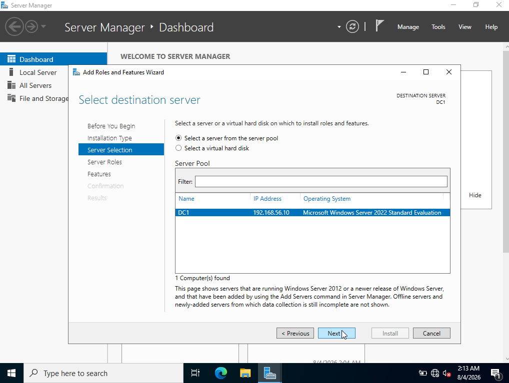
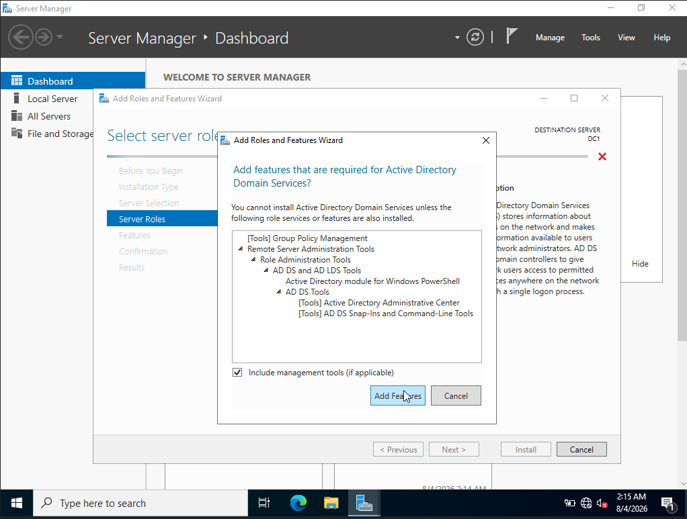
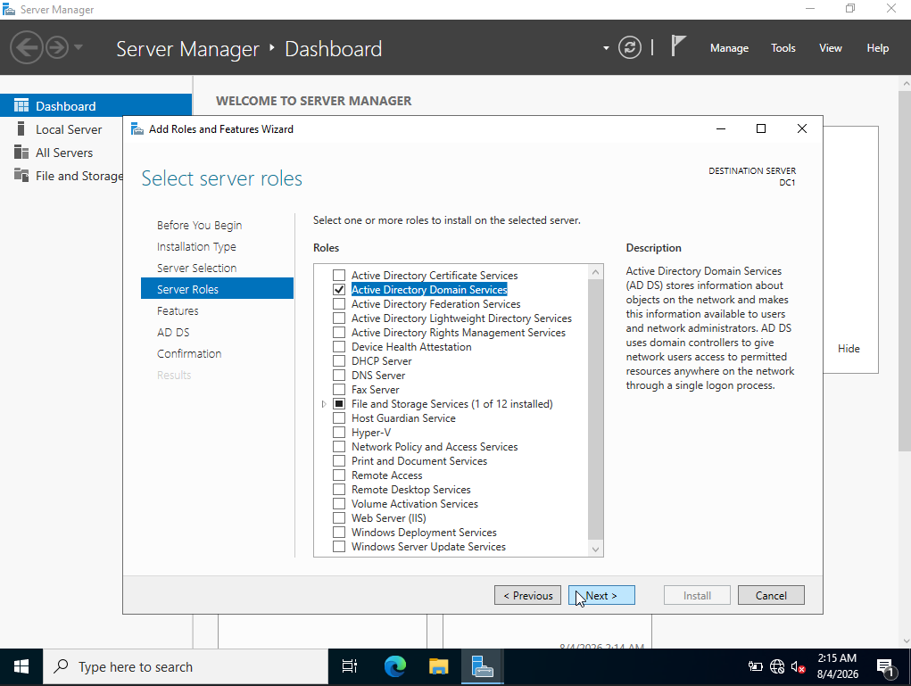
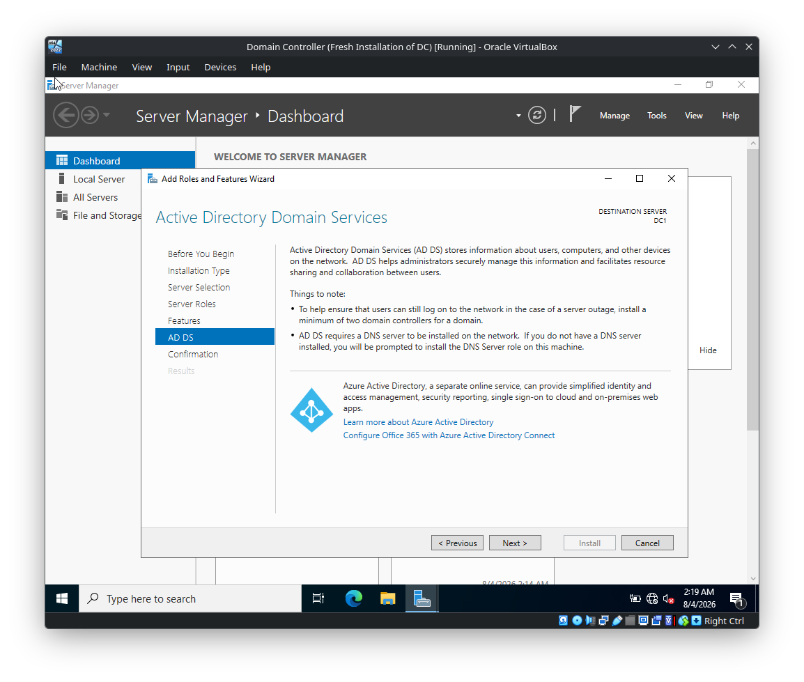
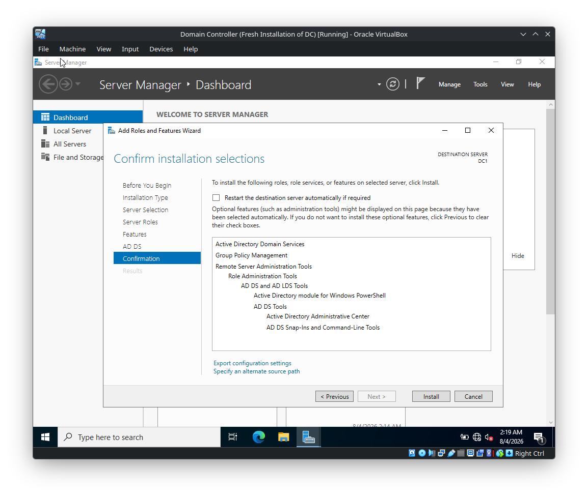
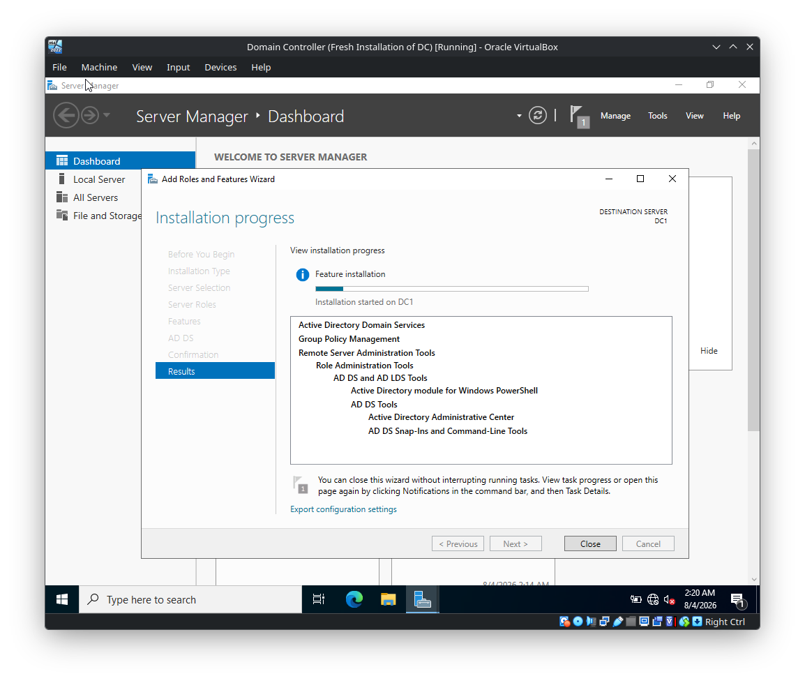
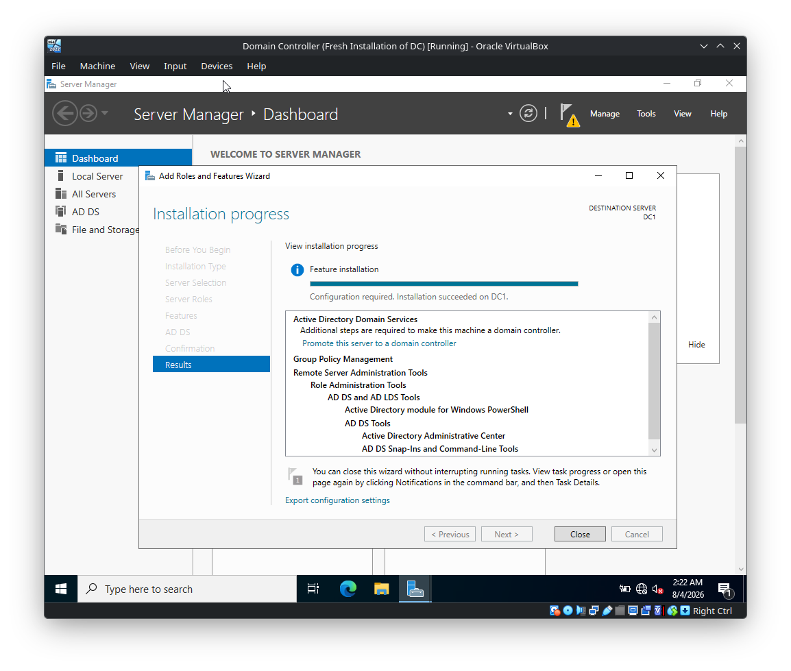

# DC-Server — Installing Active Directory Domain Services (AD DS) Role

> **Lab:** Windows Server 2022  
> **Server:** `DC1`  
> **Server IP shown in the lab:** `192.168.56.10`  
> **Purpose:** Install the **Active Directory Domain Services (AD DS)** server role using Server Manager before promoting the server to a Domain Controller.

---

## 1. Overview

Before a Windows Server can be promoted to a Domain Controller, the **Active Directory Domain Services (AD DS)** role must first be installed.

This walkthrough documents the complete **Add Roles and Features** process shown in the screenshots.

The installation flow is:

```text
Server Manager
      |
      v
Manage
      |
      v
Add Roles and Features
      |
      v
Before You Begin
      |
      v
Role-based or feature-based installation
      |
      v
Select DC1
      |
      v
Select Active Directory Domain Services
      |
      v
Add required management tools
      |
      v
Review Features
      |
      v
Review AD DS information
      |
      v
Confirm installation
      |
      v
Install
      |
      v
Installation completed
      |
      v
Promote server to Domain Controller
```

---

# 2. Open Add Roles and Features

Open **Server Manager**.

From the top-right menu, select:

```text
Manage
    |
    └── Add Roles and Features
```



The **Add Roles and Features Wizard** opens.

---

# 3. Before You Begin

The wizard first displays the **Before You Begin** page.



The wizard recommends verifying:

- The Administrator account has a strong password.
- Network settings, such as static IP addresses, are configured.
- The latest security updates from Windows Update are installed.

For a Domain Controller lab, these prerequisites are important because Active Directory depends heavily on stable network configuration and reliable name resolution.

Click:

```text
Next
```

---

# 4. Select Installation Type

The next page is **Select installation type**.



Select:

```text
Role-based or feature-based installation
```

This is the appropriate option for installing the AD DS server role directly on the Windows Server.

Click:

```text
Next
```

---

# 5. Select Destination Server

The wizard asks which server should receive the role.



Select:

```text
Select a server from the server pool
```

The server shown in the screenshot is:

```text
Name:              DC1
IP Address:        192.168.56.10
Operating System:  Microsoft Windows Server 2022 Standard Evaluation
```

Select:

```text
DC1
```

and click:

```text
Next
```

---

# 6. Select Active Directory Domain Services

The **Select server roles** page displays the available Windows Server roles.


Locate:

```text
Active Directory Domain Services
```

Select the checkbox next to:

```text
Active Directory Domain Services
```

---

# 7. Add Required AD DS Features

After selecting **Active Directory Domain Services**, Windows displays a dialog asking whether the required role services and features should also be installed.



The dialog shows components required by AD DS, including:

```text
Group Policy Management
Remote Server Administration Tools
    |
    └── Role Administration Tools
        |
        └── AD DS and AD LDS Tools
            |
            ├── Active Directory module for Windows PowerShell
            └── AD DS Tools
                ├── Active Directory Administrative Center
                └── AD DS Snap-Ins and Command-Line Tools
```

Keep the following enabled:

```text
[x] Include management tools if applicable
```

Click:

```text
Add Features
```

---

# 8. Confirm AD DS Role Selection

After adding the required features, the **Active Directory Domain Services** role is selected.



The server roles list now shows:

```text
[x] Active Directory Domain Services
```

Click:

```text
Next
```

---

# 9. Select Additional Features

The wizard displays the **Select features** page.


The required management functionality associated with AD DS is selected automatically as applicable.

The screenshot shows:

```text
Group Policy Management
```

selected.

Do not add unrelated features unless they are required for another part of the lab.

Click:

```text
Next
```

---

# 10. Active Directory Domain Services Information

The wizard displays information about **Active Directory Domain Services**.



The page explains that AD DS:

- Stores information about users, computers, and other devices on the network.
- Helps administrators securely manage information and facilitate resource sharing.
- Uses Domain Controllers to provide access to permitted resources.
- Allows users to access resources through a single logon process.

The page also highlights:

```text
A minimum of two domain controllers is recommended
for a domain to provide continued logon capability
during a server outage.
```

and:

```text
AD DS requires a DNS server to be installed on the network.
```

For this lab, DNS will be configured during the later Domain Controller promotion process.

Click:

```text
Next
```

---

# 11. Confirm Installation Selections

The wizard reaches the **Confirmation** page.



The selected components include:

```text
Active Directory Domain Services
Group Policy Management
Remote Server Administration Tools
    |
    └── Role Administration Tools
        |
        └── AD DS and AD LDS Tools
            |
            ├── Active Directory module for Windows PowerShell
            └── AD DS Tools
                ├── Active Directory Administrative Center
                └── AD DS Snap-Ins and Command-Line Tools
```

The wizard also provides:

```text
[ ] Restart the destination server automatically if required
```

The screenshot shows this option unchecked.

Review the selected components and click:

```text
Install
```

---

# 12. Installation Begins

The **Installation progress** page appears.



The wizard begins installing:

```text
Active Directory Domain Services
Group Policy Management
Remote Server Administration Tools
AD DS and AD LDS Tools
Active Directory module for Windows PowerShell
Active Directory Administrative Center
AD DS Snap-Ins and Command-Line Tools
```

The progress page indicates that installation has started on:

```text
DC1
```

Wait for the installation to complete.

---

# 13. AD DS Role Installation Completed

After installation completes, the wizard reports that the installation succeeded.



The important message is:

```text
Configuration required. Installation succeeded on DC1.
```

The wizard also indicates:

```text
Additional steps are required to make this machine a domain controller.
```

This distinction is important:

```text
AD DS Role Installed
        !=
Domain Controller Promotion Completed
```

Installing the role only places the AD DS components on the server.

The server still needs to be **promoted to a Domain Controller**.

---

# 14. Promote the Server to a Domain Controller

The installation results provide the next required action:

```text
Promote this server to a domain controller
```


Click:

```text
Promote this server to a domain controller
```

This opens the:

```text
Active Directory Domain Services Configuration Wizard
```

The next stage is the actual Domain Controller promotion.

---

# 15. Installation Verification

After installation, Server Manager should show the AD DS role.

You can also verify the installed role from PowerShell:

```powershell
Get-WindowsFeature AD-Domain-Services
```

The AD DS feature should be shown as installed.

You can also inspect related AD components:

```powershell
Get-WindowsFeature *AD*
```

---

# 16. Important Distinction

It is important to understand the difference between **installing the AD DS role** and **promoting a server to a Domain Controller**.

### Stage 1 — Install AD DS

```text
Windows Server
      |
      +-- Install AD DS Role
      |
      +-- Install management tools
```

At this point, the AD DS components are installed, but the server is **not yet a Domain Controller**.

### Stage 2 — Promote to Domain Controller

```text
Installed AD DS Server
        |
        +-- Create / join domain
        |
        +-- Configure DNS
        |
        +-- Configure Active Directory database
        |
        +-- Configure SYSVOL
        |
        +-- Configure Global Catalog
        |
        +-- Complete promotion
        |
        +-- Reboot
        |
        v
Domain Controller
```

This distinction is fundamental when building an Active Directory environment.

---

# 17. Installation Checklist

```text
[+] Server Manager opened
[+] Add Roles and Features selected
[+] Before You Begin reviewed
[+] Role-based or feature-based installation selected
[+] DC1 selected from server pool
[+] Active Directory Domain Services selected
[+] Required management tools added
[+] Group Policy Management installed
[+] Remote Server Administration Tools installed
[+] AD DS and AD LDS Tools installed
[+] Active Directory PowerShell module installed
[+] Active Directory Administrative Center installed
[+] AD DS Snap-Ins and Command-Line Tools installed
[+] AD DS information reviewed
[+] Installation selections confirmed
[+] AD DS installation started
[+] Installation completed successfully
[+] Server ready for Domain Controller promotion
```

---

# 18. Final State After This Walkthrough

At the end of this phase:

```text
Server:
    DC1

Operating System:
    Windows Server 2022

Installed Role:
    Active Directory Domain Services

Management Components:
    Group Policy Management
    Remote Server Administration Tools
    AD DS and AD LDS Tools
    Active Directory PowerShell Module
    Active Directory Administrative Center
    AD DS Snap-Ins and Command-Line Tools
```

The server is now ready for:

```text
AD DS Role
    |
    v
Promote this server to a domain controller
    |
    v
Create / join Active Directory domain
```

---

# 19. Next Step

Continue with the **Active Directory Domain Services Configuration Wizard**.

The next walkthrough covers:

```text
Deployment Configuration
        |
        v
Add a new forest
        |
        v
Root domain: evil.corp
        |
        v
Domain Controller Options
        |
        v
DNS Options
        |
        v
Additional Options
        |
        v
AD DS Paths
        |
        v
Review Options
        |
        v
Prerequisites Check
        |
        v
Install
        |
        v
Automatic Reboot
        |
        v
Domain Controller
```

---

## Status

```text
AD DS ROLE INSTALLATION: COMPLETE
SERVER: DC1
STATUS: READY FOR DOMAIN CONTROLLER PROMOTION
```
