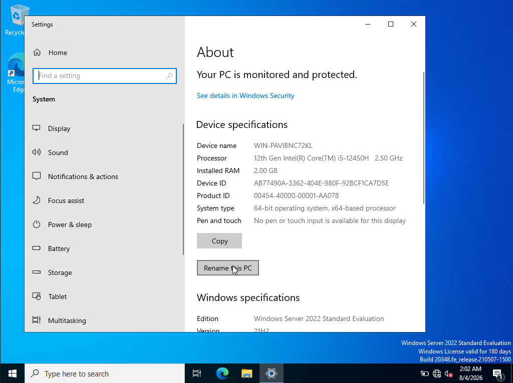
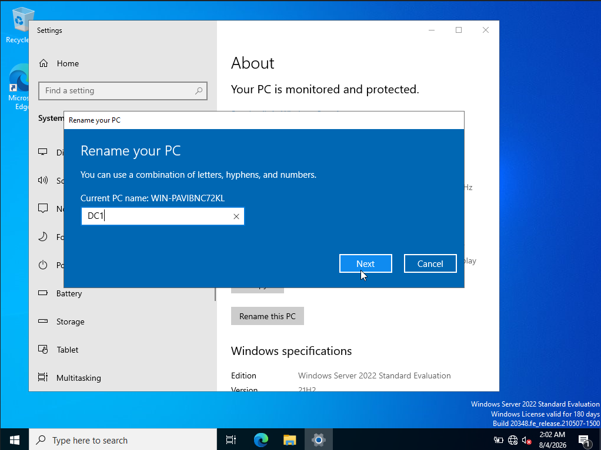
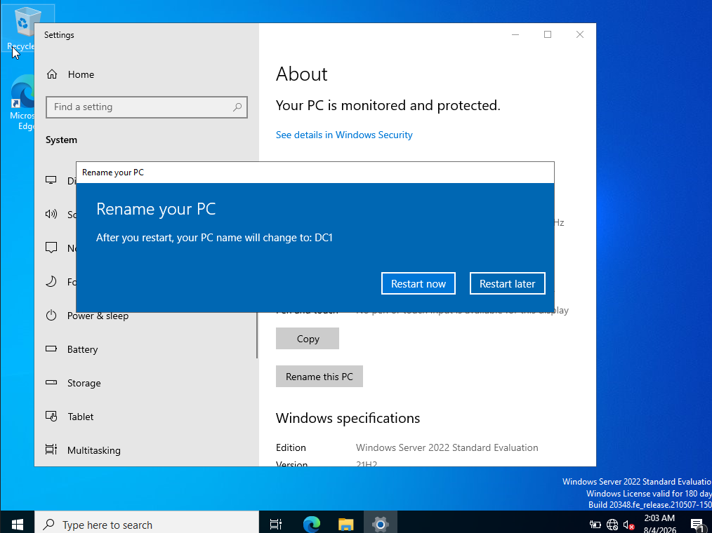
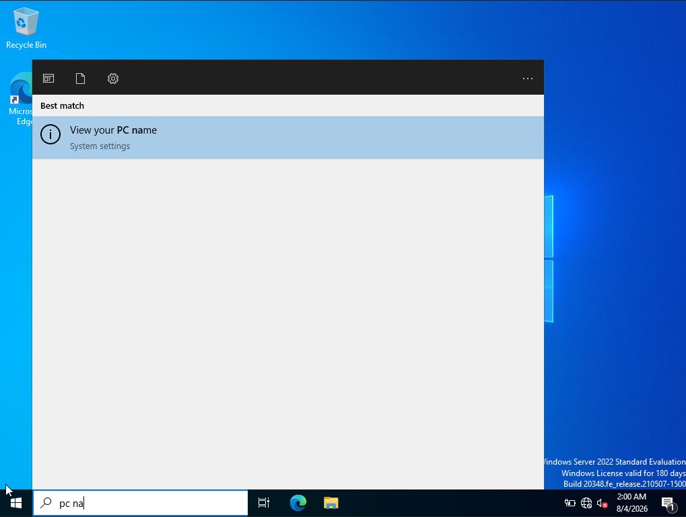

# DC-Server — Rename the Windows Server to `DC1`

> **Lab:** Windows Server 2022  
> **Purpose:** Rename the server before configuring it as a Domain Controller.  
> **Target computer name:** `DC1`

---

## 1. Why Rename the Server?

Before configuring Active Directory, it is useful to give the server a meaningful hostname.

In this lab, the server is renamed from the automatically generated name:

```text
WIN-PAVIBNC72KL
```

to:

```text
DC1
```

`DC1` is used as the hostname for the first Domain Controller in the lab.

A clear naming convention makes an Active Directory environment easier to understand and manage, particularly when multiple Domain Controllers, member servers, and workstations are added later.

---

# 2. Open Windows Settings

Open:

```text
Settings
    |
    └── System
        |
        └── About
```

The **About** page displays the current device information.



The screenshot shows the current computer name as:

```text
WIN-PAVIBNC72KL
```

The system is running:

```text
Windows Server 2022 Standard Evaluation
```

Locate:

```text
Rename this PC
```

Click it to begin changing the hostname.

---

# 3. Rename the PC

The **Rename your PC** dialog appears.



The current computer name is shown as:

```text
WIN-PAVIBNC72KL
```

Enter the new computer name:

```text
DC1
```

The dialog indicates that the computer name can contain a combination of:

```text
Letters
Hyphens
Numbers
```

For this lab, enter:

```text
DC1
```

Click:

```text
Next
```

---

# 4. Restart the Server

Windows informs you that the computer name will change after a restart.



The dialog displays:

```text
After you restart, your PC name will change to DC1
```

Two options are available:

```text
Restart now
Restart later
```

Choose:

```text
Restart now
```

The server will reboot and apply the new hostname.

---

# 5. Verify the New Computer Name

After the server restarts, open Windows Search.

Search for:

```text
PC name
```

The search result should display:

```text
View your PC name
```



Open:

```text
View your PC name
```

This takes you back to the system information where the new hostname can be verified.

The expected computer name is:

```text
DC1
```

---

# 6. Verification from PowerShell

The hostname can also be verified from PowerShell.

Run:

```powershell
hostname
```

Expected output:

```text
DC1
```

You can also use:

```powershell
$env:COMPUTERNAME
```

Expected output:

```text
DC1
```

Another useful command is:

```powershell
Get-ComputerInfo | Select-Object CsName
```

Expected result:

```text
CsName
------
DC1
```

---

# 7. Verification Checklist

```text
[+] Opened Settings
[+] Navigated to System → About
[+] Identified the original hostname
[+] Selected Rename this PC
[+] Changed hostname to DC1
[+] Confirmed the new name
[+] Restarted the server
[+] Verified the hostname after reboot
```

---

# 8. Final State

The server should now have:

```text
Computer Name:
    DC1

Operating System:
    Windows Server 2022 Standard Evaluation
```

The server is now ready for the next Active Directory preparation/configuration stage.

---

## Status

```text
PC HOSTNAME CONFIGURATION: COMPLETE
CURRENT HOSTNAME: DC1
```
