# Active Directory — Users, Groups & Organizational Units

> **Lab:** Windows Server 2022 / Active Directory Domain Services  
> **Domain:** `evil.corp`  
> **Tool:** Active Directory Users and Computers (ADUC)

---

## 1. Objective

This section documents the configuration of:

- Active Directory Users
- Organizational Units (OUs)
- Security Groups
- User accounts
- Password settings
- User/group organization

The screenshots show the work being performed from **Active Directory Users and Computers**.

---

# 2. Open Active Directory Users and Computers

From **Server Manager**, open:

```text
Tools
    └── Active Directory Users and Computers
```

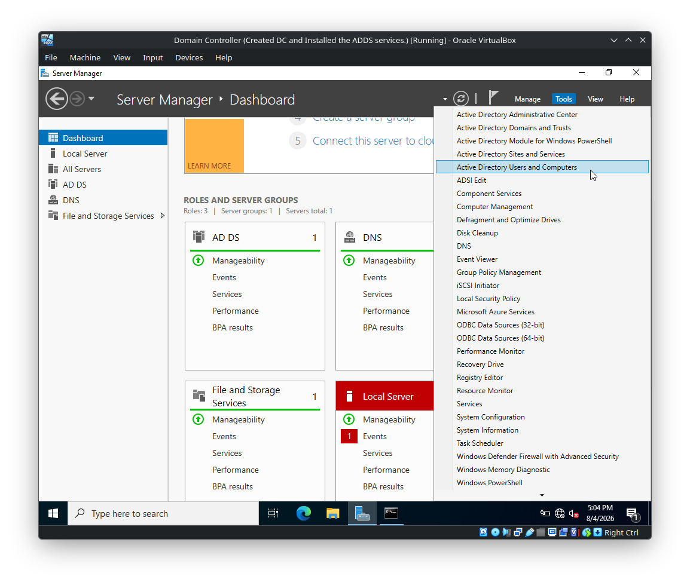

The ADUC console provides a graphical interface for managing domain objects such as:

```text
Users
Groups
Computers
Organizational Units
Domain Controllers
```

The lab domain visible in the console is:

```text
evil.corp
```

---

# 3. Inspect the Domain Structure

Expand:

```text
evil.corp
```

The domain contains the standard Active Directory containers/OUs, including:

```text
Builtin
Computers
Domain Controllers
ForeignSecurityPrincipals
Managed Service Accounts
Users
```

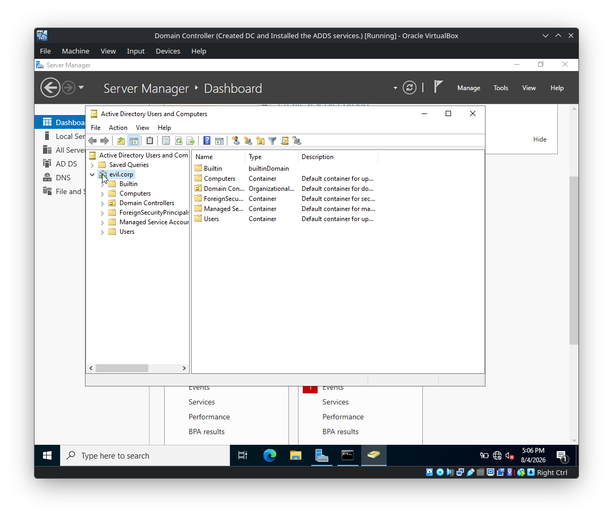

These containers provide the initial structure created when the domain is established.

---

# 4. Create an Organizational Unit

Organizational Units are used to logically organize objects in Active Directory.

Right-click the domain:

```text
evil.corp
```

Then select:

```text
New
    └── Organizational Unit
```

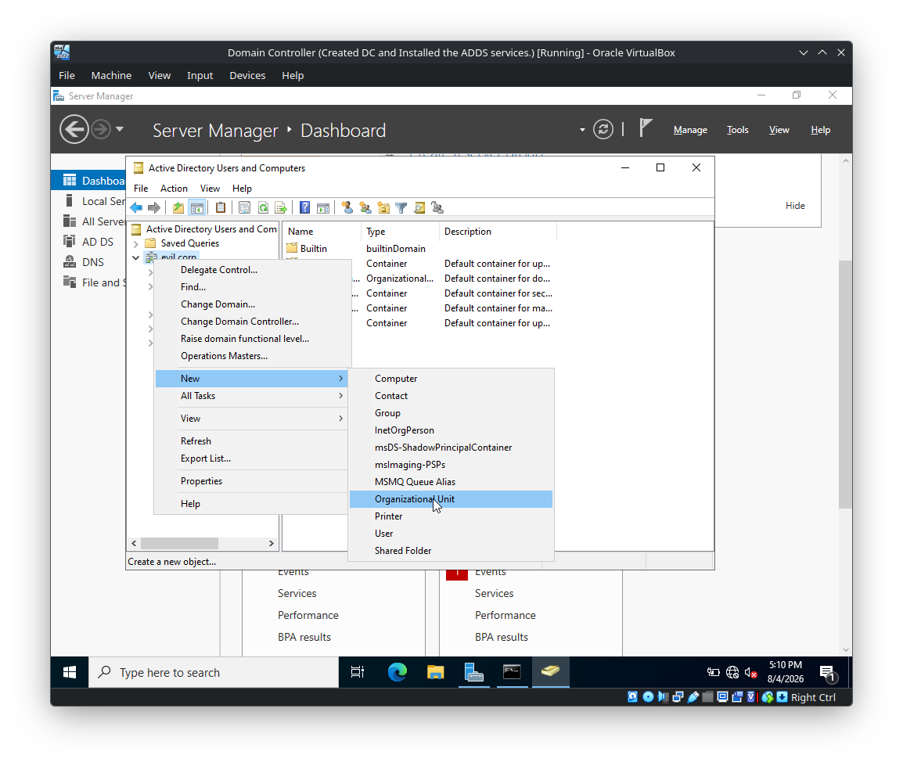

Enter the OU name:

```text
Groups
```

The screenshot shows the **Protect container from accidental deletion** option enabled.

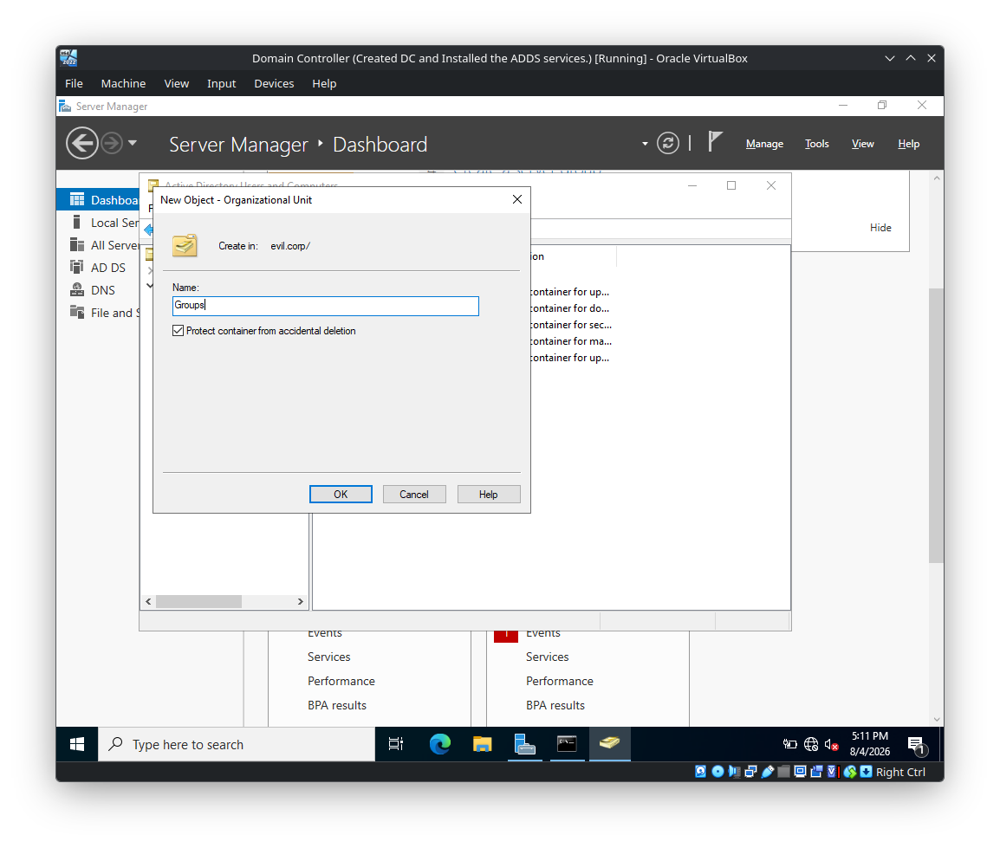

Click:

```text
OK
```

The new OU will appear under the domain.

---

# 5. Create a Group

The lab also demonstrates creating a group object.

Right-click the appropriate Active Directory container and select:

```text
New
    └── Group
```

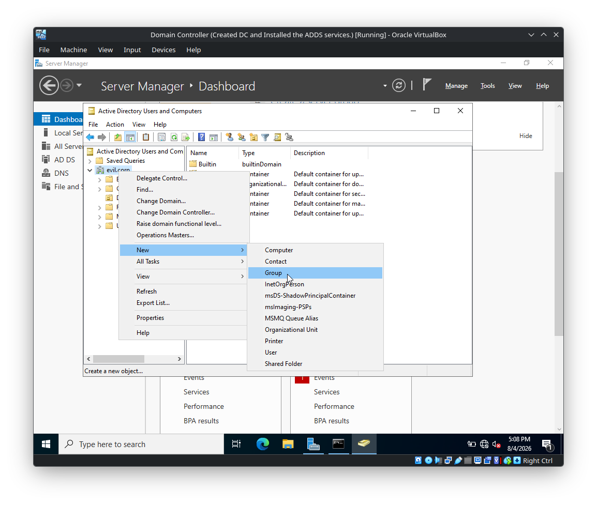

The group can then be used to organize users and assign permissions collectively rather than configuring permissions individually for every account.

The created group objects can be viewed from the relevant container.

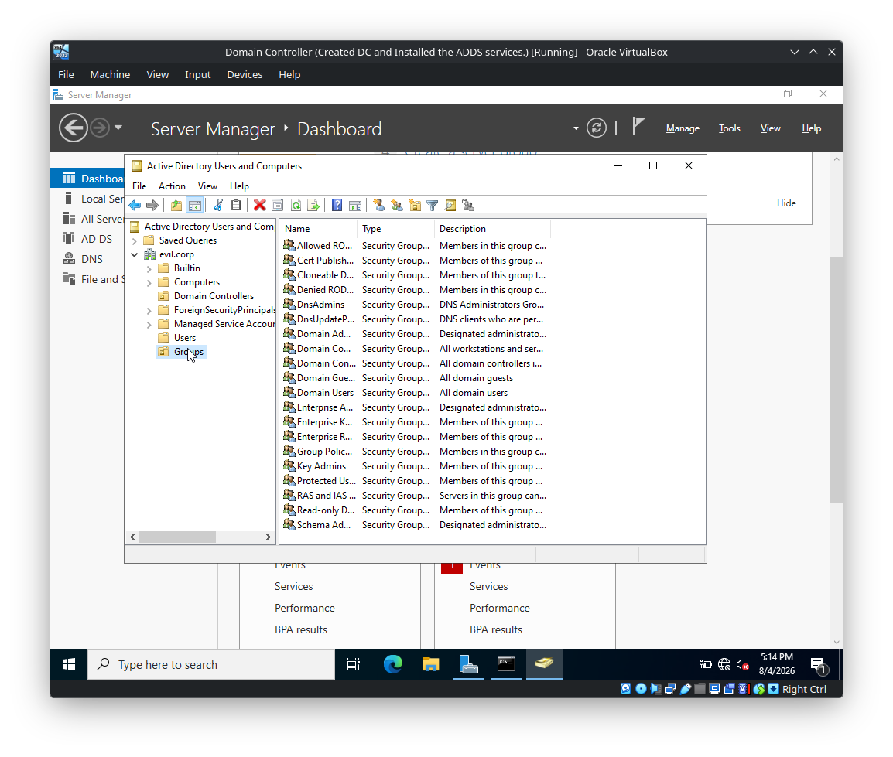

---

# 6. Create a User

To create a user manually, navigate to:

```text
evil.corp
    └── Users
```

Right-click the `Users` container and select:

```text
New
    └── User
```

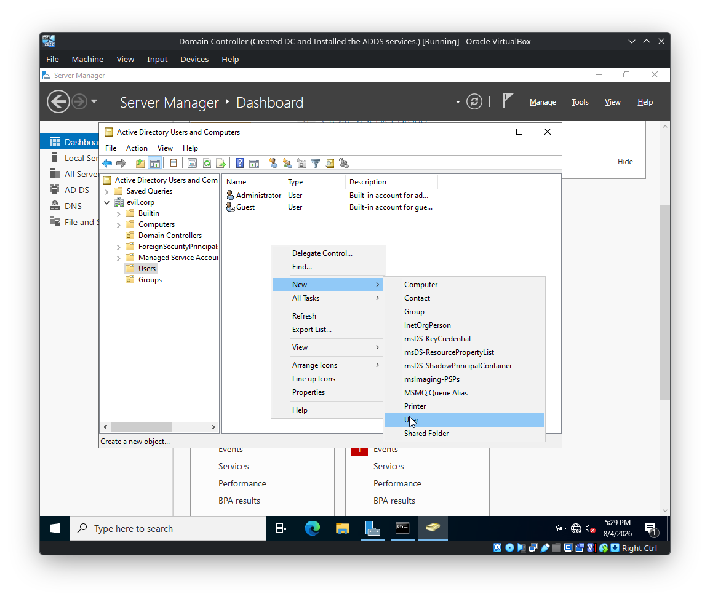

The **New Object - User** wizard opens.

Enter the user's identity information.

---

# 7. Create the Gideon Goddard Account

The screenshots show a user being created for:

```text
First name: Gideon
Last name: Goddard
Full name: Gideon Goddard
```

The logon name is:

```text
ggideon
```

with the domain suffix:

```text
@evil.corp
```


The resulting UPN is therefore:

```text
ggideon@evil.corp
```

Continue through the wizard to configure the password.

---

# 8. Configure the User Password

The password configuration page provides several account options.


The available options shown include:

```text
User must change password at next logon
User cannot change password
Password never expires
Account is disabled
```

For this lab configuration, the screenshot shows:

```text
Password never expires
```

enabled.

> **Lab note:** `Password never expires` is useful in controlled lab environments, but it is generally a poor production security practice for ordinary user accounts. In a real enterprise, password policy and account lifecycle controls should be governed centrally.

---

# 9. Copy an Existing User Account

ADUC can also create a new user by copying an existing user object.

In the lab, the built-in:

```text
Administrator
```

account is selected.

Right-click it and choose:

```text
Copy...
```

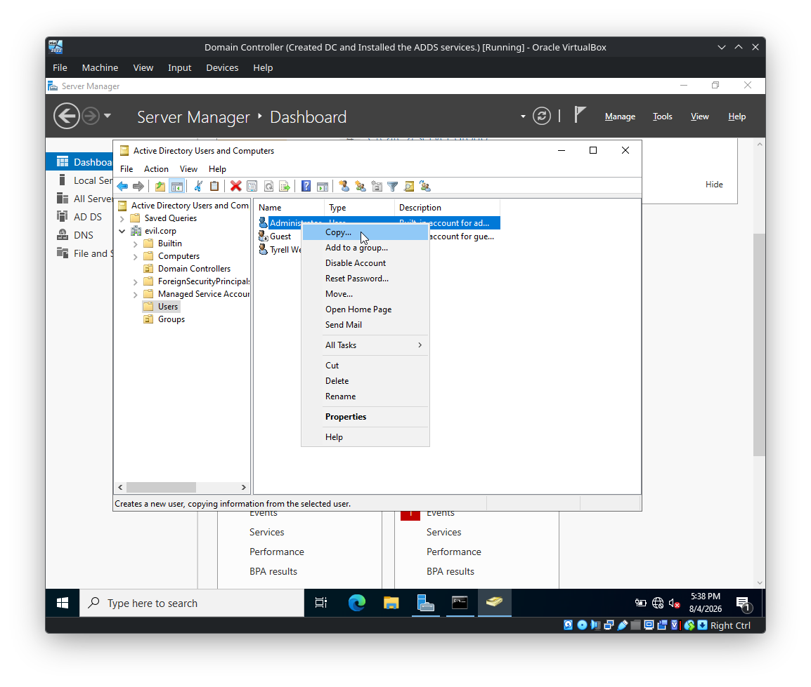

This opens the **Copy Object - User** wizard.

The benefit of copying an existing account is that selected account properties and group memberships can be reused instead of configuring every attribute manually.

---

# 10. Create the Terry Colby Account

The copied account is configured with:

```text
First name: Terry
Last name: Colby
Full name: Terry Colby
```

The user logon name is:

```text
tcolby
```

with:

```text
@evil.corp
```

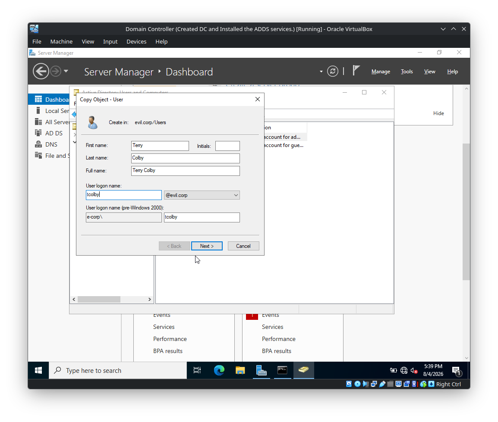

The resulting UPN is:

```text
tcolby@evil.corp
```

Proceed to the password configuration stage.


The wizard then presents a summary before the account is created.


Click:

```text
Finish
```

to create the account.

---

# 11. Create the SQL Service Account

The screenshots also show a service-oriented account being created using:

```text
First name: SQL
Last name: Service
Full name: SQL Service
```

The logon name is:

```text
SQLService
```

with the domain suffix:

```text
@evil.corp
```


The resulting UPN is:

```text
SQLService@evil.corp
```

This type of account can be used in a lab to represent a service account.

> **Security note:** In production environments, service accounts should be designed carefully. Modern Windows environments can use technologies such as Group Managed Service Accounts (gMSA) where appropriate, rather than relying on ordinary user accounts with static passwords.

---

# 12. Create the Tyrell Wellick Account

Another user created in the lab is:

```text
First name: Tyrell
Last name: Wellick
Full name: Tyrell Wellick
```

The username is:

```text
tyrell
```


The resulting UPN is:

```text
tyrell@evil.corp
```

The final wizard page confirms the account details before creation.


Click:

```text
Finish
```

to create the account.

---

# 13. View the Users Container

After creating the accounts, return to:

```text
evil.corp
    └── Users
```

The Users container can be used to verify the created objects.

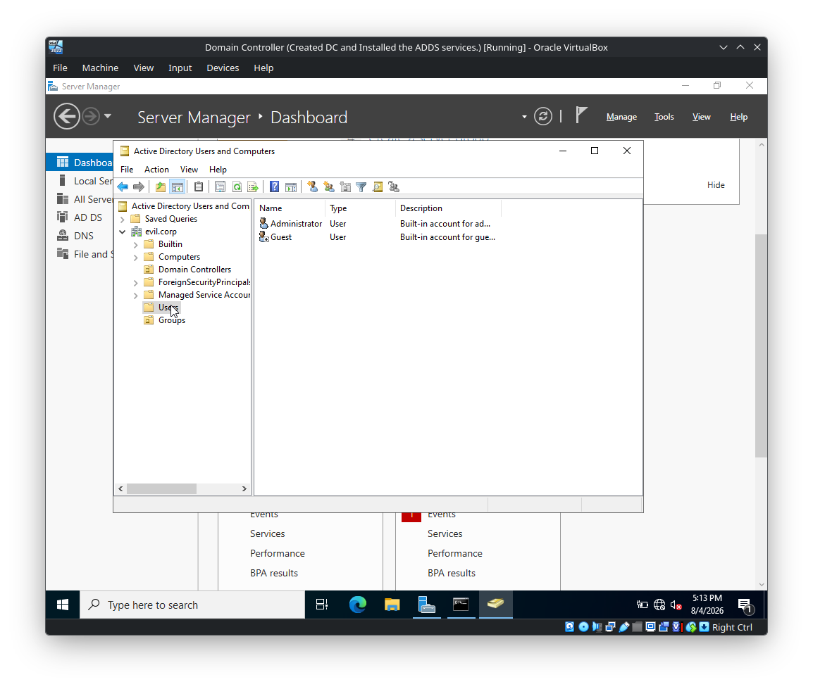

The screenshots show the default accounts as well as the newly created lab users.

---

# 14. Moving Objects Between Containers

Active Directory objects can be moved between suitable containers/OUs.

For example, objects can be selected and moved to the appropriate OU to improve organization.

When moving an object, ADUC may display a warning similar to:

> Moving objects in Active Directory Domain Services can affect how the environment works, including how Group Policy is applied.

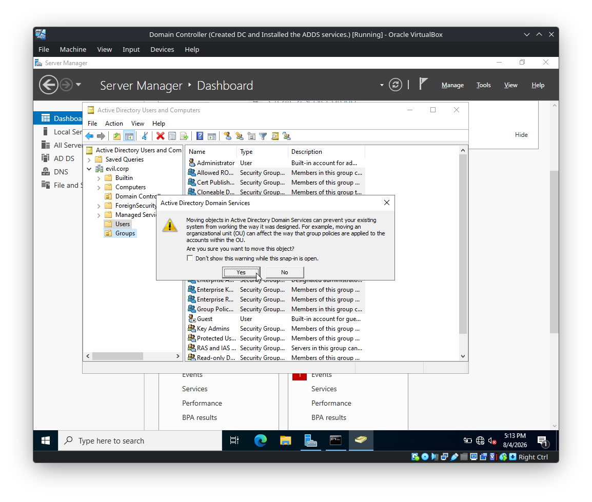

Review the warning and select:

```text
Yes
```

when the move is intentional.

---

# 15. Group Membership and Multiple Selection

The lab also demonstrates selecting multiple group objects.

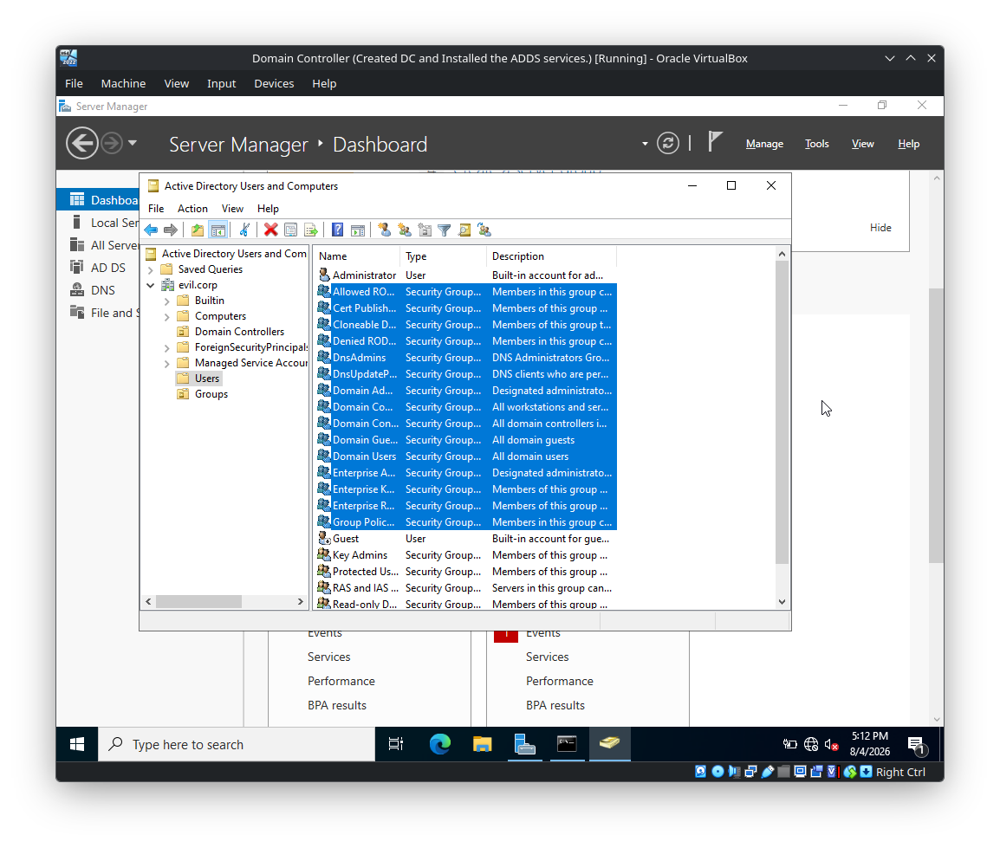

This is useful when working with several objects at once.

For security administration, remember the distinction between:

```text
User
    ↓
Group membership
    ↓
Permissions / access
```

A common Active Directory administration pattern is to assign permissions to groups and then manage membership of those groups rather than assigning permissions individually to every user.

---

# 16. Important Active Directory Concepts

### User

Represents an identity that can authenticate to the domain.

Example:

```text
tcolby@evil.corp
```

### Group

A collection of security principals used to simplify access control and administration.

### Organizational Unit (OU)

A logical container used to organize objects and apply management controls such as Group Policy.

### User Container

The default `Users` container contains built-in and newly created user objects.

### Group Membership

A user's effective access can depend heavily on their direct and nested group memberships.

---

# 17. Why This Matters for Security

Understanding ADUC is important for offensive security because many Active Directory attack paths involve relationships between:

```text
Users
    ↓
Groups
    ↓
ACLs
    ↓
OUs
    ↓
Group Policy
    ↓
Computers / Servers
```

During an authorized assessment, these relationships are commonly investigated for:

- Excessive group membership
- Privileged accounts
- Weak service-account practices
- Dangerous ACLs
- Misconfigured OUs
- Group Policy exposure
- Delegated administration
- Nested group relationships

A simple user-management task therefore becomes important when studying real Active Directory attack paths.

---

# 18. Verification Checklist

```text
[+] Opened Active Directory Users and Computers
[+] Inspected the evil.corp domain
[+] Created an Organizational Unit named Groups
[+] Created/inspected group objects
[+] Created a Gideon Goddard user
[+] Created a Terry Colby user
[+] Created a SQL Service account
[+] Created a Tyrell Wellick user
[+] Configured user passwords
[+] Practiced copying an existing user
[+] Reviewed object-move warnings
[+] Practiced working with multiple group objects
```

---

## Final State

The lab now contains an Active Directory environment with:

```text
Domain
└── evil.corp
    ├── Builtin
    ├── Computers
    ├── Domain Controllers
    ├── ForeignSecurityPrincipals
    ├── Managed Service Accounts
    ├── Users
    │   ├── Administrator
    │   ├── Guest
    │   ├── Gideon Goddard
    │   ├── Terry Colby
    │   ├── SQL Service
    │   └── Tyrell Wellick
    └── Groups
```

This provides the basic identity and object-management layer required for subsequent Active Directory security exercises.

---

## Status

```text
ACTIVE DIRECTORY USER MANAGEMENT: COMPLETE
OU CONFIGURATION: COMPLETE
GROUP MANAGEMENT PRACTICE: COMPLETE
USER ACCOUNT CONFIGURATION: COMPLETE
```
