# Group Policy Management

## Overview

**Group Policy Management (GPMC)** is used in an Active Directory domain to create, edit, link, and manage **Group Policy Objects (GPOs)**.

In this lab, a GPO named **Disabled Windows Defender** is created and linked to the `evil.corp` domain. The GPO is then configured to turn off Microsoft Defender Antivirus.

> **Lab note:** Disabling Defender is appropriate only for an isolated training environment. Do not apply this configuration to production systems.

---

## 1. Open Group Policy Management 

From **Server Manager**, search for:

**Group Policy Management**

The Group Policy Management console provides the management view for the Active Directory forest and its domains.


---

## 2. Understand the GPMC Structure

The console shows the Active Directory forest and domain:

```text
Forest: evil.corp
└── Domains
    └── evil.corp
```

The domain contains objects such as:

- Default Domain Policy
- Domain Controllers
- Groups
- Group Policy Objects
- WMI Filters
- Starter GPOs

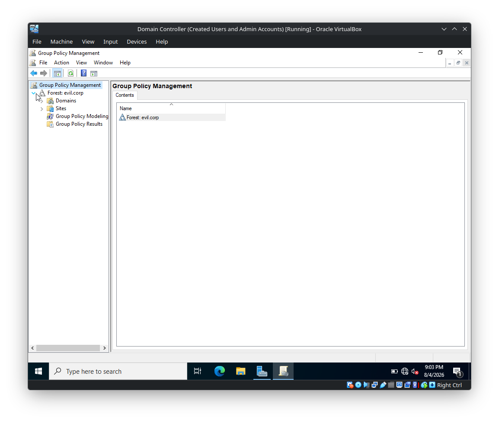

### Important GPMC objects

| Object | Purpose |
|---|---|
| **Domain** | Scope at which domain-level GPOs can be linked |
| **Group Policy Objects** | Repository containing GPOs |
| **Organizational Unit (OU)** | Container to organize users/computers and apply policies |
| **WMI Filters** | Apply a GPO only when a specific WMI condition matches |
| **Starter GPOs** | Templates used when creating new GPOs |

---

## 3. Create a New GPO

Right-click the domain `evil.corp` and select:

**Create a GPO in this domain, and Link it here...**

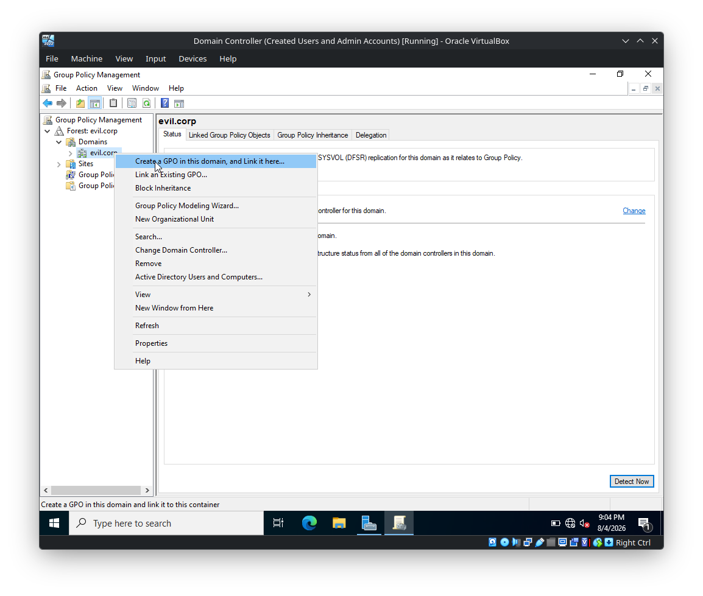

This creates the GPO and simultaneously creates a **link** from the selected domain to that GPO.

### Name the GPO

Use:

```text
Disabled Windows Defender
```

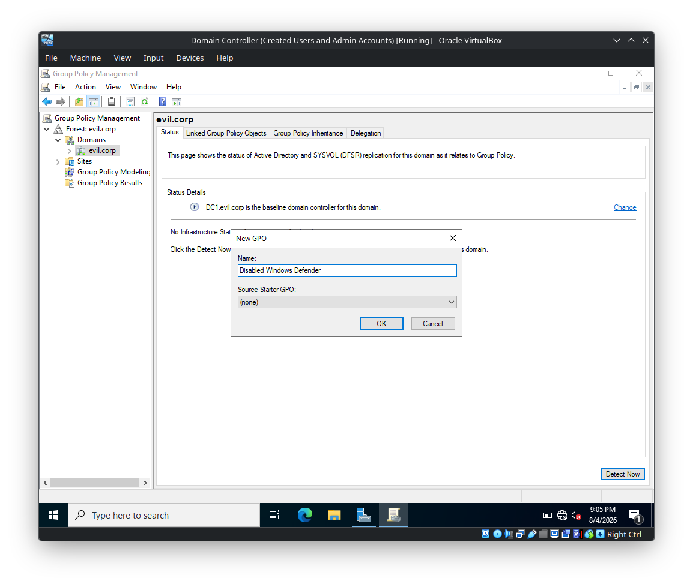

The important distinction is:

```text
GPO
│
├── Contains policy settings
│
└── Link
    └── Determines where the GPO is applied
```

A GPO can exist without being linked. A link determines the domain, site, or OU where its settings can take effect.

---

## 4. Edit the GPO

After creating the GPO, right-click it and select:

**Edit**

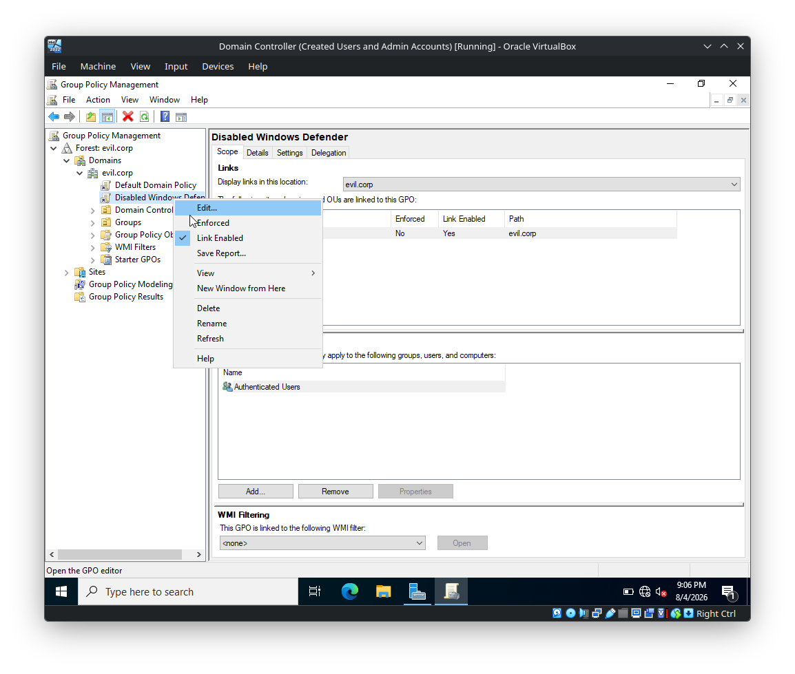

This opens the **Group Policy Management Editor**.

The editor separates policy settings into:

```text
Computer Configuration
└── Policies
    ├── Software Settings
    ├── Windows Settings
    └── Administrative Templates

User Configuration
└── Policies
    ├── Software Settings
    ├── Windows Settings
    └── Administrative Templates
```

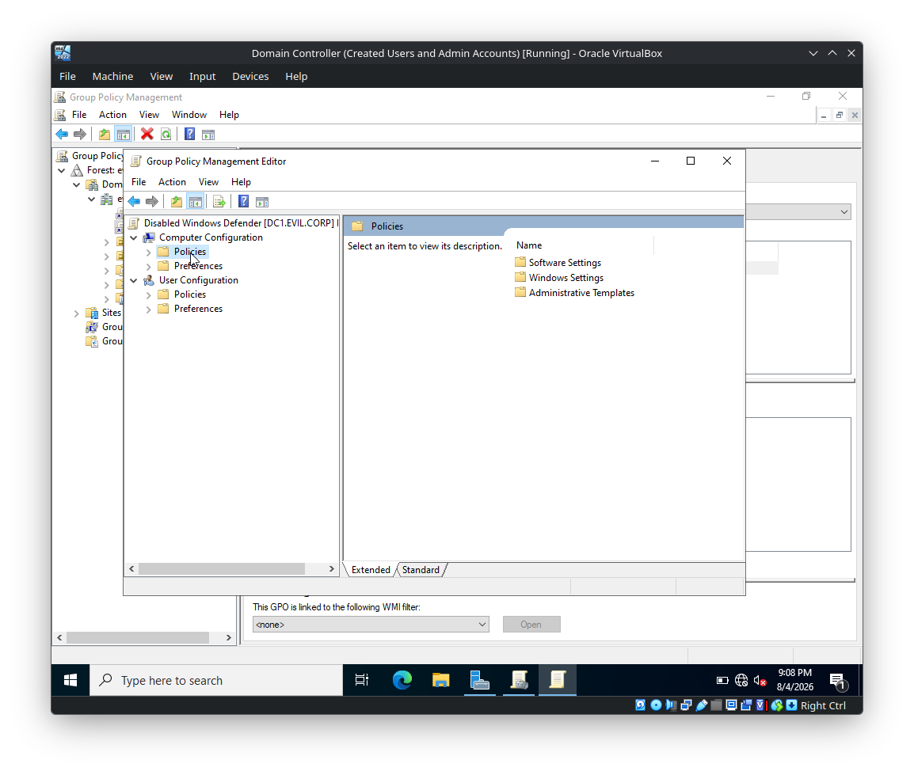

### Computer vs User Configuration

**Computer Configuration**

Applies to the computer regardless of which user logs in.

**User Configuration**

Applies to the user account regardless of which domain-joined computer they use.

This distinction is important during both AD administration and penetration testing because an attacker may abuse policy configuration depending on whether the target is a **computer-scoped** or **user-scoped** setting.

---

# 5. Administrative Templates

Navigate to:

```text
Computer Configuration
└── Policies
    └── Administrative Templates
```

Administrative Templates provide policy definitions for Windows components and applications.

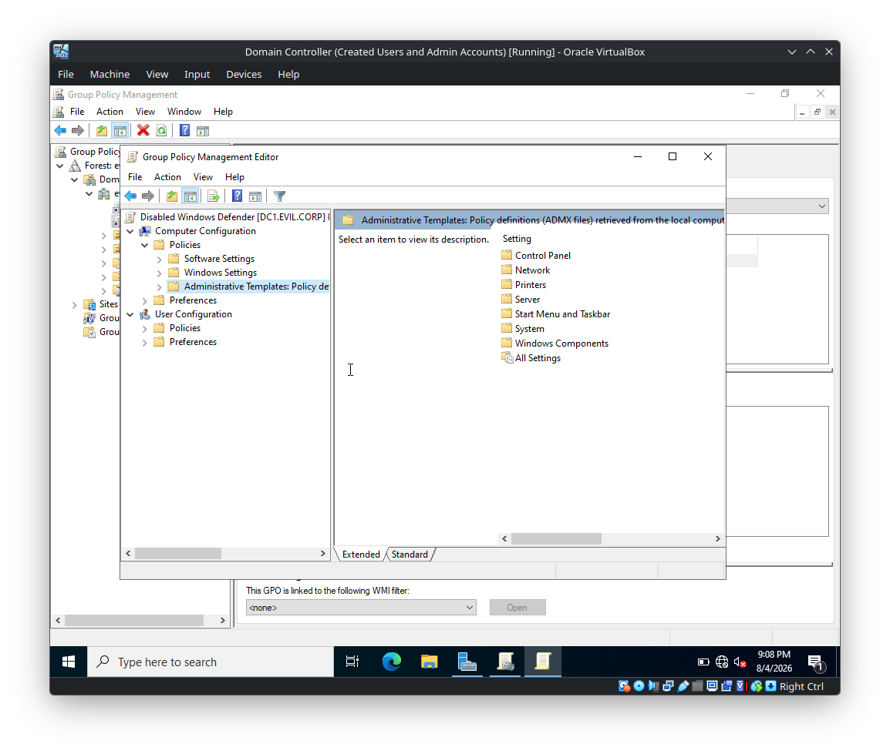

The screenshot shows categories including:

- Control Panel
- Network
- Printers
- Server
- Start Menu and Taskbar
- System
- Windows Components
- All Settings

These policies are backed by **ADMX/ADML policy-definition files**.

---

# 6. Configure Microsoft Defender Antivirus

Navigate through:

```text
Computer Configuration
└── Policies
    └── Administrative Templates
        └── Windows Components
            └── Microsoft Defender Antivirus
```

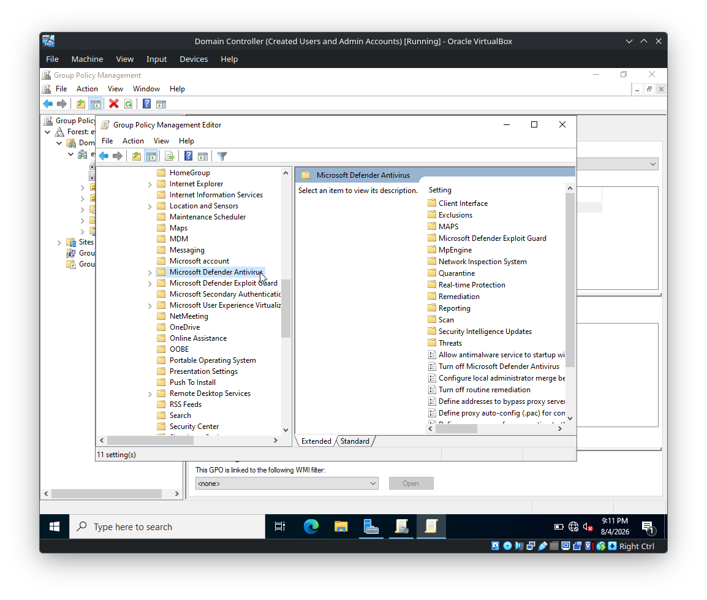

The Defender policy area contains settings related to:

- Client Interface
- Exclusions
- MAPS
- Microsoft Defender Exploit Guard
- MpEngine
- Network Inspection System
- Quarantine
- Real-time Protection
- Remediation
- Reporting
- Scan
- Security Intelligence Updates
- Threats

---

## 7. Turn Off Microsoft Defender Antivirus

Select:

**Turn off Microsoft Defender Antivirus**

Then configure the policy as:

```text
Enabled
```

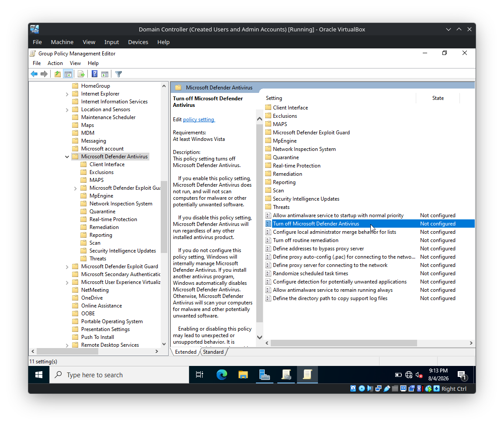

The policy description in the editor states that enabling this policy turns off Microsoft Defender Antivirus.

### Important terminology

This can initially look confusing:

```text
Policy: "Turn off Microsoft Defender Antivirus"

Enabled = Turn Defender OFF
Disabled = Do not apply the "turn off" policy
Not Configured = Leave the setting at its normal/default behavior
```

Therefore, **Enabled** here refers to enabling the *policy*, not enabling Defender.

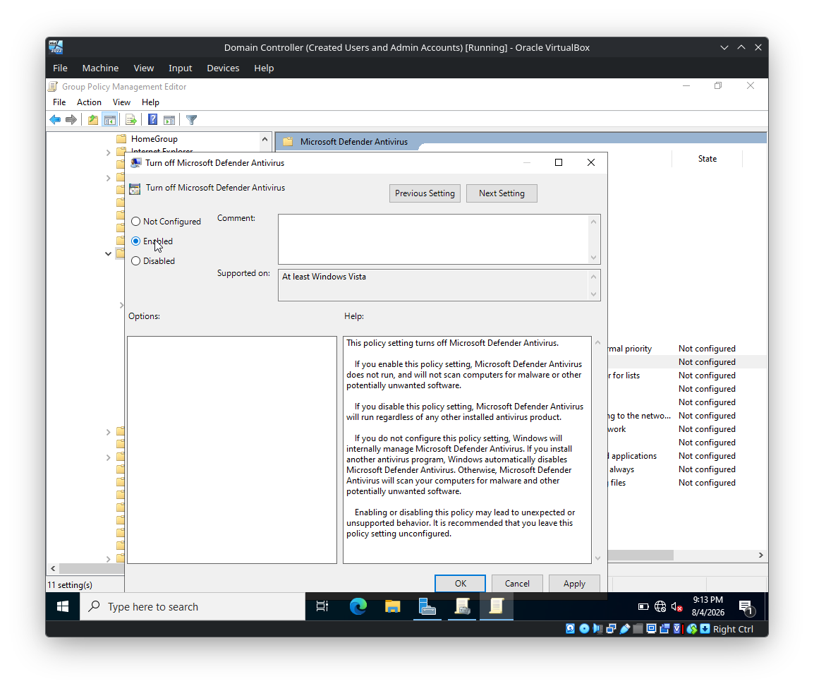

---

# 8. Microsoft Defender Exploit Guard

The screenshots also show the:

```text
Microsoft Defender Exploit Guard
```

section.

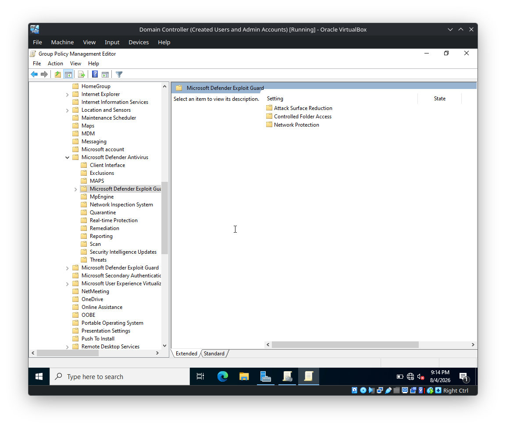

It contains areas such as:

- Attack Surface Reduction
- Controlled Folder Access
- Network Protection

These are separate Defender security controls. They should not be confused with the **Turn off Microsoft Defender Antivirus** policy.

---

# 9. GPO Linking

After the GPO is created, it appears under the domain as a linked GPO.

The GPO shown in the lab is:

```text
Disabled Windows Defender
```

with:

```text
Link Enabled: Yes
```

The security filtering shown is:

```text
Authenticated Users
```

This means the GPO is associated with the domain scope shown in the console and is eligible to apply according to normal GPO processing and filtering rules.

---

# 10. Enforced GPO

The screenshots show the GPO link configured with:

```text
Enforced: Yes
Link Enabled: Yes
```

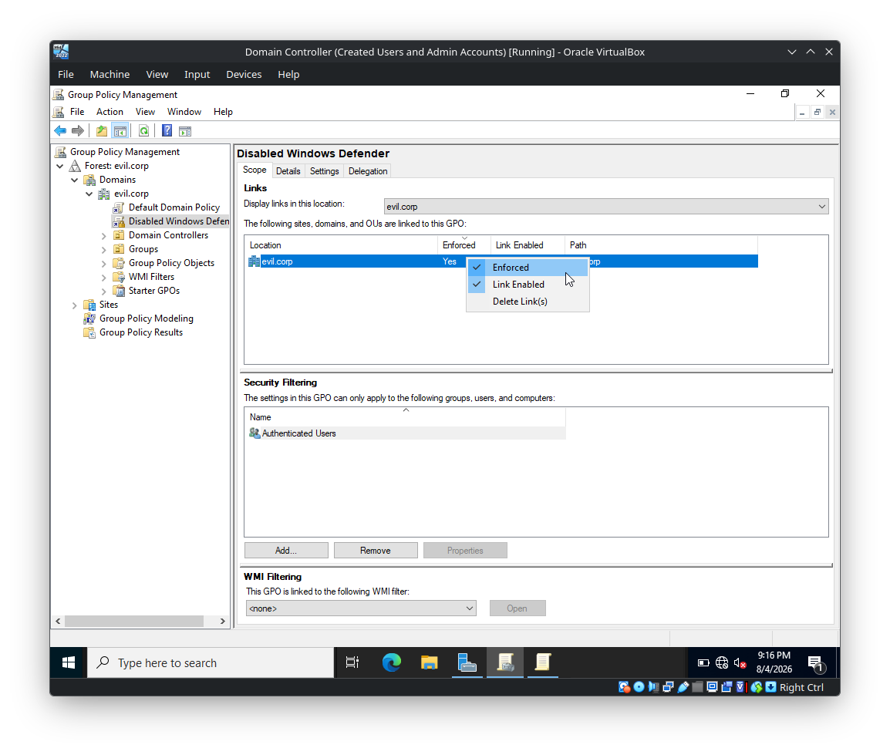

### Enforced vs Link Enabled

These are different concepts.

**Link Enabled**

Determines whether the GPO link is active.

```text
Link Enabled = No
        ↓
GPO link is disabled
```

**Enforced**

Controls how the linked GPO participates in Group Policy inheritance. An enforced GPO cannot normally be overridden by a conflicting GPO at a lower level in the hierarchy.

Conceptually:

```text
Higher-level GPO
       │
       ├── Enforced
       │
       ↓
Lower-level OU GPO
```

The enforced setting is therefore important when analyzing **GPO precedence and inheritance**.

---

# 11. Security Filtering

The GPO screenshot shows:

```text
Authenticated Users
```

under **Security Filtering**.

Security filtering controls which security principals are allowed to have the GPO apply to them.

Typical principals include:

- Users
- Computers
- Security groups

For example:

```text
GPO
 │
 └── Security Filtering
       │
       └── RedTeam-Lab
```

would restrict the GPO's scope to the relevant security principal(s), subject to the required permissions and other GPO processing rules.

---

# 12. GPO Processing Model

A simplified model for understanding Group Policy is:

```text
Active Directory
       │
       ▼
Site
       │
       ▼
Domain
       │
       ▼
Organizational Unit
       │
       ▼
Computer / User
```

A GPO must generally have an appropriate **link/scope** and the target must satisfy the relevant filtering and processing conditions before the settings take effect.

For a security practitioner, do not think of a GPO as simply "a configuration file." Think of it as:

```text
GPO
│
├── Policy settings
├── Scope / Link
├── Security filtering
├── WMI filtering (optional)
└── Precedence / inheritance
```

---

# 13. Why GPOs Matter in Active Directory Security

Group Policy is a major part of enterprise Windows administration and therefore a major part of **Active Directory security assessment**.

A security tester should understand:

- Where GPOs are linked
- Which users/computers receive them
- GPO inheritance
- GPO precedence
- Enforced links
- Security filtering
- Computer vs User Configuration
- Administrative Templates
- Restricted or privileged configuration
- Potentially dangerous policy settings
- Permissions over GPO objects

From an offensive-security perspective, excessive permissions over GPOs can become significant because a policy that affects many machines can provide a large attack surface.

From a defensive perspective, GPO permissions should follow **least privilege**, and high-impact policies should be carefully controlled and audited.

---

# 14. Lab Configuration Summary

The configuration demonstrated in the screenshots is:

```text
Domain:
    evil.corp

GPO:
    Disabled Windows Defender

GPO Link:
    evil.corp

Link:
    Enabled

Enforced:
    Yes

Security Filtering:
    Authenticated Users

Policy Location:
    Computer Configuration
    └── Policies
        └── Administrative Templates
            └── Windows Components
                └── Microsoft Defender Antivirus

Policy:
    Turn off Microsoft Defender Antivirus

Policy State:
    Enabled
```

---

# 15. Key Takeaways

1. **GPOs contain configuration policies; links determine where they apply.**
2. **Computer Configuration** targets computers, while **User Configuration** targets users.
3. **Administrative Templates** provide policy settings through ADMX/ADML definitions.
4. **Security Filtering** controls which security principals can receive a GPO.
5. **Link Enabled** and **Enforced** are different settings.
6. **Enforced** affects GPO inheritance and precedence.
7. A policy named **"Turn off Microsoft Defender Antivirus"** being set to **Enabled** means the *policy is enabled to turn Defender off*.
8. GPOs are operationally important and should be treated as a security-sensitive component of an Active Directory environment.
