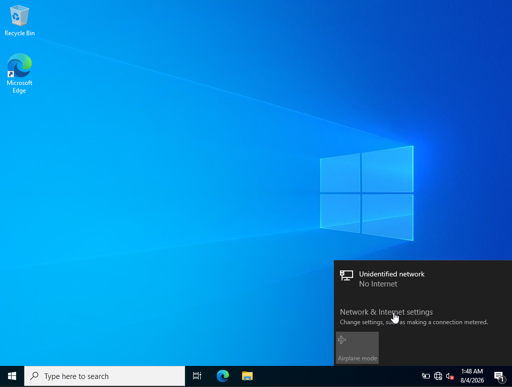
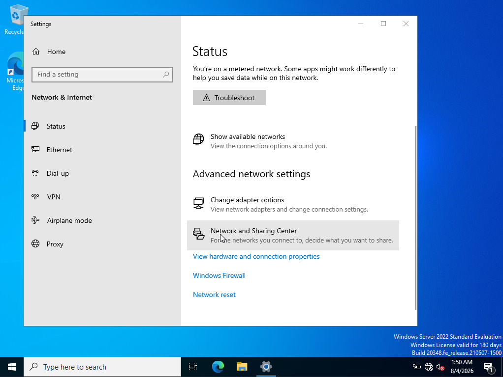
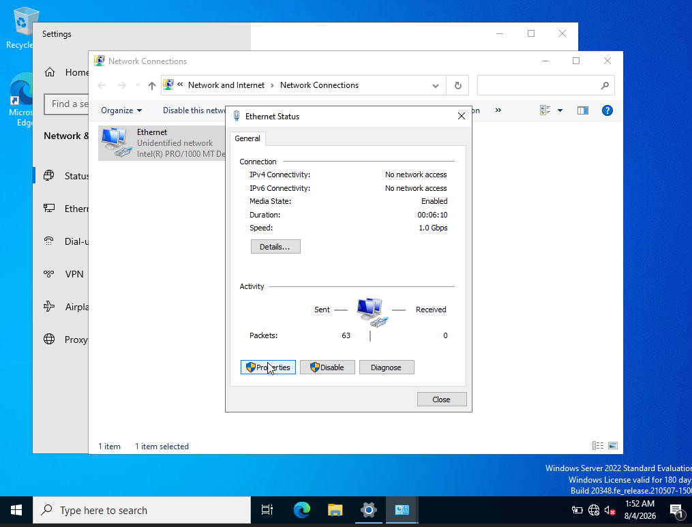
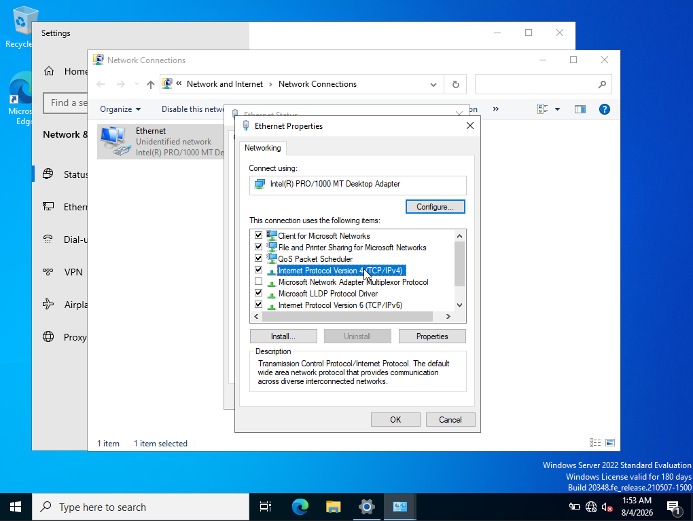
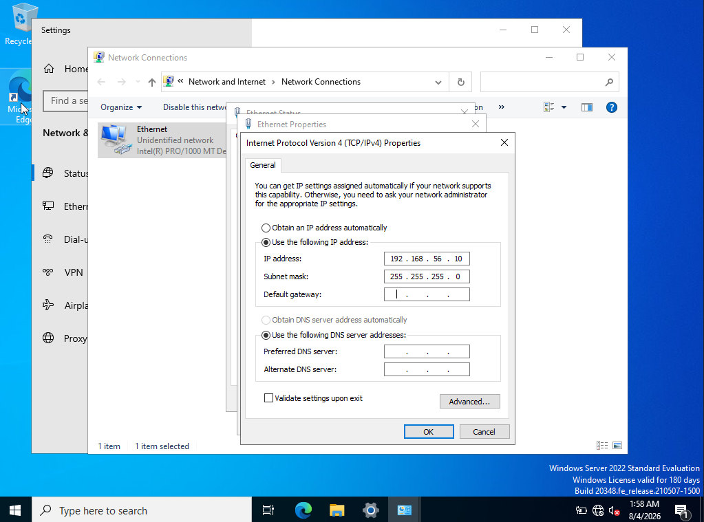
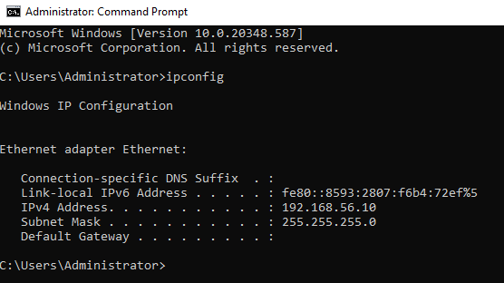
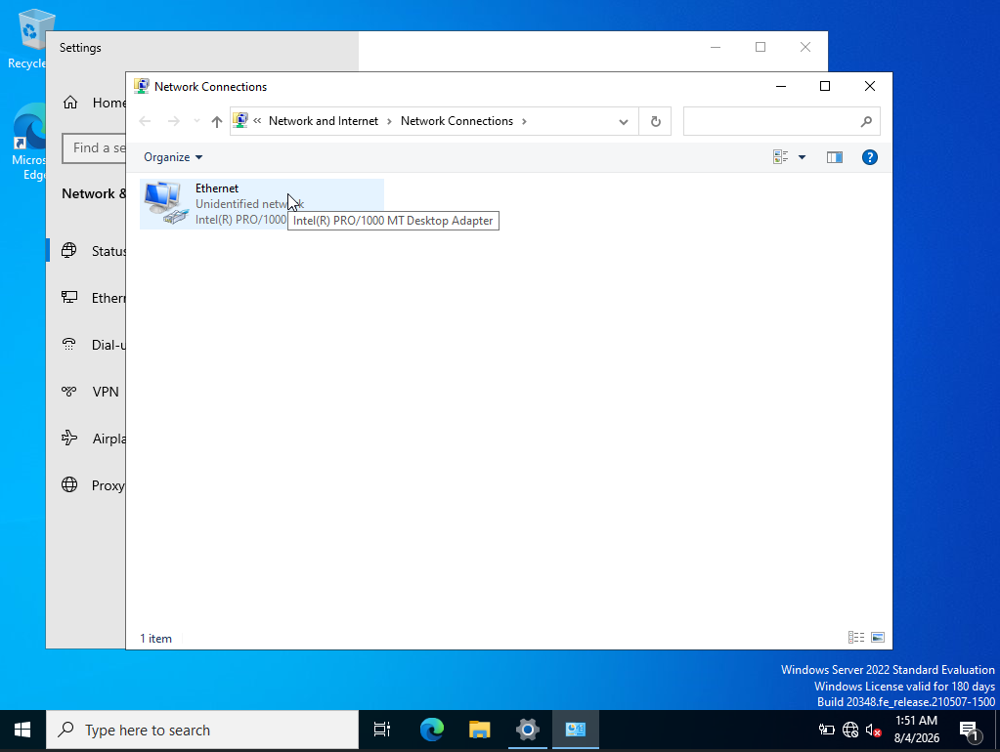

# Network Configuration

## Overview

This lab configures the Windows Server network adapter with a **static IPv4 address**.

The configuration demonstrated in the screenshots is:

```text
IPv4 Address : 192.168.56.10
Subnet Mask  : 255.255.255.0
Default Gateway : Not configured
DNS Servers     : Not configured
```

The server is using an **Intel(R) PRO/1000 MT Desktop Adapter**.

> **Lab note:** The screenshots show an `Unidentified network` and no Internet access. This is consistent with an isolated lab adapter such as a host-only/internal VirtualBox network.

---

# 1. Open Network Settings

Open:

```text
Settings
└── Network & Internet
    └── Status
```

From the Status page, select:

**Change adapter options**



This opens the traditional **Network Connections** window.

---

# 2. Identify the Ethernet Adapter

The Network Connections window shows:

```text
Ethernet
└── Unidentified network
    └── Intel(R) PRO/1000 MT Desktop Adapter
```



The adapter is enabled and represents the virtual Ethernet interface connected to the lab network.

### Why this matters

In a Windows/Active Directory lab, the server's network interface must have predictable addressing and connectivity because services such as:

- Active Directory Domain Services
- DNS
- Kerberos
- LDAP
- SMB
- RPC

depend heavily on network communication.

---

# 3. Open Ethernet Properties

Right-click the **Ethernet** adapter and select:

**Properties**



The Ethernet Properties window lists the protocols and services bound to the network interface.

Important entries include:

```text
Client for Microsoft Networks
File and Printer Sharing for Microsoft Networks
QoS Packet Scheduler
Internet Protocol Version 4 (TCP/IPv4)
Microsoft Network Adapter Multiplexor Protocol
Microsoft LLDP Protocol Driver
Internet Protocol Version 6 (TCP/IPv6)
```

---

# 4. Configure IPv4

Select:

**Internet Protocol Version 4 (TCP/IPv4)**

and click:

**Properties**



IPv4 is the protocol being configured in this lab.

---

# 5. Select a Static IP Address

In the IPv4 Properties window, select:

```text
Use the following IP address:
```

Then enter:

```text
IP address:
192.168.56.10

Subnet mask:
255.255.255.0
```

The screenshot shows the default gateway field left empty.



The corresponding configuration is:

| Setting | Value |
|---|---|
| IP address | `192.168.56.10` |
| Subnet mask | `255.255.255.0` |
| Default gateway | Not configured |
| Preferred DNS | Not configured |
| Alternate DNS | Not configured |

---

# 6. Understand the IP Address

The configured address is:

```text
192.168.56.10
```

This belongs to the private IPv4 address space:

```text
192.168.0.0/16
```

The subnet mask is:

```text
255.255.255.0
```

which corresponds to:

```text
/24
```

Therefore, the lab network is:

```text
Network:
192.168.56.0/24

Usable host range:
192.168.56.1 - 192.168.56.254

Broadcast:
192.168.56.255
```

The server is therefore located at:

```text
192.168.56.10/24
```

---

# 7. Why Use a Static IP for a Domain Controller?

A Domain Controller should normally have a predictable IP address.

Several Active Directory services depend on stable network addressing, particularly:

```text
Active Directory
      │
      ├── DNS
      ├── Kerberos
      ├── LDAP
      ├── SMB
      └── RPC
```

If the Domain Controller's address changes unexpectedly, clients may no longer be able to reliably locate services.

For an AD lab, static addressing therefore makes the environment easier to manage and troubleshoot.

---

# 8. Default Gateway

The screenshot leaves:

```text
Default gateway:
[empty]
```

A default gateway is used when a host needs to communicate with networks outside its local subnet.

For example:

```text
192.168.56.10/24
       │
       ├── 192.168.56.20
       └── 192.168.56.30
             ↓
       Same local subnet
```

Traffic to another network would normally require a router/default gateway.

In this isolated lab configuration, no gateway is configured.

### Practical consequence

The server can communicate with systems on the directly connected network, but the screenshot does not show a route configured for external networks.

---

# 9. DNS Configuration

The screenshot also leaves:

```text
Preferred DNS server:
[empty]

Alternate DNS server:
[empty]
```

This is an important point for an Active Directory environment.

The screenshots demonstrate the **IP configuration step**, but they do not show a DNS server being configured.

Therefore, do not treat this screenshot alone as proof that the final AD/DNS configuration is complete.

For an AD lab, DNS configuration should be verified separately.

---

# 10. Verify the Configuration with `ipconfig`

Open an elevated Command Prompt and run:

```cmd
ipconfig
```

The screenshot shows:

```text
Ethernet adapter Ethernet:

   Connection-specific DNS Suffix  . :
   Link-local IPv6 Address . . . . . : fe80::8593:2807:f6b4:72ef%5
   IPv4 Address. . . . . . . . . . . : 192.168.56.10
   Subnet Mask . . . . . . . . . . . : 255.255.255.0
   Default Gateway . . . . . . . . . :
```



The `ipconfig` output confirms the static IPv4 configuration shown in the GUI.

---

# 11. Ethernet Status

The Ethernet Status window shows:

```text
IPv4 Connectivity : No network access
IPv6 Connectivity : No network access
Media State       : Enabled
Speed             : 1.0 Gbps
```



The important distinction is:

```text
Media State: Enabled
```

does not mean:

```text
Internet access: Available
```

The adapter can be enabled while the network remains isolated or lacks a route to the Internet.

---

# 12. Understanding "Unidentified Network"

Windows identifies the connection as:

```text
Unidentified network
```

and the desktop network notification shows:

```text
Unidentified network
No Internet
```

This does not necessarily mean that the Ethernet adapter is broken.

It can occur in an isolated lab where:

- There is no Internet route.
- The network does not provide the expected network-identification information.
- The virtual adapter is connected to an isolated VirtualBox network.
- DNS/default gateway configuration is absent.

For an AD lab, lack of Internet access can be intentional.

---

# 13. Network Configuration Model

The resulting configuration can be represented as:

```text
                    Windows Server
                         │
                         │
              Intel PRO/1000 Adapter
                         │
                         ▼
                  192.168.56.10/24
                         │
                ┌────────┴────────┐
                │                 │
        192.168.56.20      192.168.56.30
        Lab machine        Lab machine
```

All hosts in the same `/24` subnet can communicate directly at Layer 2/Layer 3, subject to firewall and other controls.

---

# 14. Useful Verification Commands

After configuring the address, verify the interface from the command line.

### Display IP configuration

```cmd
ipconfig
```

More detailed output:

```cmd
ipconfig /all
```

### Test local TCP/IP configuration

```cmd
ping 127.0.0.1
```

### Test the server's own address

```cmd
ping 192.168.56.10
```

### View the ARP cache

```cmd
arp -a
```

### View the routing table

```cmd
route print
```

### Display interface configuration

```cmd
netsh interface ipv4 show config
```

These commands are useful when troubleshooting an AD lab because they distinguish:

```text
Interface problem
      ↓
IP configuration problem
      ↓
Routing problem
      ↓
DNS problem
      ↓
Firewall/service problem
```

---

# 15. Troubleshooting Framework

When a Windows Server cannot communicate with another lab machine, troubleshoot from the bottom up.

## Layer 1 — Adapter

Check:

```text
Media State: Enabled
```

Verify that the virtual network adapter is connected.

---

## Layer 2 — Local Network

Check whether the systems are connected to the same VirtualBox network.

For example:

```text
Server:
192.168.56.10/24

Client:
192.168.56.20/24
```

Both belong to:

```text
192.168.56.0/24
```

---

## Layer 3 — IP Configuration

Run:

```cmd
ipconfig /all
```

Check:

- IPv4 address
- Subnet mask
- Default gateway
- DNS servers

---

## Layer 3 — Routing

Run:

```cmd
route print
```

Confirm that a route exists for the required destination.

---

## Layer 7 — DNS

For AD environments, verify DNS independently.

Useful commands include:

```cmd
nslookup
```

and:

```cmd
nslookup <domain-name>
```

The screenshots provided do not demonstrate this DNS verification step.

---

# 16. Network Configuration Summary

The lab configuration shown is:

```text
Adapter:
    Intel(R) PRO/1000 MT Desktop Adapter

Connection:
    Ethernet

Network:
    Unidentified network

IPv4:
    192.168.56.10

Subnet Mask:
    255.255.255.0 (/24)

Default Gateway:
    Not configured

DNS:
    Not configured in the shown screenshots

Connectivity:
    No Internet access shown

Link Speed:
    1.0 Gbps
```

---

# 17. Key Takeaways

1. **Static IP addressing** gives the Windows Server a predictable network identity.
2. `192.168.56.10/24` places the server on the `192.168.56.0/24` subnet.
3. `255.255.255.0` is equivalent to `/24`.
4. An enabled Ethernet adapter does not necessarily have Internet connectivity.
5. An **Unidentified network** can be expected in an isolated virtual lab.
6. The absence of a default gateway prevents normal routing to external networks.
7. The screenshots demonstrate IPv4 configuration but do **not** demonstrate a completed DNS configuration.
8. For Active Directory labs, verify **IP → routing → DNS → AD services** separately.
9. `ipconfig /all`, `route print`, `arp -a`, and `nslookup` are practical troubleshooting tools worth knowing rather than relying only on the GUI.

---

## Quick Reference

```text
Settings
  ↓
Network & Internet
  ↓
Status
  ↓
Change adapter options
  ↓
Ethernet
  ↓
Properties
  ↓
Internet Protocol Version 4 (TCP/IPv4)
  ↓
Properties
  ↓
Use the following IP address
  ↓
192.168.56.10
255.255.255.0
```
