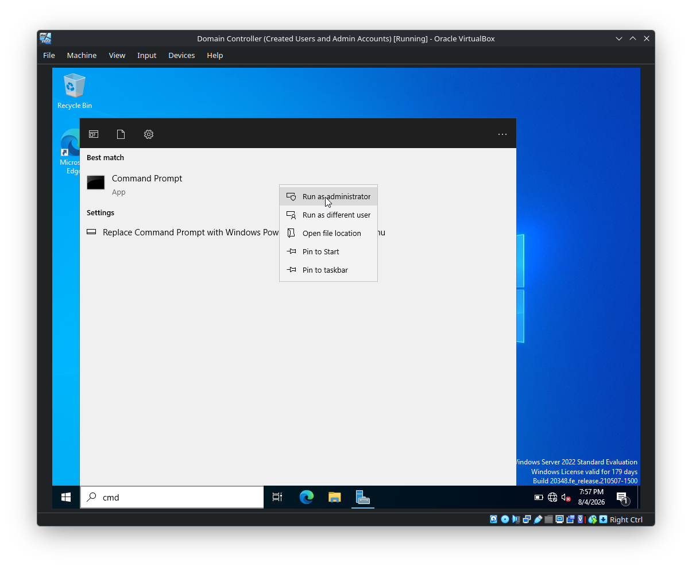
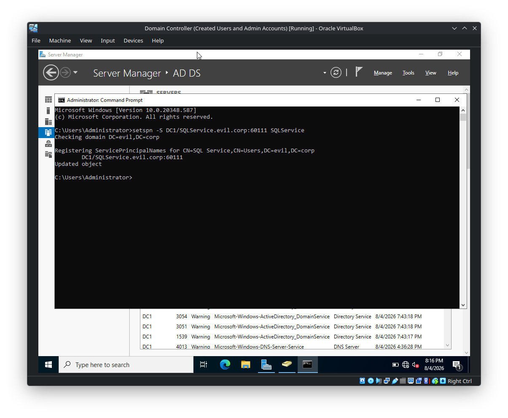
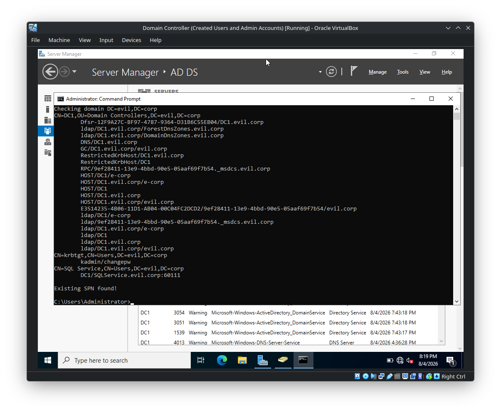
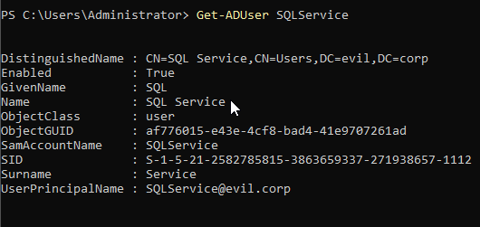

# Setting SQL Service Account and SPN

## Overview

This lab creates/uses an Active Directory user named **SQL Service** and registers a **Service Principal Name (SPN)** for the SQL service.

The screenshots demonstrate:

1. Opening an elevated Command Prompt.
2. Registering an SPN with `setspn`.
3. Verifying that the SPN already exists.
4. Verifying the `SQL_Service` Active Directory user with PowerShell.

The domain shown in the screenshots is:

```text
evil.corp
```

The Domain Controller is:

```text
DC1.evil.corp
```

---

# 1. Open Command Prompt as Administrator

Search for:

```text
cmd
```

Right-click **Command Prompt** and select:

```text
Run as administrator
```



An elevated Command Prompt is used because modifying Active Directory service principal names requires appropriate privileges.

---

# 2. Register the SQL Service SPN

The following command is executed:

```cmd
setspn -S DC1/SQLService.evil.corp:60111 SQLService
```



The command output shows:

```text
Checking domain DC=evil,DC=corp

Registering ServicePrincipalNames for
CN=SQL Service,CN=Users,DC=evil,DC=corp

        DC1/SQLService.evil.corp:60111

Updated object
```

This associates the SPN:

```text
DC1/SQLService.evil.corp:60111
```

with the AD account:

```text
CN=SQL Service,CN=Users,DC=evil,DC=corp
```

---

# 3. Understand the `setspn` Command

The command structure is:

```cmd
setspn -S <SPN> <account>
```

For this lab:

```text
setspn
  │
  ├── -S
  │     Register the SPN and check for duplicates
  │
  ├── DC1/SQLService.evil.corp:60111
  │     The SPN being registered
  │
  └── SQLService
        The AD account associated with the SPN
```

### SPN used

```text
DC1/SQLService.evil.corp:60111
```

It contains:

```text
Service class : DC1
Service name  : SQLService.evil.corp
Port          : 60111
```

The exact value above is the value shown in the lab screenshots.

---

# 4. What Is an SPN?

A **Service Principal Name (SPN)** is an identifier used by Kerberos to associate a network service with an Active Directory security principal.

Conceptually:

```text
Client
   │
   │ requests access to a service
   ▼
SPN
   │
   │ identifies the service account
   ▼
Active Directory Account
```

In this lab, the SPN is associated with:

```text
SQLService
```

This allows Kerberos to identify the security principal responsible for the registered service.

---

# 5. Verify the Existing SPN

The screenshot shows the output:

```text
Existing SPN found!

C:\Users\Administrator>
```



This indicates that the requested SPN is already present in Active Directory at the point shown in the screenshot.

The previously displayed SPN is:

```text
DC1/SQLService.evil.corp:60111
```

---

# 6. Inspect the SQL Service Account

PowerShell is used to query the account:

```powershell
Get-ADUser SQLService
```



The output shows:

```text
DistinguishedName : CN=SQL Service,CN=Users,DC=evil,DC=corp
Enabled           : True
GivenName         : 
Name              : SQL Service
ObjectClass       : user
ObjectGUID        : af776015-e43e-4cf8-bad4-41e9707261ad
SamAccountName    : SQLService
SID               : S-1-5-21-2582758515-3863659337-271938657-1112
Surname           : Service
UserPrincipalName : SQLService@evil.corp
```

The important fields for this lab are:

| Attribute | Value |
|---|---|
| Name | `SQL Service` |
| SamAccountName | `SQLService` |
| UPN | `SQLService@evil.corp` |
| Object class | `user` |
| Enabled | `True` |
| Distinguished Name | `CN=SQL Service,CN=Users,DC=evil,DC=corp` |

---

# 7. Relationship Between the Account and SPN

The lab establishes the following relationship:

```text
Active Directory
      │
      ▼
SQLService
      │
      │ associated SPN
      ▼
DC1/SQLService.evil.corp:60111
```

The account is:

```text
SQLService@evil.corp
```

and the registered SPN is:

```text
DC1/SQLService.evil.corp:60111
```

This association is the key configuration demonstrated by the lab.

---

# 8. Why the `-S` Option Matters

The command uses:

```cmd
setspn -S
```

rather than simply:

```cmd
setspn -A
```

The `-S` form checks for an existing duplicate SPN before adding it.

This is important because duplicate SPNs can cause Kerberos service-identification problems.

The screenshot later reports:

```text
Existing SPN found!
```

which demonstrates why checking the existing directory state matters before assuming that an SPN still needs to be created.

---

# 9. Useful SPN Verification Commands

The screenshots specifically demonstrate the registration command and `Get-ADUser`. The following commands are useful for inspecting SPNs during further lab work.

### Query SPNs for an account

```cmd
setspn -L SQLService
```

This lists the SPNs registered against the `SQLService` account.

### Search for a particular SPN

```cmd
setspn -Q DC1/SQLService.evil.corp:60111
```

This queries Active Directory for the specified SPN.

### Search for duplicate SPNs

```cmd
setspn -X
```

This checks the directory for duplicate SPNs.

---

# 10. Verify the AD User with PowerShell

The screenshot uses:

```powershell
Get-ADUser SQLService
```

For additional account attributes, the command can be expanded:

```powershell
Get-ADUser SQLService -Properties *
```

This is useful when investigating how an AD account is configured.

---

# 11. Configuration Summary

```text
Domain:
    evil.corp

Domain Controller:
    DC1.evil.corp

AD Account:
    SQLService

Account UPN:
    SQLService@evil.corp

Account DN:
    CN=SQL Service,CN=Users,DC=evil,DC=corp

SPN:
    DC1/SQLService.evil.corp:60111

Status shown:
    Account enabled
    SPN exists
```

---

# 12. Practical Workflow

The workflow demonstrated by the screenshots is:

```text
Open elevated CMD
        │
        ▼
Run setspn
        │
        ▼
Register/check SPN
        │
        ▼
Verify SPN state
        │
        ▼
Inspect SQLService account
        │
        ▼
Confirm account ↔ SPN relationship
```

Commands:

```cmd
setspn -S DC1/SQLService.evil.corp:60111 SQLService
```

```cmd
setspn -L SQLService
```

```cmd
setspn -Q DC1/SQLService.evil.corp:60111
```

PowerShell:

```powershell
Get-ADUser SQLService
```

---

# 13. Key Takeaways

1. An **SPN identifies a service instance to Kerberos**.
2. The lab associates the SQL service SPN with the `SQLService` AD account.
3. The SPN shown is:

   ```text
   DC1/SQLService.evil.corp:60111
   ```

4. The service account is:

   ```text
   SQLService@evil.corp
   ```

5. `setspn -S` is used to register an SPN while checking for duplicates.
6. `Existing SPN found!` means the requested SPN is already present.
7. `Get-ADUser SQLService` confirms the AD account and its attributes.
8. SPNs are an important part of understanding **Kerberos authentication and AD service identity**.

---

## Quick Reference

```text
Account
└── SQLService
      │
      └── SPN
          └── DC1/SQLService.evil.corp:60111

Domain
└── evil.corp

Domain Controller
└── DC1.evil.corp
```

### Commands

```cmd
setspn -S DC1/SQLService.evil.corp:60111 SQLService
setspn -L SQLService
setspn -Q DC1/SQLService.evil.corp:60111
setspn -X
```

```powershell
Get-ADUser SQLService
Get-ADUser SQLService -Properties *
```
