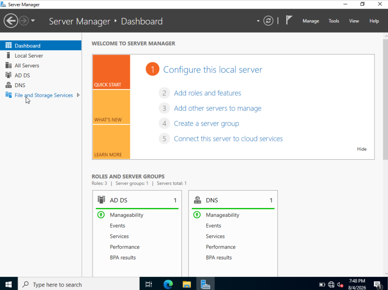
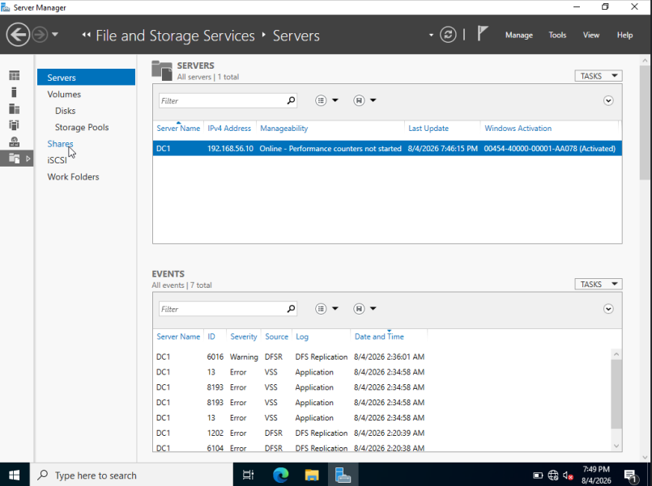
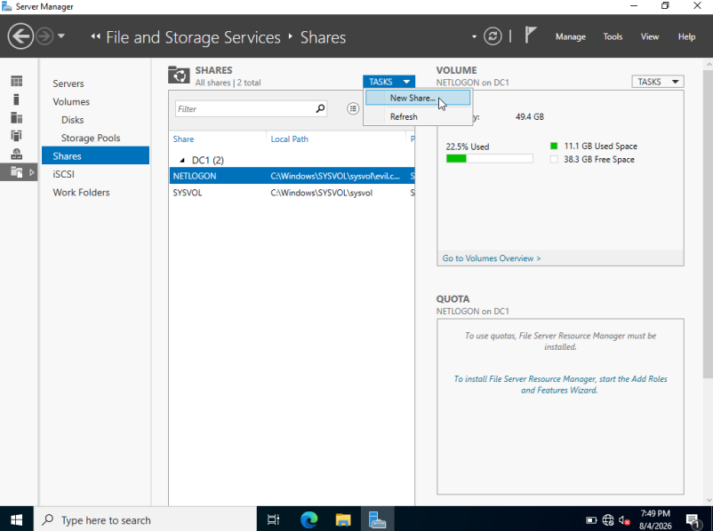
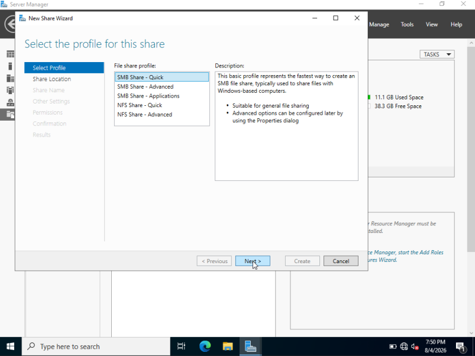
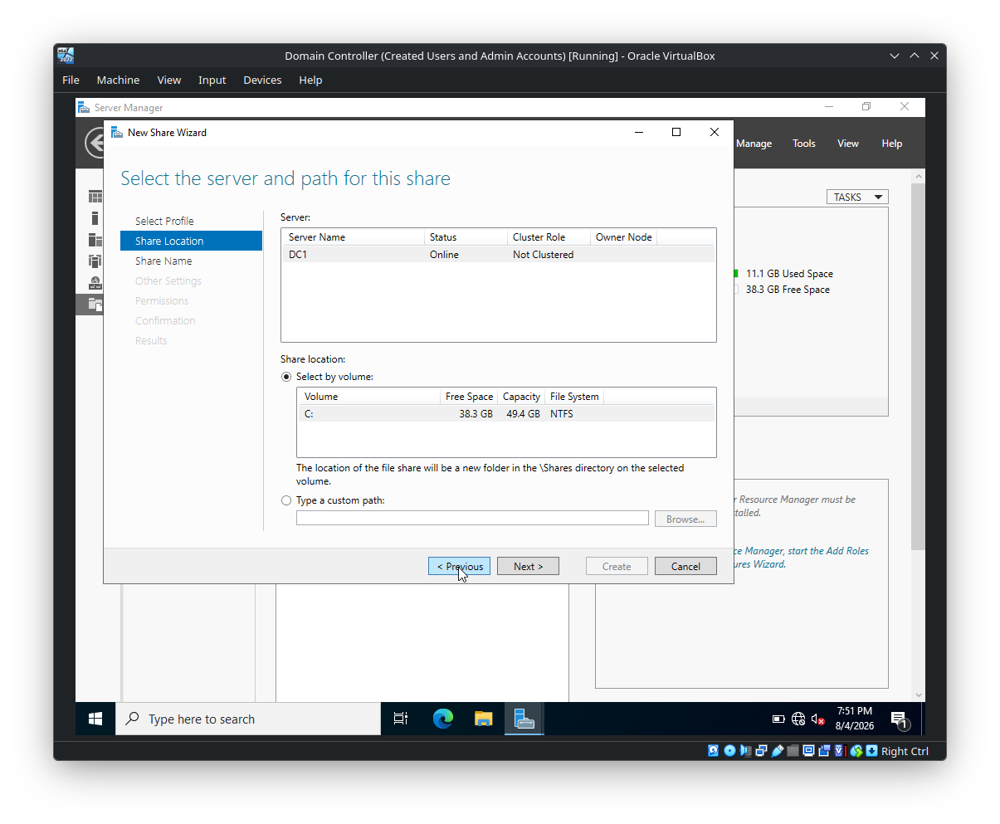
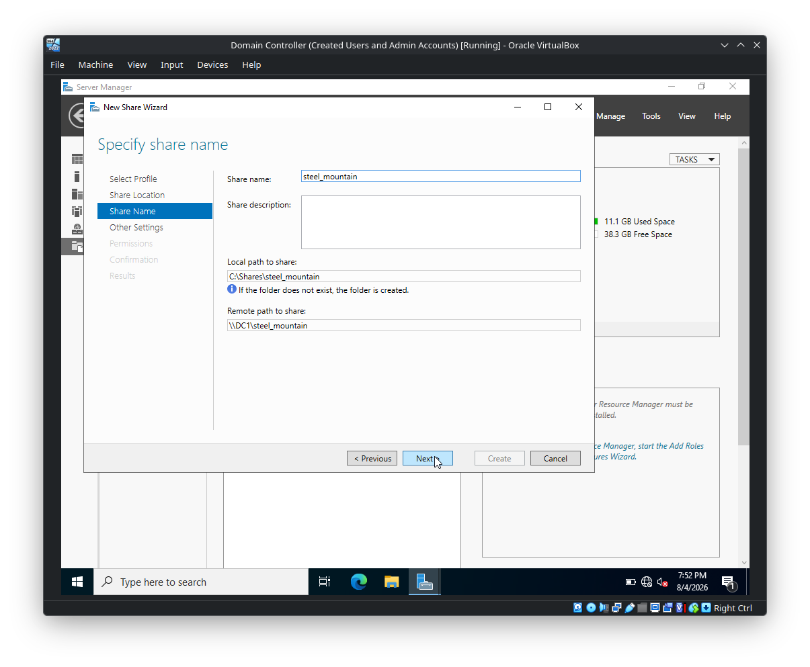
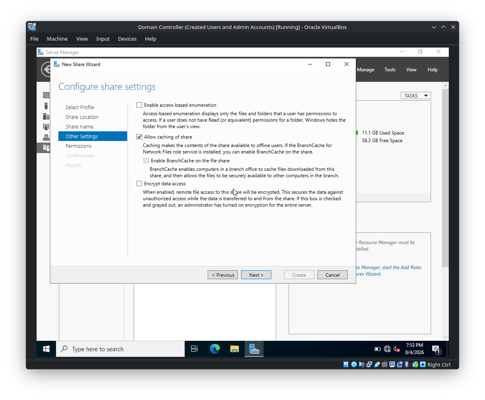
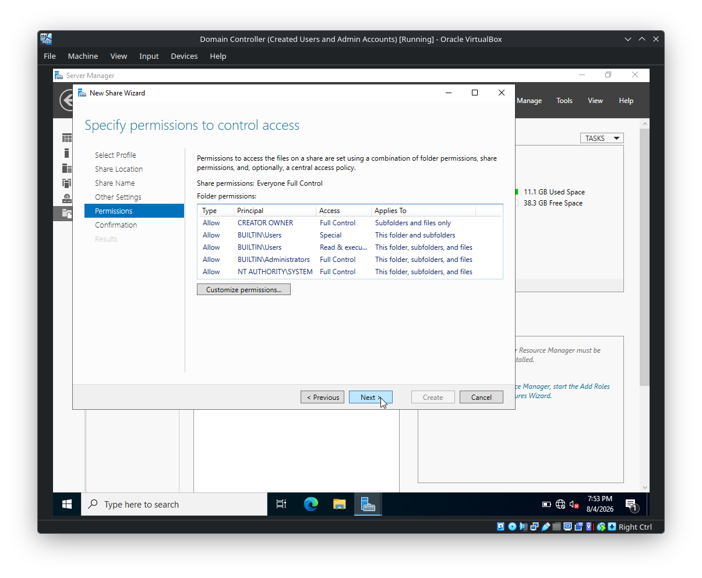
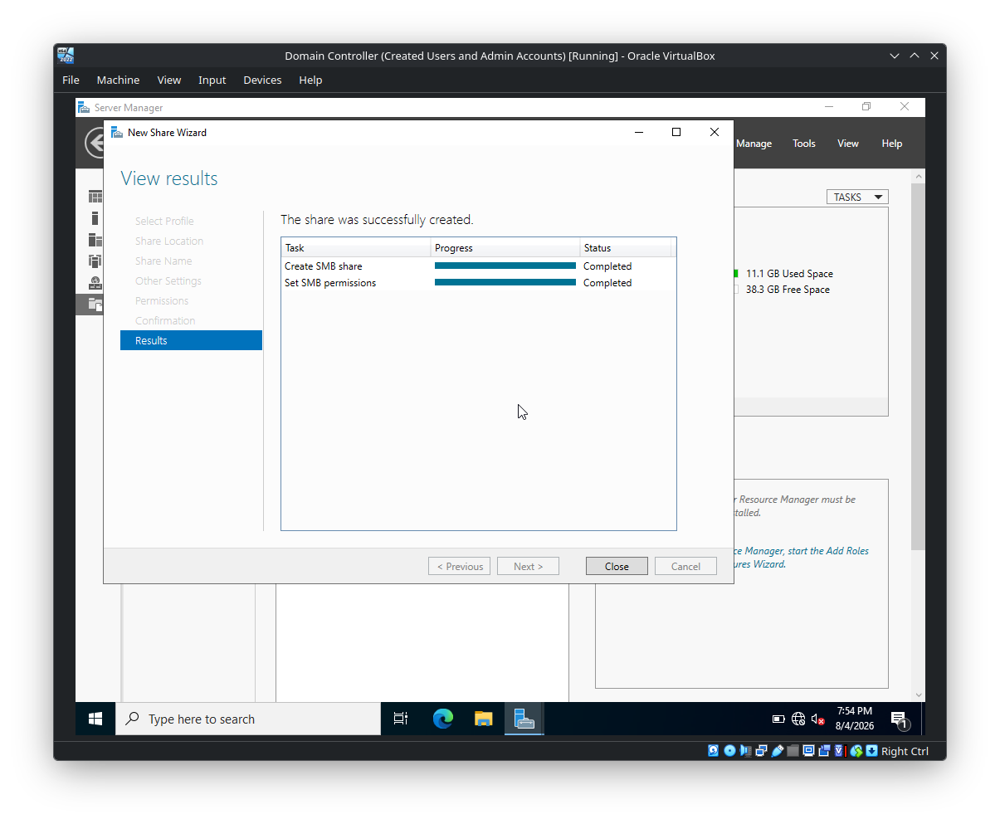
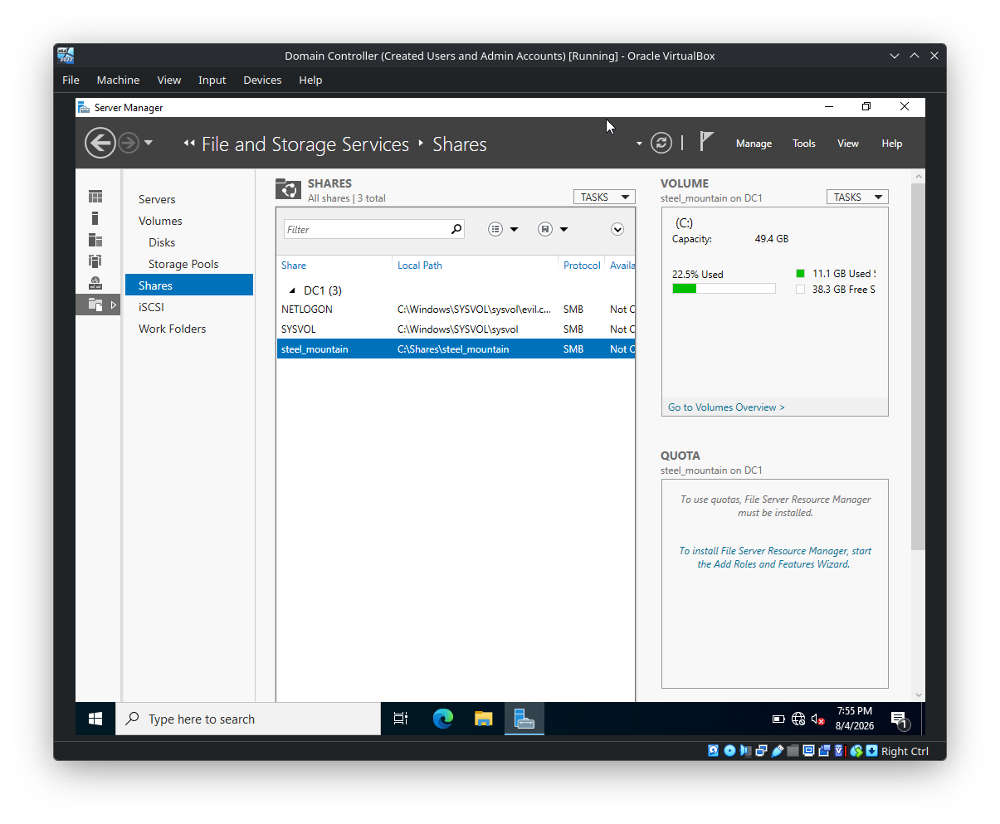

# Creating an SMB Share on Windows Server

## Overview

This lab demonstrates how to create an **SMB file share** on the Windows Server Domain Controller using **Server Manager → File and Storage Services → Shares**.

The share created in the screenshots is:

```text
Share name: steel_mountain
Local path: C:\Shares\steel_mountain
Remote path: \\DC1\steel_mountain
Protocol: SMB
```

The screenshots show the complete workflow from opening Server Manager through successful share creation and permission configuration.

---

# 1. Open Server Manager

Open **Server Manager** on the Windows Server.

From the dashboard, select:

```text
File and Storage Services
```



File and Storage Services provides the management interface for server-side storage, volumes, and SMB shares.

---

# 2. Open the Shares Section

Navigate to:

```text
File and Storage Services
    └── Shares
```

The Shares page displays the SMB shares currently configured on the server.



The screenshot shows existing system shares such as:

```text
NETLOGON
SYSVOL
```

These are normal Active Directory-related shares. The lab adds another SMB share for `steel_mountain`.

---

# 3. Start the New Share Wizard

From the **Shares** page, open:

```text
TASKS → New Share
```



This launches the **New Share Wizard**.

---

# 4. Select the Share Profile

The wizard provides several file-share profiles:

```text
SMB Share - Quick
SMB Share - Advanced
SMB Share - Applications
NFS Share - Quick
NFS Share - Advanced
```

For this lab, select:

```text
SMB Share - Quick
```



### Why SMB?

SMB (**Server Message Block**) is the Windows file-sharing protocol used to expose files and directories over the network.

The selected profile provides the basic configuration required for a normal Windows SMB file share.

---

# 5. Select the Server and Storage Location

The wizard asks where the share should be created.

The selected server is:

```text
DC1
```

The server is shown as:

```text
Status: Online
Cluster Role: Not Clustered
```

The available volume is:

```text
C:
File system: NTFS
Capacity: 49.4 GB
Free space: 38.3 GB
```



The wizard indicates that the share will be created under the `\Shares` directory on the selected volume.

The resulting local path will be:

```text
C:\Shares\steel_mountain
```

---

# 6. Specify the Share Name

Set the share name to:

```text
steel_mountain
```

The wizard automatically shows:

```text
Local path to share:
C:\Shares\steel_mountain
```

and the network path:

```text
\\DC1\steel_mountain
```



### Important distinction

There are two paths involved:

**Local filesystem path**

```text
C:\Shares\steel_mountain
```

This is where the files physically reside on the server.

**SMB network path**

```text
\\DC1\steel_mountain
```

This is how a client accesses the share over the network.

---

# 7. Configure Share Settings

The **Other Settings** page contains options controlling SMB share behavior.

The screenshot shows:

```text
Enable access-based enumeration       Disabled
Allow caching of share                Enabled
Enable BranchCache on the file share  Disabled
Encrypt data access                   Disabled
```



## Access-Based Enumeration

The screenshot describes access-based enumeration as a feature that displays only files and folders a user has permission to access.

It is disabled in this configuration.

## Allow Caching of Share

Caching is enabled.

This allows the contents of the share to be made available for offline users.

## BranchCache

BranchCache is disabled.

## Encrypt Data Access

SMB encryption is disabled in this configuration.

This means the screenshot represents a basic SMB share configuration rather than an encrypted SMB share.

---

# 8. Configure Permissions

The wizard then displays the permissions controlling access to the share.



The screenshot shows:

```text
Share permissions: Everyone - Full Control
```

The displayed folder permissions include:

```text
CREATOR OWNER       Full Control
BUILTIN\Users       Special
BUILTIN\Users       Read & execute
BUILTIN\Administrators Full Control
NT AUTHORITY\SYSTEM Full Control
```

The wizard explains that effective access to files on a share is determined using a combination of:

```text
Folder permissions
+
Share permissions
+
Optional central access policy
```

### Security principle

The permissions shown here are intentionally broad for the lab configuration.

In a production environment, avoid granting `Everyone` unnecessary access. Apply least privilege and explicitly define which users or groups require read/write access.

---

# 9. Confirm the Configuration

The confirmation screen summarizes the share before creation.

.png)

The important configuration shown is:

```text
SHARE LOCATION

Server:
DC1

Cluster role:
Not Clustered

Local path:
C:\Shares\steel_mountain
```

Share properties:

```text
Share name:
steel_mountain

Protocol:
SMB

Access-based enumeration:
Disabled

Caching:
Enabled

BranchCache:
Disabled

Encrypt data:
Disabled
```

This is the final configuration before selecting **Create**.

---

# 10. Create the SMB Share

After confirming the configuration, click:

```text
Create
```

The wizard reports:

```text
The share was successfully created.
```

The displayed tasks are:

```text
Create SMB share       Completed
Set SMB permissions    Completed
```



This confirms that both the SMB share and its SMB permissions were successfully configured.

---

# 11. Verify the Share

Return to:

```text
Server Manager
→ File and Storage Services
→ Shares
```

The share should appear in the list.



The screenshot shows:

```text
steel_mountain
```

with the local path:

```text
C:\Shares\steel_mountain
```

and protocol:

```text
SMB
```

This confirms that the share is registered with the server's SMB service.

---

# 12. SMB Share Architecture

The configuration can be represented as:

```text
                    Windows Server
                         │
                         │
                        DC1
                         │
              ┌──────────┴──────────┐
              │                     │
       Local filesystem        SMB service
              │                     │
              ▼                     ▼
C:\Shares\steel_mountain    \\DC1\steel_mountain
                                      │
                                      │ SMB
                                      ▼
                                  Client
```

The client does not directly access:

```text
C:\Shares\steel_mountain
```

Instead, it accesses the exported SMB namespace:

```text
\\DC1\steel_mountain
```

The SMB server maps that network share to the underlying local filesystem path.

---

# 13. Share Permissions vs. NTFS Permissions

A critical concept when working with Windows file shares is that **share permissions and NTFS permissions are separate layers**.

```text
Client
  │
  ▼
SMB Share Permissions
  │
  ▼
NTFS / Folder Permissions
  │
  ▼
File
```

The effective permissions are determined by the combination of these controls.

For example, a user may have:

```text
SMB: Full Control
NTFS: Read
```

The user will not gain write access simply because the SMB share grants Full Control.

The more restrictive effective permission controls the resulting access.

---

# 14. Accessing the Share from a Client

From a Windows client on the same network/domain, the share can be accessed using:

```text
\\DC1\steel_mountain
```

For example, it can be entered in File Explorer's address bar:

```text
\\DC1\steel_mountain
```

Alternatively, from Command Prompt:

```cmd
dir \\DC1\steel_mountain
```

A mapped network drive can also be created:

```cmd
net use Z: \\DC1\steel_mountain
```

The exact access behavior depends on the user's authentication and the configured share/NTFS permissions.

---

# 15. Useful SMB Enumeration Commands

From a Windows client, useful commands for inspecting SMB shares include:

### List shares on a server

```cmd
net view \\DC1
```

### Inspect the current user's SMB connections

```cmd
net use
```

### Connect to the share

```cmd
net use Z: \\DC1\steel_mountain
```

### Remove the mapped connection

```cmd
net use Z: /delete
```

From an authorized Linux lab machine, SMB enumeration can also be performed with tools such as:

```bash
smbclient -L //DC1 -U 'evil.corp\username'
```

and the share can be accessed with:

```bash
smbclient //DC1/steel_mountain -U 'evil.corp\username'
```

---

# 16. Security Considerations

The lab configuration is useful for learning, but several settings deserve attention in a real environment.

### 1. `Everyone - Full Control`

The screenshot explicitly shows:

```text
Share permissions: Everyone - Full Control
```

This is overly permissive for many production scenarios.

Prefer specific AD groups, for example:

```text
SMB_SteelMountain_Read
SMB_SteelMountain_Modify
```

and assign only the required permissions.

### 2. SMB Encryption

The screenshot shows:

```text
Encrypt data: Disabled
```

For sensitive data and appropriate environments, SMB encryption can provide protection for SMB traffic in transit.

### 3. Access-Based Enumeration

The screenshot shows:

```text
Access-based enumeration: Disabled
```

When enabled, users can be prevented from seeing files/folders for which they lack appropriate access.

This does not replace proper permissions; it primarily changes visibility.

### 4. NTFS Permissions

Do not rely only on SMB share permissions. Always inspect the underlying NTFS ACLs.

---

# 17. Practical Verification Workflow

After creating the share, verify it from both the server and a client.

### On the server

Confirm:

```text
C:\Shares\steel_mountain
```

exists.

Confirm the SMB share:

```text
steel_mountain
```

appears under:

```text
Server Manager
→ File and Storage Services
→ Shares
```

### From a client

Test:

```cmd
dir \\DC1\steel_mountain
```

Then test an actual file operation appropriate to the configured permissions.

For example:

```cmd
echo SMB test > \\DC1\steel_mountain\test.txt
```

Only perform write testing when the account is intentionally configured to have write access.

---

# 18. Configuration Summary

| Setting | Value |
|---|---|
| Server | `DC1` |
| Volume | `C:` |
| Local path | `C:\Shares\steel_mountain` |
| Share name | `steel_mountain` |
| Remote path | `\\DC1\steel_mountain` |
| Protocol | SMB |
| Access-Based Enumeration | Disabled |
| Caching | Enabled |
| BranchCache | Disabled |
| Encrypt data | Disabled |
| Share permission shown | `Everyone - Full Control` |

---

# 19. Key Takeaways

1. **SMB** provides Windows network file sharing.
2. A local directory can be published through an SMB share.
3. The lab creates:

   ```text
   C:\Shares\steel_mountain
   ```

   and exposes it as:

   ```text
   \\DC1\steel_mountain
   ```

4. SMB share permissions and NTFS permissions are separate security layers.
5. The screenshot configuration uses `Everyone - Full Control` at the share level.
6. Access-Based Enumeration is disabled.
7. SMB caching is enabled.
8. SMB encryption is disabled in this lab configuration.
9. The share creation wizard confirms both SMB-share creation and SMB permission configuration.
10. From a security perspective, the most important lesson is to understand **how network share permissions combine with NTFS ACLs**.

---

## Quick Reference

```text
Server:
    DC1

Share:
    steel_mountain

Local:
    C:\Shares\steel_mountain

Network:
    \\DC1\steel_mountain

Protocol:
    SMB
```

### Basic verification

```cmd
net view \\DC1
```

```cmd
dir \\DC1\steel_mountain
```

```cmd
net use Z: \\DC1\steel_mountain
```

```cmd
net use
```
