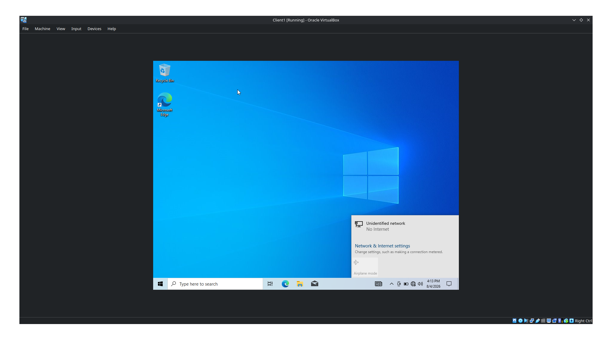
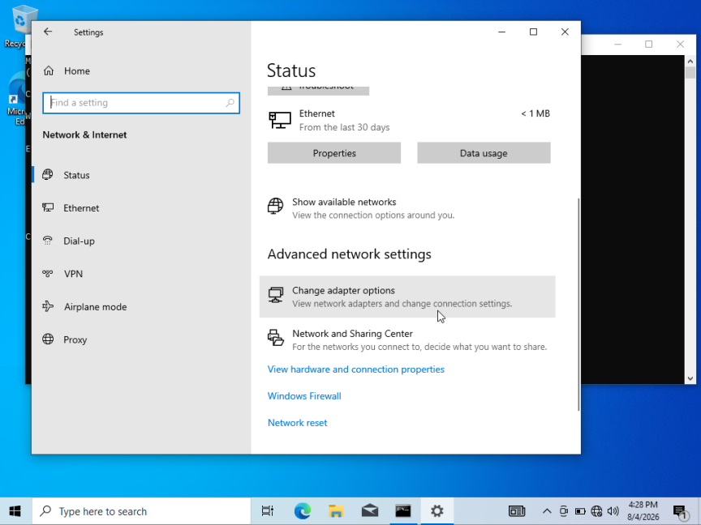
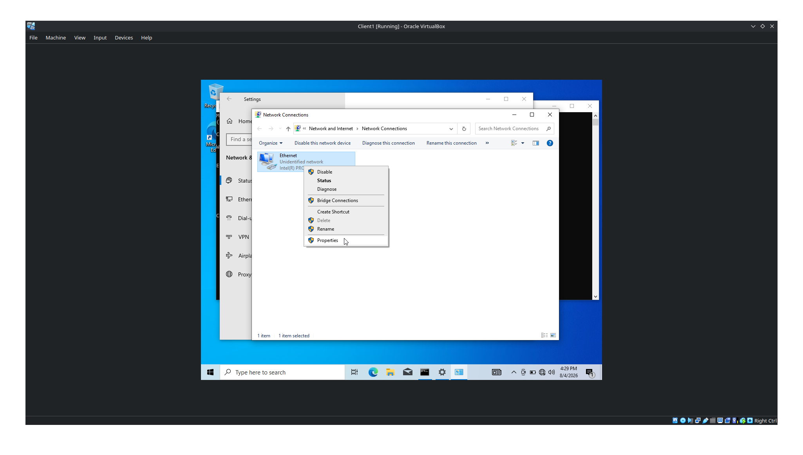
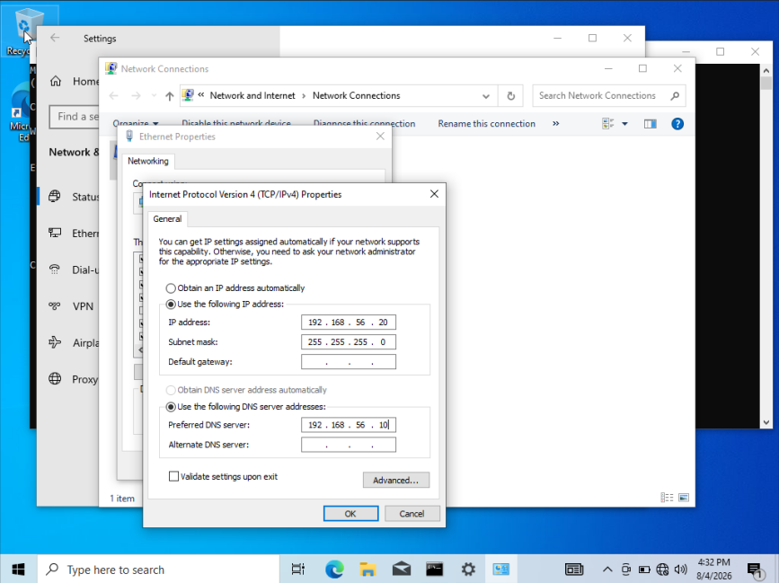
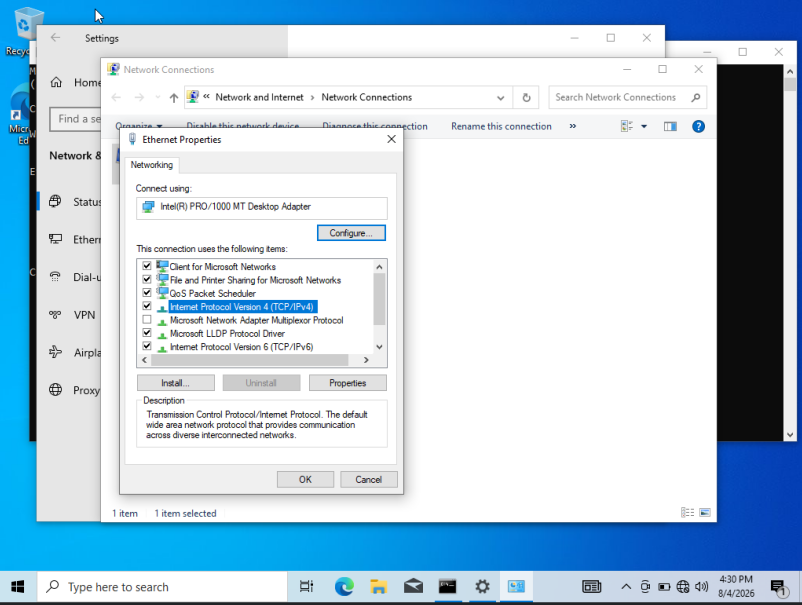
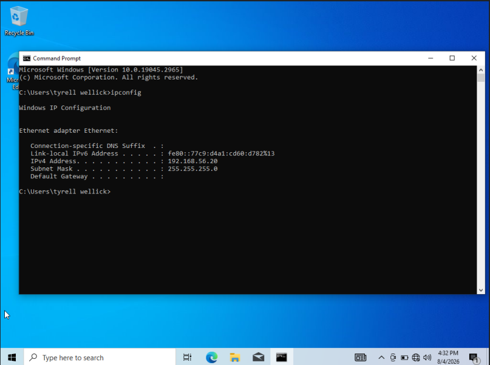

# CTO Workstation Configuration

This document covers the post-installation configuration performed on the **CTO workstation** after Windows installation.

---

# Machine Information

| Setting | Value |
|---------|-------|
| Computer Name | CTO |
| User | tyrell wellick |
| IP Address | 192.168.56.20 |
| Subnet Mask | 255.255.255.0 |
| Preferred DNS | 192.168.56.10 |
| Domain | evil.corp |

---

# 1. Configure Static Network

The workstation must communicate with the Domain Controller using a static IPv4 configuration. The Domain Controller also acts as the DNS server for the Active Directory environment.

---

## Step 1 — Verify Initial Network

After Windows installation the workstation receives an unidentified network because no static IP or DNS server has been configured.



At this stage:

- Network is identified as **Unidentified Network**
- Internet connectivity is unavailable
- Active Directory resources cannot be reached

---

## Step 2 — Open Network Adapter Settings

Navigate to:

```
Settings
    ↓
Network & Internet
    ↓
Advanced Network Settings
    ↓
Change Adapter Options
```

This opens the classic Network Connections window.



---

## Step 3 — Open Ethernet Properties

Right-click the Ethernet adapter and select **Properties**.



The Ethernet Properties window contains all networking protocols installed on the adapter.

---

## Step 4 — Configure IPv4

Select

```
Internet Protocol Version 4 (TCP/IPv4)
```

Click **Properties**.

Configure the following values.

| Setting | Value |
|---------|-------|
| IP Address | 192.168.56.20 |
| Subnet Mask | 255.255.255.0 |
| Default Gateway | Leave Blank |
| Preferred DNS | 192.168.56.10 |
| Alternate DNS | Leave Blank |

The Domain Controller (DC01) acts as the DNS server for all domain clients.



---

## Step 5 — Save Configuration

Click

```
OK
```

to save the IPv4 configuration.

Windows immediately applies the new networking configuration.

The Ethernet Properties dialog should now show IPv4 configured correctly.



---

## Step 6 — Verify Configuration

Open Command Prompt and execute:

```cmd
ipconfig
```

Expected output:

```
IPv4 Address . . . . . . . : 192.168.56.20
Subnet Mask . . . . . . . : 255.255.255.0
Preferred DNS . . . . . . : 192.168.56.10
```

Verify that the IP address matches the configuration assigned earlier.



---

## Result

The CTO workstation is now configured with a static IPv4 address and uses the Domain Controller as its DNS server.

This configuration allows the workstation to:

- Resolve Active Directory DNS records
- Locate the Domain Controller
- Join the Active Directory domain
- Access enterprise resources such as shared folders and authentication services
  
---

# 2. Join the Workstation to the Active Directory Domain

After configuring the network, the workstation can communicate with the Domain Controller. The next step is to join the machine to the **e-corp** Active Directory domain.

Joining the domain enables centralized authentication, Group Policy management, resource sharing, and domain-based administration.

---

## Prerequisites

Before joining the domain, verify the following:

- Static IP address has been configured.
- Preferred DNS points to the Domain Controller (`192.168.56.10`).
- The Domain Controller is powered on.
- A domain account with permission to join computers exists.

---

## Step 1 — Open "Access work or school"

Open the Windows Search and search for:

```
Access work or school
```

Open the matching System Settings application.


---

## Step 2 — Connect the Device

Inside **Access work or school**, click **Connect**.


---

## Step 3 — Select Local Active Directory Domain

Windows first displays the Microsoft account enrollment window.

Instead of signing in with a Microsoft account, select:

```
Join this device to a local Active Directory domain
```

This option allows the workstation to join an on-premises Active Directory environment.


---

## Step 4 — Enter the Domain Name

Enter the Active Directory domain name.

```
evil.corp
```

Click **Next**.


---

## Step 5 — Authenticate Using Domain Credentials

Windows requests credentials from a domain account that has permission to join computers to the domain.

Provide the following credentials:

| Field | Value |
|--------|-------|
| Username | tyrell |
| Password | ******** |

Click **OK**.


---

## Step 6 — Restart the Workstation

Windows verifies the domain configuration and begins joining the workstation to Active Directory.

The system must reboot to complete the process.

Do not interrupt the restart.


---

## Step 7 — Sign in Using the Domain Account

After rebooting, the workstation is now a member of the **e-corp** domain.

Select **Other User** and authenticate using a domain account.

Example:

```
e-corp\tyrell
```

or

```
tyrell@evil.corp
```

Enter the appropriate password and sign in.


---

## Step 8 — First Domain Login

During the first domain login, Windows creates the user's local profile.

This process may take several minutes.

Do not power off the machine.


---

## Step 9 — Verify Administrative Group Membership

After logging in, verify that the required domain accounts have been added to the local **Administrators** group.

Open:

```
Computer Management
    ↓
Local Users and Groups
    ↓
Groups
    ↓
Administrators
```


Open the **Administrators** group.

The following members should be present:

- Administrator
- e-corp\Domain Admins
- e-corp\tyrell
- tyrell


This confirms that the workstation has successfully joined the Active Directory domain and that the required administrative permissions have been applied.

---

## Result

The CTO workstation has successfully joined the **e-corp** Active Directory domain.

The workstation can now:

- Authenticate using domain credentials.
- Receive Group Policy Objects (GPOs).
- Access shared folders and enterprise resources.
- Be centrally managed by the Domain Controller.
- Participate fully in the Active Directory environment.

---

# 3. Create a Shared Folder

After joining the workstation to the Active Directory domain, the next step is to create a shared folder. This shared folder allows users on the network to access common files and resources over SMB (Server Message Block).

In this lab, a folder named **Share** is created on the `C:\` drive and published to the network.

---

## Step 1 — Create the Shared Folder

Open **File Explorer** and navigate to:

```
This PC → Local Disk (C:)
```

Create a new folder named:

```
Share
```

The directory structure should look similar to:

```
C:\
 ├── Program Files
 ├── Users
 ├── Windows
 └── Share
```


---

## Step 2 — Open Folder Properties

Right-click the **Share** folder and select:

```
Properties
```


---

## Step 3 — Open the Sharing Tab

Navigate to the **Sharing** tab.

From here Windows provides two sharing methods:

- Share Wizard (Simple Sharing)
- Advanced Sharing

For this walkthrough, the Share Wizard is used.

Click:

```
Share...
```

> **Note:** Advanced Sharing provides more granular control over share names, permissions, and caching. It is commonly used in enterprise environments.


---

## Step 4 — Choose Users

The **Network Access** window appears.

Select:

```
Everyone
```

Click:

```
Add
```

Then click:

```
Share
```

This grants access to the selected users over the network.


---

## Step 5 — Enable Network Discovery

If Windows displays a prompt asking to enable Network Discovery and File Sharing, choose:

```
Yes, turn on network discovery and file sharing for all public networks
```

This allows the shared folder to become accessible from other systems on the network.


---

## Step 6 — Finish the Sharing Process

Windows creates the SMB share and displays the network path.

Example:

```
\\CTO\Share
```

Click:

```
Done
```


---

## Verification

The folder is now accessible using its UNC (Universal Naming Convention) path.

Example:

```
\\CTO\Share
```

or

```
\\192.168.56.20\Share
```

Other domain users with appropriate permissions can now browse, read, or write to this shared folder depending on the permissions assigned.

---

## Result

The CTO workstation now hosts a network shared folder that can be accessed by other computers in the **e-corp** domain.

The workstation is now fully configured with:

- Static IP configuration
- Active Directory domain membership
- Shared SMB folder for network file access

This completes the workstation configuration.
