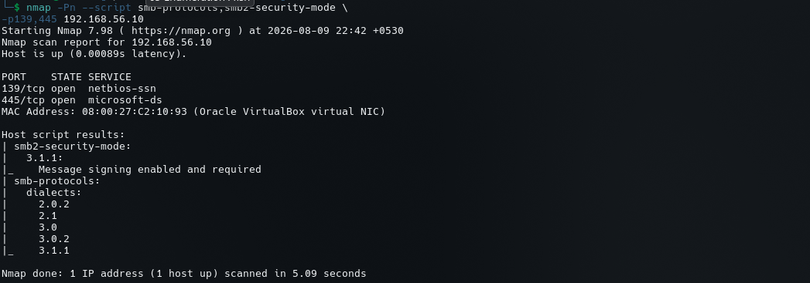
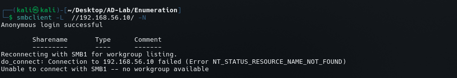
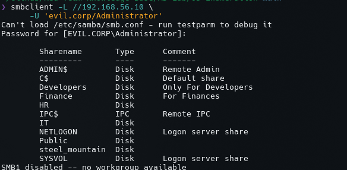
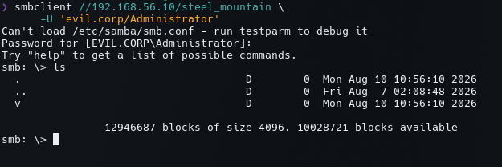

# SMB Enumeration

## Objective

After identifying TCP/139 and TCP/445 during port scanning, SMB enumeration was performed against `DC1`.

Target:

```text
IP Address: 192.168.56.10
Hostname:   DC1
Domain:     evil.corp
```

The objective was to determine:

- SMB protocol versions
- SMB security configuration
- Whether anonymous access is possible
- Available SMB shares
- Authenticated share visibility
- Access to the custom `steel_mountain` share

---

# 1. SMB Protocol and Security Enumeration

The first command used Nmap NSE scripts:

```bash
nmap -Pn --script smb-protocols,smb2-security-mode -p139,445 192.168.56.10
```

### Results

Nmap identified:

```text
139/tcp open  netbios-ssn
445/tcp open  microsoft-ds
```

The SMB 2 security mode reported:

```text
SMB 3.1.1:
    Message signing enabled and required
```

The server also supports the following SMB dialects:

```text
2.0.2
2.1
3.0
3.0.2
3.1.1
```

### Interpretation

The target supports modern SMB2/SMB3 protocols, including SMB 3.1.1.

The important security configuration is:

```text
Message signing: Enabled and required
```

Therefore, based on this enumeration, SMB signing is **not disabled**.

This matters later when evaluating SMB-based attack paths. We should not assume that relay attacks are viable simply because SMB is exposed.



---

# 2. Anonymous SMB Enumeration

The next step was to determine whether SMB shares could be enumerated without credentials:

```bash
smbclient -L //192.168.56.10/ -N
```

The result initially showed:

```text
Anonymous login successful
```

However, SMB1 workgroup enumeration failed:

```text
Reconnecting with SMB1 for workgroup listing
NT_STATUS_RESOURCE_NAME_NOT_FOUND

Unable to connect with SMB1 with no workgroup available
```

### Interpretation

There is an important distinction here.

The message:

```text
Anonymous login successful
```

does not necessarily mean that anonymous users can access useful shares or files.

The subsequent SMB1 workgroup failure is also not evidence that SMB itself is unavailable.

The server has SMB1 disabled, while modern SMB2/SMB3 protocols are available.

Therefore:

```text
Anonymous authentication attempt → possible
Anonymous share enumeration       → unsuccessful/incomplete
SMB1 workgroup browsing           → unavailable
```



---

# 3. Authenticated SMB Enumeration

Because anonymous enumeration did not provide the share list, authenticated enumeration was performed using the domain Administrator account:

```bash
smbclient -L //192.168.56.10/ \
    -U 'evil.corp/Administrator'
```

After entering the account password, the server returned the following shares:

| Share | Type | Comment |
|---|---|---|
| `ADMIN$` | Disk | Remote Admin |
| `C$` | Disk | Default share |
| `Developers` | Disk | Only for Developers |
| `Finance` | Disk | For Finances |
| `HR` | Disk | — |
| `IPC$` | IPC | Remote IPC |
| `IT` | Disk | — |
| `NETLOGON` | Disk | Logon server share |
| `Public` | Disk | — |
| `steel_mountain` | Disk | Custom lab share |
| `SYSVOL` | Disk | Logon server share |

This is a significant enumeration result because the target contains both standard Windows/AD shares and custom organizational shares.



---

# 4. Standard Active Directory Shares

Two shares are particularly important in a Domain Controller environment:

```text
NETLOGON
SYSVOL
```

### NETLOGON

```text
NETLOGON
```

The comment identifies it as:

```text
Logon server share
```

NETLOGON is associated with domain logon infrastructure and can contain scripts and other domain-related resources.

### SYSVOL

```text
SYSVOL
```

The comment also identifies it as:

```text
Logon server share
```

SYSVOL is an important Active Directory share and is used for domain-wide files such as Group Policy-related data.

These shares should therefore be treated as high-value enumeration targets.

---

# 5. Administrative Shares

The authenticated enumeration also identified:

```text
ADMIN$
C$
IPC$
```

### ADMIN$

```text
ADMIN$
```

This is the standard Windows administrative share.

### C$

```text
C$
```

This exposes the system drive through the administrative SMB mechanism to appropriately privileged accounts.

### IPC$

```text
IPC$
```

IPC$ is used for inter-process communication and SMB/RPC-related operations.

These shares are normally expected on Windows systems and should not automatically be considered vulnerabilities.

---

# 6. Custom Organizational Shares

The lab also contains several custom SMB shares:

```text
Developers
Finance
HR
IT
Public
steel_mountain
```

The comments provide additional information:

```text
Developers → Only for Developers
Finance    → For Finances
```

This gives us an initial indication that access control is intended to be based on organizational roles or groups.

That is particularly relevant because the infrastructure was previously configured with organizational users and groups.

The next phase should therefore compare:

```text
AD group membership
        +
SMB share permissions
        +
NTFS permissions
```

rather than treating share access as an isolated problem.

---

# 7. Enumerating the `steel_mountain` Share

The custom `steel_mountain` share was accessed using the authenticated Administrator account:

```bash
smbclient //192.168.56.10/steel_mountain \
    -U 'evil.corp/Administrator'
```

After authentication, an SMB session was established:

```text
smb: \>
```

The initial directory listing showed:

```text
.
..
v
```

The SMB client reported the share's filesystem capacity:

```text
12946687 blocks of size 4096
10028721 blocks available
```

The important result is that the authenticated Administrator account was able to establish an SMB session to:

```text
\\192.168.56.10\steel_mountain
```



---

# 8. What We Learned

The SMB enumeration established the following:

```text
DC1
│
├── SMB 2/3
│   ├── SMB 2.0.2
│   ├── SMB 2.1
│   ├── SMB 3.0
│   ├── SMB 3.0.2
│   └── SMB 3.1.1
│
├── SMB signing
│   └── Enabled and required
│
├── Standard shares
│   ├── ADMIN$
│   ├── C$
│   └── IPC$
│
├── Active Directory shares
│   ├── NETLOGON
│   └── SYSVOL
│
└── Organizational/custom shares
    ├── Developers
    ├── Finance
    ├── HR
    ├── IT
    ├── Public
    └── steel_mountain
```

This gives us a much better model of the file-sharing attack surface.

---

# 9. Security-Relevant Observations

## SMB Signing

```text
Enabled and required
```

This is a positive security control.

Do not classify it as an SMB signing weakness.

## SMB1

```text
Disabled
```

The SMB1 workgroup-listing failure is consistent with SMB1 being unavailable.

This is not a service failure because SMB2/SMB3 are available.

## Anonymous Access

The server accepted an anonymous authentication attempt, but the anonymous share-listing process did not produce a useful share list.

Therefore the evidence supports:

```text
Anonymous login attempt: accepted
Anonymous share enumeration: unsuccessful/incomplete
```

Further anonymous-access testing would be required before concluding that anonymous users have meaningful access.

## Custom Shares

The custom shares are more interesting for this lab:

```text
Developers
Finance
HR
IT
Public
steel_mountain
```

Their intended access appears to correspond to organizational roles.

This makes permissions and group membership an important next step.

---

# 10. Recommended Next Enumeration

SMB enumeration should now move beyond simply listing shares.

For each accessible share, enumerate:

```text
1. Share accessibility
2. Directory contents
3. Files
4. Read permissions
5. Write permissions
6. Interesting filenames
7. Scripts/configuration files
8. Credentials or secrets
9. NTFS permissions
10. Relationship to AD groups
```

Particularly important targets:

```text
SYSVOL
NETLOGON
Public
Developers
Finance
HR
IT
steel_mountain
```

The key question is no longer:

```text
"What SMB shares exist?"
```

It is:

```text
"Which users/groups can access which shares,
and what can they actually do there?"
```

That information will connect SMB enumeration with the Active Directory users, groups, and permissions already configured in the lab.

---

# 11. Enumeration Chain

The current workflow is:

```text
Port Scanning
     ↓
Service Identification
     ↓
SMB Protocol Enumeration
     ↓
SMB Security Enumeration
     ↓
Anonymous Access Testing
     ↓
Authenticated Share Enumeration
     ↓
Share Access Testing
     ↓
Permission Enumeration
     ↓
File/Content Enumeration
     ↓
Potential Attack Paths
```

The next logical step is **SMB share and permission enumeration**, followed by correlating those permissions with the AD groups and users created in the lab.
