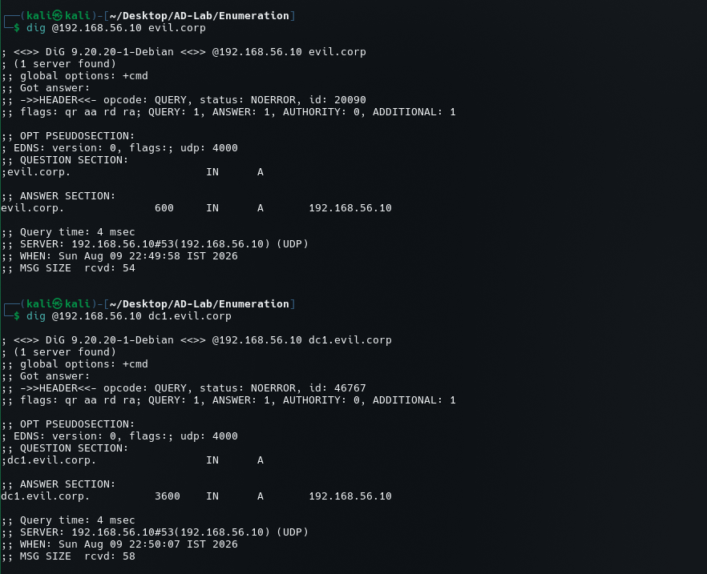
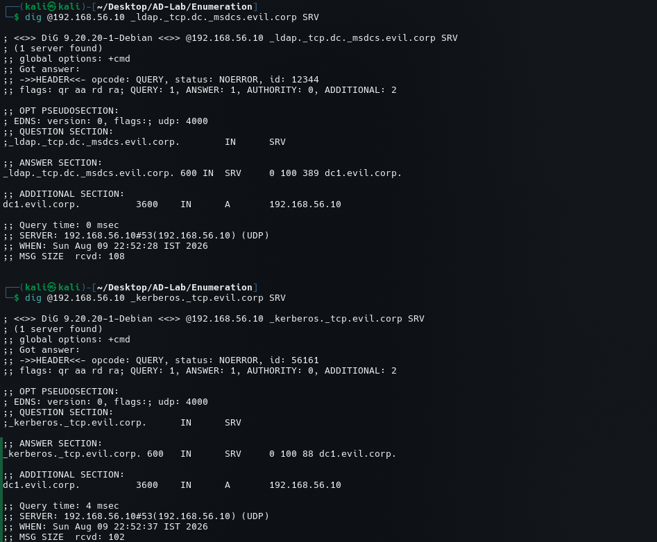
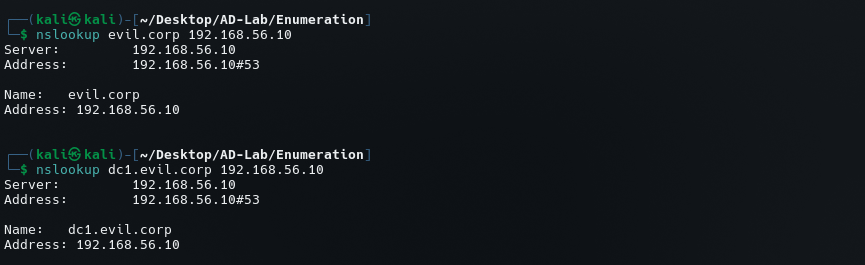

# DNS Enumeration

## Objective

DNS enumeration was performed against the Active Directory DNS server running on:

```text
DC1
192.168.56.10
UDP/53
Domain: evil.corp
```

The objective was to confirm domain resolution and identify AD-related DNS service records.

---

## 1. Domain Resolution with `dig`

The domain was queried directly against the DC:

```bash
dig @192.168.56.10 evil.corp
```

The response returned:

```text
evil.corp.    600    IN    A    192.168.56.10
```

This confirms that the Active Directory domain resolves to the Domain Controller's IP address.



---

## 2. Domain Controller Resolution

The Domain Controller hostname was queried:

```bash
dig @192.168.56.10 dc1.evil.corp
```

The response returned:

```text
dc1.evil.corp.    3600    IN    A    192.168.56.10
```

Therefore:

```text
dc1.evil.corp → 192.168.56.10
```


---

## 3. LDAP Service Discovery Through SRV

The following SRV record was queried:

```bash
dig @192.168.56.10 _ldap._tcp.dc._msdcs.evil.corp SRV
```

The response identified:

```text
_ldap._tcp.dc._msdcs.evil.corp.

0 100 389 dc1.evil.corp.
```

This confirms that LDAP is advertised through the AD DNS infrastructure on:

```text
dc1.evil.corp:389
```



---

## 4. Kerberos Service Discovery Through SRV

The Kerberos SRV record was queried:

```bash
dig @192.168.56.10 _kerberos._tcp.evil.corp SRV
```

The response identified:

```text
_kerberos._tcp.evil.corp.

0 100 88 dc1.evil.corp.
```

This confirms that Kerberos is advertised through DNS on:

```text
dc1.evil.corp:88
```


---

## 5. Verification with `nslookup`

The domain was also queried using:

```bash
nslookup evil.corp 192.168.56.10
```

The response showed:

```text
Name:    evil.corp
Address: 192.168.56.10
```

The Domain Controller hostname was then queried:

```bash
nslookup dc1.evil.corp 192.168.56.10
```

The response showed:

```text
Name:    dc1.evil.corp
Address: 192.168.56.10
```



---

## 6. Consolidated DNS Findings

| Query | Result |
|---|---|
| `evil.corp` | `192.168.56.10` |
| `dc1.evil.corp` | `192.168.56.10` |
| `_ldap._tcp.dc._msdcs.evil.corp` | `dc1.evil.corp:389` |
| `_kerberos._tcp.evil.corp` | `dc1.evil.corp:88` |

The DNS infrastructure therefore provides useful information about the AD environment.

---

## 7. Enumeration Significance

DNS is particularly important in Active Directory because service discovery is integrated into the domain infrastructure.

The discovered records allow us to connect:

```text
evil.corp
    ↓
dc1.evil.corp
    ↓
192.168.56.10
    ↓
LDAP : 389
Kerberos : 88
```

This also confirms that the DNS, LDAP, and Kerberos components discovered during port scanning are part of the same AD infrastructure.

---

## 8. Next Steps

Further DNS enumeration can investigate:

```text
1. Additional A records
2. CNAME records
3. SRV records
4. Name server records
5. Reverse DNS
6. AD-specific DNS records
7. Hostnames discovered from LDAP/SMB
8. Potential additional systems in the domain
```

The current evidence confirms the primary domain and Domain Controller but does not establish the existence of additional hosts.
