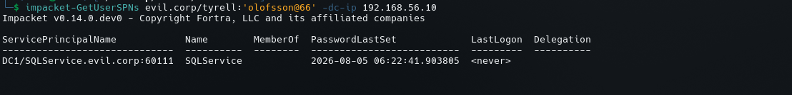

# Kerberos Enumeration

## Objective

Kerberos enumeration was performed against the Domain Controller:

```text
DC1
192.168.56.10
Domain: evil.corp
Kerberos: TCP/88
```

The objective was to identify Kerberos-related service accounts and Service Principal Names (SPNs).

---

## 1. SPN Enumeration

The following Impacket command was used:

```bash
impacket-GetUserSPNs evil.corp/tyrell:'olofsson@66' -dc-ip 192.168.56.10
```

The result identified the following SPN:

```text
ServicePrincipalName          Name
DC1/SQLService.evil.corp:60111 SQLService
```

The account identified by the query is:

```text
SQLService
```

The returned information also showed:

```text
MemberOf:
PasswordLastSet:
    2026-08-05 06:22:41.903805

LastLogon:
    <never>

Delegation:
```



---

## 2. Service Principal Name

The important finding is:

```text
DC1/SQLService.evil.corp:60111
```

This associates the `SQLService` account with a service running under the Kerberos identity represented by the SPN.

The port in the SPN is:

```text
60111
```

This is useful because it provides another service-related artifact that can be correlated with the previously discovered RPC/service ports and the lab's SQL service configuration.

---

## 3. Why SPNs Matter

An SPN maps a service instance to an AD security principal.

During AD enumeration, SPNs are important because they can reveal:

```text
Service accounts
Service names
Service hosts
Potentially interesting service identities
```

Service accounts are especially important during an assessment because their permissions may differ from normal user accounts.

An SPN by itself does **not** mean that an account is vulnerable.

Further testing is required before drawing conclusions about Kerberos attacks such as Kerberoasting.

---

## 4. Lab Correlation

Earlier infrastructure configuration created:

```text
Account:
    SQLService

SPN:
    DC1/SQLService.evil.corp:60111
```

Therefore the Kerberos enumeration confirms that the service account and SPN configuration are visible from the domain.

---

## 5. Next Steps

The next Kerberos/AD enumeration steps should include:

```text
1. Enumerate all user-associated SPNs
2. Identify service accounts
3. Review service-account group membership
4. Review account privileges
5. Check password age and account configuration
6. Determine whether Kerberos pre-authentication is enabled
7. Assess whether any service accounts are suitable for controlled Kerberoasting testing
8. Correlate SPNs with discovered network services
```

The current evidence establishes the existence of the `SQLService` SPN but does not by itself establish an exploitable weakness.
