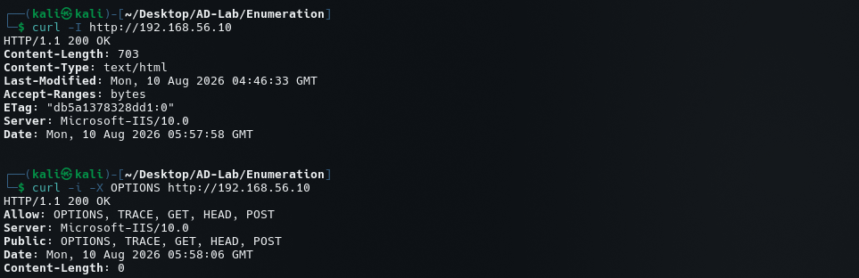
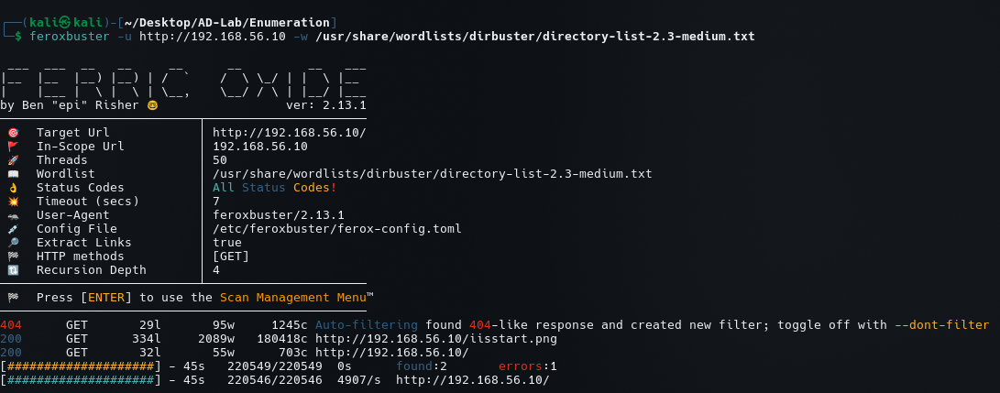
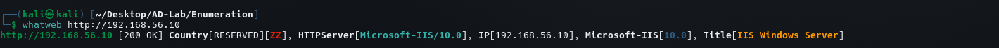

# Web Enumeration

## Objective

After identifying TCP/80 as an open HTTP service during port scanning, web enumeration was performed against the IIS web server running on `DC1`.

Target:

```text
IP Address: 192.168.56.10
Web Server: Microsoft IIS 10.0
URL:        http://192.168.56.10
```

The objective was to identify:

- HTTP response information
- Web server technology
- Supported HTTP methods
- Web application/server metadata
- Common directories and files
- Potentially interesting web content

---

# 1. HTTP Header Enumeration with `curl`

The first step was to retrieve the HTTP response headers:

```bash
curl -I http://192.168.56.10
```

The server returned:

```text
HTTP/1.1 200 OK
Content-Length: 703
Content-Type: text/html
Last-Modified: Mon, 10 Aug 2026 04:46:33 GMT
Accept-Ranges: bytes
ETag: "db5a1378328dd1:0"
Server: Microsoft-IIS/10.0
Date: Mon, 10 Aug 2026 05:57:58 GMT
```

### Findings

The response confirms:

```text
HTTP Status: 200 OK
Server: Microsoft-IIS/10.0
Content-Type: text/html
Content-Length: 703 bytes
```

The `Server` header provides a useful technology fingerprint:

```text
Microsoft-IIS/10.0
```

The target is therefore running Microsoft Internet Information Services (IIS) 10.0.



---

# 2. HTTP Method Enumeration

The next command tested the HTTP `OPTIONS` method:

```bash
curl -i -X OPTIONS http://192.168.56.10
```

The response was:

```text
HTTP/1.1 200 OK
Allow: OPTIONS, TRACE, GET, HEAD, POST
Server: Microsoft-IIS/10.0
Public: OPTIONS, TRACE, GET, HEAD, POST
Content-Length: 0
```

The server therefore advertises:

```text
OPTIONS
TRACE
GET
HEAD
POST
```

### Security Observation

`TRACE` is enabled.

TRACE is an HTTP diagnostic method that causes the server to reflect a request back to the client. Its presence is worth recording during enumeration because it may increase the web application's attack surface.

However:

```text
TRACE enabled ≠ automatically exploitable
```

The finding should therefore be treated as an enumeration/security-hardening observation rather than immediately classified as a vulnerability.

The response also confirms that:

```text
POST
```

is accepted by the server, which may become relevant when enumerating application functionality.


---

# 3. Directory and File Enumeration with Feroxbuster

Common web paths were enumerated using:

```bash
feroxbuster -u http://192.168.56.10 \
-w /usr/share/wordlists/dirbuster/directory-list-2.3-medium.txt
```

Feroxbuster identified the target as:

```text
http://192.168.56.10/
```

The scan used:

```text
Threads: 50
Wordlist: directory-list-2.3-medium.txt
HTTP Method: GET
Recursion Depth: 4
```

Feroxbuster automatically detected a `404`-like response and created an auto-filter:

```text
404 GET 29l 95w 1245c
```

The scan identified the following successful responses:

```text
200 GET 334l 2089w 18041c http://192.168.56.10/iisstart.png
200 GET 32l 55w 703c     http://192.168.56.10/
```

### Findings

The root page:

```text
/
```

returns:

```text
HTTP 200
```

An additional resource was discovered:

```text
/iisstart.png
```

The `iisstart.png` filename is consistent with the default IIS start-page content visible on an IIS installation.

No additional application directories were identified in the supplied scan output.



---

# 4. Technology Fingerprinting with WhatWeb

WhatWeb was used to fingerprint the HTTP service:

```bash
whatweb http://192.168.56.10
```

The result identified:

```text
HTTPServer[Microsoft-IIS/10.0]
IP[192.168.56.10]
Microsoft-IIS[10.0]
Title[IIS Windows Server]
```

The target therefore presents:

```text
Server: Microsoft-IIS/10.0
Title:  IIS Windows Server
```

### Interpretation

WhatWeb confirms the IIS technology identified through the HTTP headers.

The web server appears to be serving the default IIS Windows Server page rather than exposing an identified custom web application in the supplied enumeration results.



---

# 5. Consolidated Findings

The current web enumeration results are:

| Item | Result |
|---|---|
| Target | `192.168.56.10` |
| Protocol | HTTP |
| Port | `80/tcp` |
| Web Server | Microsoft IIS 10.0 |
| HTTP Status | `200 OK` |
| Page Title | IIS Windows Server |
| Content Type | `text/html` |
| HTTP Methods | OPTIONS, TRACE, GET, HEAD, POST |
| TRACE | Enabled |
| Root Path | `/` |
| Discovered Resource | `/iisstart.png` |
| Web Application | Not identified from supplied scans |

---

# 6. Security-Relevant Observations

## IIS Version Disclosure

The server exposes:

```text
Microsoft-IIS/10.0
```

through the HTTP response.

This provides technology/version information to a remote client and can assist fingerprinting.

Version disclosure alone does not establish a vulnerability.

---

## TRACE Method

The server advertises:

```text
TRACE
```

as an allowed HTTP method.

This should be recorded for further investigation, but it should not automatically be reported as exploitable without demonstrating an actual security impact.

---

## Default IIS Content

The root page and discovered resource indicate default IIS content:

```text
IIS Windows Server
/iisstart.png
```

This suggests that no obvious custom web application was discovered during the supplied enumeration.

---

# 7. Enumeration Chain

The web enumeration workflow was:

```text
Port Scanning
     ↓
HTTP Service Identification
     ↓
HTTP Header Enumeration
     ↓
HTTP Method Enumeration
     ↓
Technology Fingerprinting
     ↓
Directory/File Enumeration
     ↓
Application Identification
     ↓
Further Web Testing
```

---

# 8. Current Assessment

Based strictly on the supplied enumeration results, the web service currently appears to be:

```text
Microsoft IIS 10.0
        │
        ├── HTTP/80
        │
        ├── Default IIS page
        │
        ├── /iisstart.png
        │
        ├── GET / HEAD / POST
        │
        └── TRACE enabled
```

No exploitable web vulnerability has been established from these scans alone.

The important result at this stage is the identification and characterization of the HTTP service.

---

# 9. Next Steps

The next web-enumeration phase should focus on application-level discovery rather than immediately attempting exploitation.

Recommended areas:

```text
1. Inspect the IIS landing page
2. Review page source
3. Identify linked resources
4. Enumerate additional files/extensions
5. Test common IIS-specific paths
6. Examine response headers
7. Test virtual hosts if domain information is available
8. Investigate HTTP/HTTPS configuration
9. Correlate the web service with the AD environment
10. Reassess the application after other services reveal additional information
```

The current AD domain is:

```text
evil.corp
```

so virtual-host and hostname-based web enumeration may become relevant later.

The supplied results do not establish whether additional virtual hosts exist, so this remains an open enumeration item.
