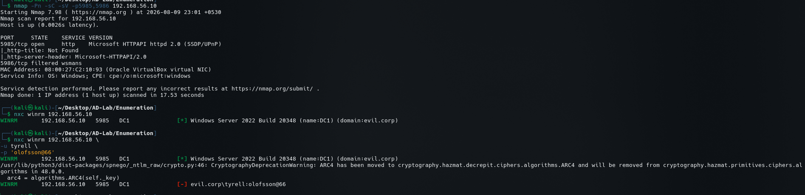

# WinRM Enumeration

## Objective

Windows Remote Management (WinRM) was identified during the full TCP port scan.

Target:

```text
DC1
192.168.56.10
Domain: evil.corp
WinRM: TCP/5985
```

The objective was to confirm the WinRM service and test authenticated remote-management access.

---

## 1. WinRM Service Identification

The service was identified with Nmap:

```bash
nmap -Pn -sC -sV -p5985,5986 192.168.56.10
```

The result showed:

```text
5985/tcp open  http  Microsoft HTTPAPI httpd 2.0 (SSDP/UPnP)
5986/tcp filtered wsmans
```

The HTTP service on TCP/5985 is consistent with the Windows Remote Management HTTP listener.

The Nmap output also identified the host as:

```text
Windows
```



---

## 2. Host Identification with NetExec

NetExec was used to query WinRM:

```bash
nxc winrm 192.168.56.10
```

The response identified:

```text
WINRM  192.168.56.10  5985  DC1
Windows Server 2022 Build 20348
name: DC1
domain: evil.corp
```

This provides several useful pieces of information:

```text
Host:       DC1
OS:         Windows Server 2022 Build 20348
Domain:     evil.corp
Service:    WinRM
Port:       5985
```

---

## 3. Authenticated WinRM Test

An authenticated connection attempt was made with:

```bash
nxc winrm 192.168.56.10 \
-u tyrell \
-p 'olofsson@66'
```

The result was:

```text
WINRM  192.168.56.10  5985  DC1
Windows Server 2022 Build 20348
name: DC1
domain: evil.corp

[-] evil.corp\tyrell:olofsson@66
```

The `[-]` result indicates that the supplied credentials were not accepted for WinRM authentication in this test.


---

## 4. Interpretation

The important distinction is:

```text
WinRM service available
        ≠
User has WinRM access
```

The service itself is reachable on TCP/5985, but the tested credentials:

```text
evil.corp\tyrell
```

with the supplied password were rejected.

This does not prove that WinRM authentication is disabled for the account or that no other account can use WinRM.

It only establishes that this particular authentication attempt failed.

---

## 5. Security and Enumeration Significance

WinRM is a high-value service in Windows environments because successful authentication can provide remote management capabilities.

During an authorized assessment, WinRM should therefore be correlated with:

```text
AD users
Group membership
Local Administrators
Remote Management Users
Credentials
Password reuse
Account privileges
```

The service is especially relevant after obtaining valid credentials for an appropriately privileged account.

---

## 6. Current Findings

```text
Service:
    Windows Remote Management

Host:
    DC1

IP:
    192.168.56.10

Port:
    TCP/5985

OS:
    Windows Server 2022 Build 20348

Domain:
    evil.corp

Tested account:
    evil.corp\tyrell

Authentication result:
    Failed
```

---

## 7. Next Steps

The next WinRM-related enumeration should focus on:

```text
1. Identify accounts authorized for remote management
2. Enumerate relevant AD groups
3. Identify privileged users
4. Validate credentials only when authorized
5. Test WinRM access with known valid lab credentials
6. If access is obtained, document the resulting privilege level
7. Correlate WinRM access with lateral-movement paths
```

At this stage, the confirmed result is that WinRM is exposed on TCP/5985 and the tested `tyrell` credentials were rejected.
