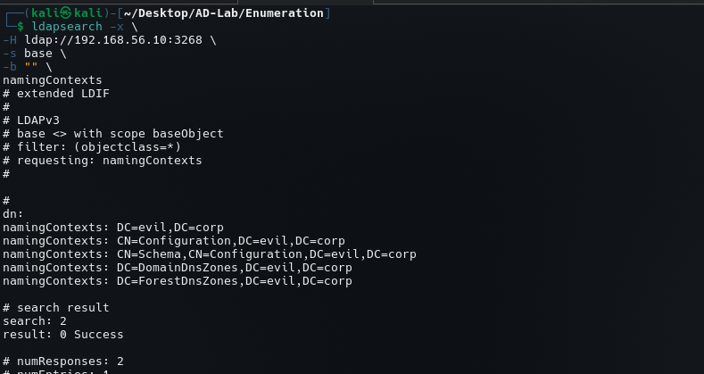

# LDAP Enumeration

## Objective

LDAP enumeration was performed against the Active Directory Domain Controller at:

```text
DC1
192.168.56.10
Domain: evil.corp
LDAP: TCP/3268
```

The objective was to identify the LDAP naming contexts and confirm the Active Directory directory structure exposed by the LDAP service.

---

## 1. LDAP Naming Context Enumeration

The following command was used:

```bash
ldapsearch -x \
-H ldap://192.168.56.10:3268 \
-b "" \
-s base \
-b ""
```

The LDAP response returned the following naming contexts:

```text
DC=evil,DC=corp
CN=Configuration,DC=evil,DC=corp
CN=Schema,CN=Configuration,DC=evil,DC=corp
DC=DomainDnsZones,DC=evil,DC=corp
DC=ForestDnsZones,DC=evil,DC=corp
```

The response confirms that the target is an Active Directory LDAP server and exposes the expected domain, configuration, schema, and DNS application partitions.



---

## 2. Interpretation

The most important naming context is:

```text
DC=evil,DC=corp
```

This is the domain naming context.

The following contexts provide information about the AD forest and supporting directory services:

```text
CN=Configuration,DC=evil,DC=corp
CN=Schema,CN=Configuration,DC=evil,DC=corp
DC=DomainDnsZones,DC=evil,DC=corp
DC=ForestDnsZones,DC=evil,DC=corp
```

These values are useful when performing authenticated LDAP enumeration because they provide the correct base distinguished names for subsequent queries.

---

## 3. Enumeration Significance

At this stage, LDAP enumeration has established:

```text
Domain:
    evil.corp

Domain DN:
    DC=evil,DC=corp

Configuration:
    CN=Configuration,DC=evil,DC=corp

Schema:
    CN=Schema,CN=Configuration,DC=evil,DC=corp

DNS partitions:
    DC=DomainDnsZones,DC=evil,DC=corp
    DC=ForestDnsZones,DC=evil,DC=corp
```

This gives us the directory structure required for deeper AD enumeration.

---

## 4. Next Steps

The next LDAP phase should use the discovered domain DN to enumerate:

```text
Users
Groups
Computers
Organizational Units
Service accounts
Group memberships
SPNs
Descriptions
Interesting attributes
```

The key base DN for the domain is:

```text
DC=evil,DC=corp
```

LDAP enumeration should then be correlated with the users, groups, OUs, service accounts, and permissions already created in the lab.
