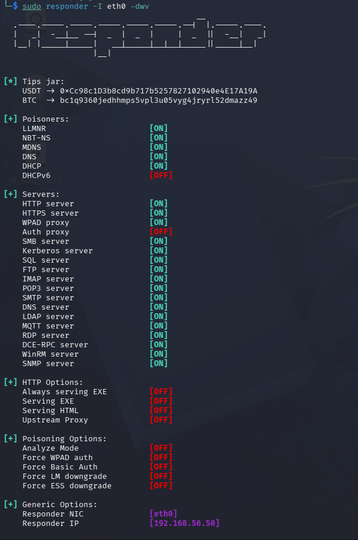
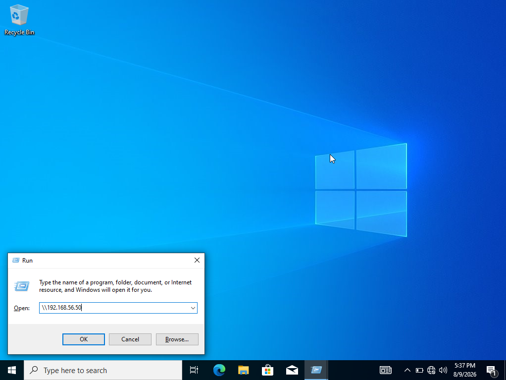
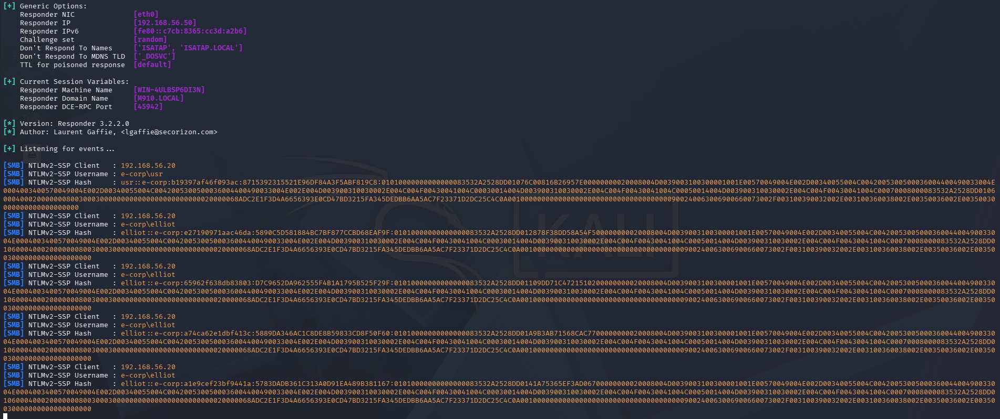
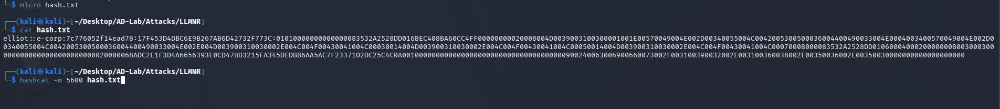
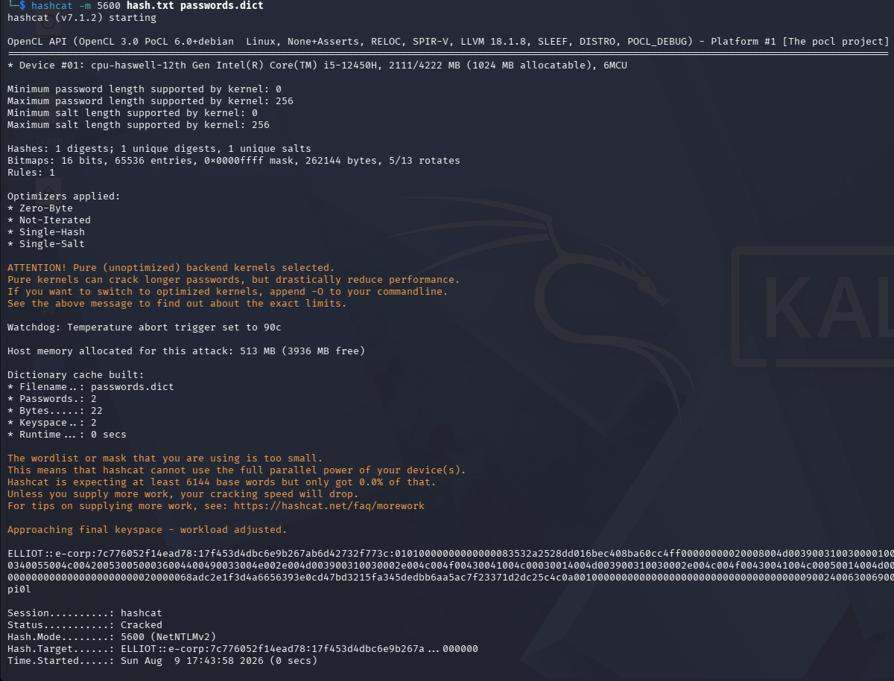
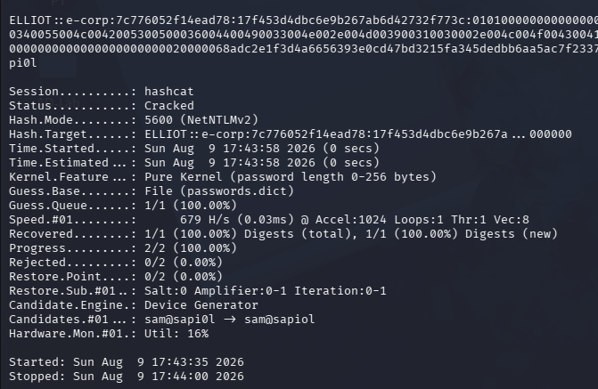

# LLMNR Poisoning

## Overview

LLMNR (Link-Local Multicast Name Resolution) is a name-resolution mechanism used by Windows hosts when normal DNS resolution is unsuccessful.

In an Active Directory environment, an attacker who can observe the local network can abuse this behavior by responding to LLMNR queries and pretending to be the requested host. If the victim then attempts an authenticated SMB connection to the attacker, Windows may send an NTLM challenge-response authentication exchange.

The attacker does **not** receive the user's plaintext password. Instead, a NetNTLMv2 challenge-response value can be captured and potentially cracked offline.

This lab demonstrates the following attack chain:

```text
Victim Windows host
       |
       |  Failed name resolution
       v
     LLMNR query
       |
       |  Attacker poisons the response
       v
Kali / Responder (192.168.56.50)
       |
       |  Victim attempts SMB authentication
       v
   NetNTLMv2 captured
       |
       |  Offline password guessing
       v
   Password recovered
       |
       v
Potential credential reuse / lateral movement
```

> **Lab scope:** This walkthrough was performed against the isolated AD lab infrastructure built for this project.

---

## 1. Lab Scenario

### Infrastructure

| Host | Role | Address |
|---|---|---|
| DC1 | Windows Server / Domain Controller | `192.168.56.10` |
| Kali | Attacker machine | `192.168.56.50` |
| Domain | Active Directory domain | `e-corp` / `evil.corp` as observed during enumeration |

The important point is that Kali and the Windows client are on the same lab network. The attacker therefore has the opportunity to observe local name-resolution traffic.

### Example real-world scenario

Consider an employee who wants to access a network resource:

```text
\\fileserver\share
```

If the hostname cannot be resolved through DNS, Windows may fall back to other name-resolution mechanisms, including LLMNR.

An attacker on the same network can run a rogue name-resolution service:

```text
Victim: "Where is fileserver?"
Attacker: "fileserver is at 192.168.56.50"
```

The victim then believes the attacker's machine is the requested server and may attempt authentication.

This is the critical transition:

```text
Name-resolution request
        ↓
Attacker-controlled response
        ↓
Victim connects to attacker
        ↓
NTLM authentication
        ↓
NetNTLMv2 captured
```

---

## 2. Why LLMNR Poisoning Works

The attack relies on a combination of two behaviors:

1. **Fallback name resolution**
2. **Automatic Windows authentication**

If DNS cannot resolve a requested hostname, a Windows system may attempt LLMNR.

For example:

```text
DNS query:
    fileserver.e-corp.local

DNS:
    No useful answer

LLMNR:
    Who is "fileserver"?

Attacker:
    192.168.56.50
```

If Windows subsequently connects to the attacker using SMB or another protocol requiring authentication, NTLM may be negotiated.

The attacker receives a challenge-response exchange rather than the plaintext password.

---

## 3. Starting Responder

On Kali, Responder was started on the interface connected to the AD lab:

```bash
sudo responder -I eth0 -dwv
```

Where:

- `-I eth0` selects the network interface.
- `-d` enables DHCP-related poisoning functionality.
- `-w` enables WPAD rogue proxy functionality.
- `-v` enables verbose output.

### Responder configuration observed in the lab

The screenshot shows:

```text
Responder NIC       [eth0]
Responder IP        [192.168.56.50]

LLMNR               [ON]
NBT-NS              [ON]
MDNS                [ON]
DNS                 [ON]
DHCP                [ON]

SMB server          [ON]
HTTP server         [ON]
Kerberos server     [ON]
LDAP server         [ON]
WinRM server        [ON]
```

The important component for this attack is:

```text
LLMNR [ON]
```

Responder listens for name-resolution requests and can answer them before the legitimate system does.



---

## 4. Triggering the Authentication

The victim must generate traffic that causes the poisoned response to be used.

A common example is an incorrect or nonexistent hostname:

```text
\\fileserver
```

or:

```text
\\something-that-does-not-exist
```

If the name is not resolved by DNS and the victim sends an LLMNR query, Responder can answer it.

In this lab, the Windows host was also directed toward the Kali system at:

```text
192.168.56.50
```

The Windows Run dialog shows an attempted connection to the attacker-controlled host:

```text
\\192.168.56.50
```



The important lesson is that the attacker is trying to make the Windows machine authenticate to a system controlled by the attacker.

---

## 5. Capturing the NTLMv2 Challenge-Response

Once the victim attempts authentication, Responder records the NTLMv2 exchange.

The captured output showed multiple authentication attempts.

For example:

```text
[SMB] NTLMv2-SSP Client : 192.168.56.20
[SMB] NTLMv2-SSP Username : e-corp\usr
[SMB] NTLMv2-SSP Hash : e-corp\usr::...
```

Another captured account was:

```text
[SMB] NTLMv2-SSP Username : e-corp\elliot
```

This is a significant finding.

We now know that:

- A Windows host at `192.168.56.20` attempted authentication.
- The authentication used NTLMv2.
- Domain accounts were exposed to the rogue SMB service.
- The captured material can be attacked offline.



---

## 6. What Was Actually Captured?

It is important to understand that this is **not the plaintext password**.

NTLMv2 authentication uses a challenge-response protocol.

Conceptually:

```text
Server → Client:
    Challenge

Client:
    Uses password-derived key + challenge + authentication data

Client → Server:
    NTLMv2 response
```

Responder obtains enough of this exchange to perform an offline password-guessing attack.

Therefore:

```text
Captured NetNTLMv2
        ≠
Plaintext password
```

However, if the user's password is weak enough, the response can be cracked offline.

---

## 7. Saving the Captured Hash

The captured NetNTLMv2 material was saved into a file:

```text
hash.txt
```

The file contained the captured authentication material in a format suitable for Hashcat.

Example:

```bash
cat hash.txt
```

The screenshot shows the captured `e-corp\elliot` authentication material being saved.



---

## 8. Offline Password Cracking

Hashcat mode `5600` corresponds to:

```text
NetNTLMv2
```

The lab used:

```bash
hashcat -m 5600 hash.txt passwords.dict
```

Where:

```text
-m 5600
    NetNTLMv2

hash.txt
    Captured authentication material

passwords.dict
    Password candidate list
```



### Important observation

Hashcat reported:

```text
Status: Cracked
Hash.Mode: 5600 (NetNTLMv2)
```

The password was successfully recovered using the supplied dictionary.



The password recovery demonstrates why weak passwords remain dangerous even when the attacker never directly obtains the plaintext password from the network exchange.

---

## 9. Why the Dictionary Attack Worked

The attack was successful because the recovered password was present in the supplied candidate set.

The attack model is:

```text
Captured NetNTLMv2
        |
        v
Candidate password
        |
        v
Calculate expected NTLMv2 response
        |
        v
Compare with captured response
        |
   +----+----+
   |         |
 Match     No match
   |
   v
Password recovered
```

The attacker can perform this process offline.

There is therefore no requirement to repeatedly authenticate against the domain controller while guessing passwords.

That distinction matters:

### Online attack

```text
Attacker → Domain Controller
          password guess
          password guess
          password guess
```

This can trigger:

- account lockout
- authentication monitoring
- rate limiting
- SIEM alerts

### Offline attack

```text
Captured NetNTLMv2
       ↓
Local password guesses
       ↓
Local verification
```

The domain controller is no longer involved in the guessing process.

---

## 10. Credential Validation

The lab also attempted to use credentials against the attacker-controlled SMB endpoint.

The Windows authentication dialog displayed:

```text
Domain: e-corp
User: usr
```

and returned:

```text
Access is denied.
```


This screenshot should be interpreted carefully.

It demonstrates an authentication attempt, but **it does not prove that the recovered password for another account was invalid**.

The captured accounts included both:

```text
e-corp\usr
e-corp\elliot
```

while the password-cracking result shown in the lab was associated with the `elliot` NetNTLMv2 material.

When validating credentials, always keep the following mapping explicit:

```text
Captured account
        ↓
Correct recovered password
        ↓
Correct target
        ↓
Correct protocol
        ↓
Authentication result
```

Do not assume that a password recovered for one account is valid for another account.

---

## 11. Attack Chain Summary

The complete attack performed in this lab was:

### Phase 1 — Positioning

Kali:

```text
192.168.56.50
```

Windows client:

```text
192.168.56.20
```

Both hosts were on the same lab network.

### Phase 2 — Poisoning

Responder was started:

```bash
sudo responder -I eth0 -dwv
```

LLMNR poisoning was enabled.

### Phase 3 — Authentication Trigger

The Windows system attempted to access a network resource associated with the attacker's address.

### Phase 4 — Credential Capture

Responder received:

```text
NTLMv2-SSP
```

authentication material for domain users.

### Phase 5 — Offline Attack

The captured material was saved and attacked with:

```bash
hashcat -m 5600 hash.txt passwords.dict
```

### Phase 6 — Password Recovery

Hashcat successfully cracked the `e-corp\elliot` NetNTLMv2 response using the supplied dictionary.

The resulting credential should now be treated as a potential foothold for the next phase of the lab.

---

## 12. Security Impact

An LLMNR poisoning attack can provide an attacker with more than just a hash.

If the captured password is weak and reused elsewhere, the attacker may be able to move from:

```text
Network access
    ↓
Credential capture
    ↓
Password cracking
    ↓
Valid credentials
    ↓
Authentication to other services
    ↓
Potential lateral movement
```

The severity therefore depends heavily on:

- password strength
- password reuse
- NTLM availability
- network segmentation
- SMB configuration
- privilege level of the compromised account
- monitoring and detection controls

A low-privileged user's password may provide little immediate access, while a privileged or service account could significantly change the attack path.

---

## 13. Defensive Mitigations

The preferred defense is to remove the unnecessary name-resolution fallback rather than relying only on detection.

### Disable LLMNR

Through Group Policy:

```text
Computer Configuration
    → Administrative Templates
        → Network
            → DNS Client
                → Turn off multicast name resolution
```

Set:

```text
Enabled
```

This setting disables LLMNR.

### Disable NetBIOS over TCP/IP where appropriate

NBT-NS can provide another poisoning path.

The environment should therefore evaluate whether NetBIOS name resolution is required.

### Reduce NTLM usage

Where operationally possible:

- Prefer Kerberos for domain authentication.
- Reduce unnecessary NTLM authentication.
- Apply appropriate NTLM auditing/restriction policies.
- Investigate legacy applications that still require NTLM before disabling it globally.

### Improve password policy

Passwords should resist offline guessing:

- sufficient length
- uniqueness
- no predictable patterns
- no password reuse
- strong service-account password management

### Network segmentation

Do not allow every workstation to freely communicate with every other workstation over:

```text
SMB
LDAP
WinRM
RPC
```

Segmentation reduces the blast radius after credential capture.

### Detection

Monitor for:

- unexpected LLMNR traffic
- unusual NBNS activity
- rogue SMB servers
- NTLM authentication to unexpected hosts
- repeated NTLM authentication failures
- suspicious workstation-to-workstation SMB traffic

---

## 14. Red-Team Thinking

The important lesson from this attack is not simply:

> "Run Responder and crack a hash."

The actual methodology is:

```text
1. Identify a protocol that trusts local network behavior.
2. Determine whether the environment still permits it.
3. Find a way to trigger victim authentication.
4. Capture the authentication material.
5. Determine exactly what was captured.
6. Attack it using an appropriate offline technique.
7. Validate the resulting credential carefully.
8. Determine what access that credential actually provides.
9. Use the resulting access to guide the next enumeration phase.
```

This is the mindset that makes the technique useful during an actual assessment.

---

## 15. What We Learned From This Attack

### Technical findings

- LLMNR was enabled.
- Responder successfully received Windows authentication traffic.
- NTLMv2 authentication material was captured.
- Multiple domain accounts were observed.
- NetNTLMv2 cracking was successful against the supplied dictionary.
- A valid password was recovered for the `elliot` account.

### Most important observation

The vulnerability is not simply "LLMNR is enabled."

The meaningful attack chain is:

```text
LLMNR
  +
NTLM authentication
  +
Weak/recoverable password
  =
Potential credential compromise
```

Removing any one of these components can substantially reduce the practical impact.

---

## 16. Next Step

The recovered credential should **not** immediately be treated as domain-admin access.

The next question is:

> **What can this account actually access?**

That leads into the next phase of the lab:

```text
Credential
    ↓
Credential validation
    ↓
SMB enumeration
    ↓
LDAP / AD enumeration
    ↓
User and group privileges
    ↓
ACL / delegation analysis
    ↓
Potential lateral movement
    ↓
Privilege escalation
```

The next attack should therefore be driven by the permissions and services exposed by the compromised account rather than by blindly running exploitation tools.

---

## Evidence

| Evidence | Observation |
|---|---|
| `starting-responder.png` | Responder running on `192.168.56.50`, LLMNR enabled |
| `captured-ntlm-hash.png` | NTLMv2 authentication captured from `192.168.56.20` |
| `connecting-to-attacker-machine.png` | Windows authentication attempt against attacker-controlled host |
| `save-hash-run-hashcat.png` | Captured material prepared for offline cracking |
| `run-hashcat.png` | Hashcat operating in mode `5600` |
| `password-cracked.png` | NetNTLMv2 successfully cracked |
| `random-creds.png` | Windows credential interaction shown during the lab |

---

## Lab Takeaway

LLMNR poisoning demonstrates a classic Active Directory attack pattern:

```text
Network trust
     ↓
Name-resolution poisoning
     ↓
Forced authentication
     ↓
NTLMv2 capture
     ↓
Offline cracking
     ↓
Credential compromise
```

The real value of the exercise is understanding the **entire attack chain and its dependencies**, not memorizing the Responder command.
